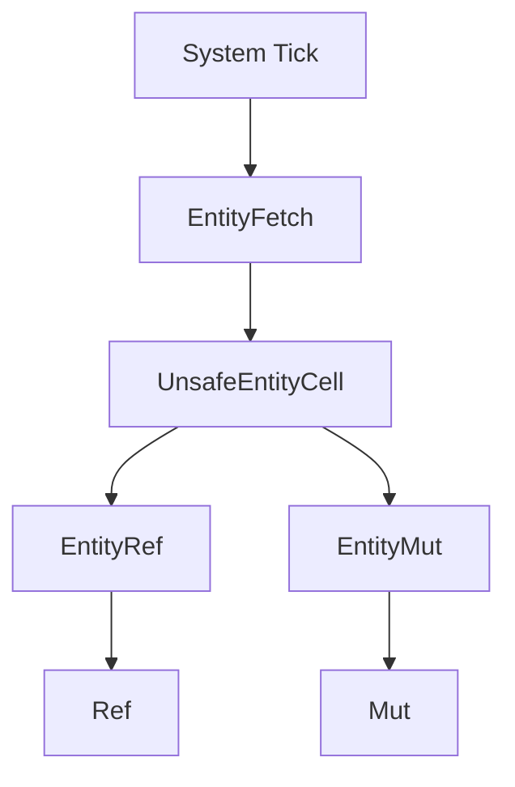

+++
title = "#19115 Add system ticks to EntityRef/Mut WorldQuery"
date = "2025-05-07T00:00:00"
draft = false
template = "pull_request_page.html"
in_search_index = false

[extra]
current_language = "zh-cn"
available_languages = {"en" = { name = "English", url = "/pull_request/bevy/2025-05/pr-19115-en-20250507" }, "zh-cn" = { name = "中文", url = "/pull_request/bevy/2025-05/pr-19115-zh-cn-20250507" }}
labels = ["C-Bug", "A-ECS"]
+++

# Add system ticks to EntityRef/Mut WorldQuery

## Basic Information
- **Title**: Add system ticks to EntityRef/Mut WorldQuery
- **PR Link**: https://github.com/bevyengine/bevy/pull/19115  
- **Author**: cBournhonesque  
- **Status**: MERGED  
- **Labels**: C-Bug, A-ECS, S-Ready-For-Final-Review  
- **Created**: 2025-05-07T14:09:44Z  
- **Merged**: 2025-05-07T18:39:46Z  
- **Merged By**: alice-i-cecile  

## Description Translation
### 目标  
- 通过使在系统内创建的`EntityRef`、`EntityMut`及相关WorldQuery使用系统的变更tick，修复[#13735](https://github.com/bevyengine/bevy/issues/13735)的部分问题  
- 确保`entity_ref.get_ref::<T>()`使用正确的变更tick（来自系统的tick），与直接在系统参数中查询`Ref<T>`的行为一致  

### 解决方案  
- 在`UnsafeEntityCell`中添加变更tick，实现[#13735评论](https://github.com/bevyengine/bevy/issues/13735#issuecomment-2652482918)中描述的方法  

### 测试  
- 新增单元测试验证修复：修复前通过`EntityRef`创建的`Ref`的`Added`/`Changed`过滤不正确  

## The Story of This Pull Request

### 问题背景
在Bevy ECS中，当通过`EntityRef`或`EntityMut`获取组件时，原有的实现使用全局的last_change_tick和change_tick，而非当前系统的tick。这导致在系统内通过`entity_ref.get_ref::<T>()`获取的`Ref<T>`的变更检测状态（Added/Changed）与直接通过系统参数查询`Ref<T>`的结果不一致，违反了ECS变更检测的基本原则。

### 解决方案选择
核心思路是将系统的tick信息注入到实体访问的底层结构中。通过修改`UnsafeEntityCell`使其携带系统tick，并调整WorldQuery的实现来传递这些tick。选择在`UnsafeEntityCell`层处理tick传递，因为这个结构是实体组件访问的底层基础，能统一处理所有相关的WorldQuery类型。

### 实现细节
1. **引入EntityFetch结构体**  
   在`fetch.rs`中新增`EntityFetch`作为WorldQuery的Fetch类型，携带world引用和系统tick：
   ```rust
   #[derive(Copy, Clone)]
   pub struct EntityFetch<'w> {
       world: UnsafeWorldCell<'w>,
       last_run: Tick,
       this_run: Tick,
   }
   ```
   这个结构体成为`EntityRef`、`EntityMut`等WorldQuery的Fetch类型，替代原有的`UnsafeWorldCell`。

2. **修改WorldQuery实现**  
   调整所有相关WorldQuery的`init_fetch`方法，传递系统tick：
   ```rust
   unsafe fn init_fetch<'w>(
       world: UnsafeWorldCell<'w>,
       _state: &Self::State,
       last_run: Tick,  // 接收系统tick
       this_run: Tick,
   ) -> Self::Fetch<'w> {
       EntityFetch { world, last_run, this_run }
   }
   ```

3. **改造UnsafeEntityCell**  
   在`unsafe_world_cell.rs`中扩展`UnsafeEntityCell`结构：
   ```rust
   pub struct UnsafeEntityCell<'w> {
       world: UnsafeWorldCell<'w>,
       entity: Entity,
       location: EntityLocation,
       last_run: Tick,  // 新增系统last_run
       this_run: Tick,   // 新增系统this_run
   }
   ```
   新增带tick参数的构造函数：
   ```rust
   pub fn get_entity_with_ticks(
       self,
       entity: Entity,
       last_run: Tick,
       this_run: Tick,
   ) -> Result<UnsafeEntityCell<'w>, EntityDoesNotExistError> {
       // 使用传入的tick创建cell
   }
   ```

4. **更新实体访问路径**  
   在`entity_ref.rs`和`world/mod.rs`中，所有创建`UnsafeEntityCell`的地方都改为传递系统tick：
   ```rust
   // entity_ref.rs示例
   fn as_unsafe_entity_cell_readonly(&self) -> UnsafeEntityCell<'_> {
       UnsafeEntityCell::new(
           self.world.as_unsafe_world_cell_readonly(),
           self.entity,
           self.location,
           self.world.last_change_tick,  // 传递系统tick
           self.world.read_change_tick(),
       )
   }
   ```

### 技术影响
1. **变更检测正确性**  
   修复后，通过`EntityRef`获取的`Ref<T>`会使用系统运行时的tick进行变更检测，确保以下代码行为一致：
   ```rust
   // 系统参数直接查询
   fn system(query: Query<Ref<C>>) {
       for c in &query {
           if c.is_added() { /* 正确检测 */ }
       }
   }
   
   // 通过EntityRef查询
   fn system(query: Query<EntityRef>) {
       for e in &query {
           let c = e.get_ref::<C>().unwrap();
           if c.is_added() { /* 现在能正确检测 */ }
       }
   }
   ```

2. **性能考量**  
   新增的tick传递操作均为基本类型拷贝，不会引入显著性能开销。结构体对齐和内存布局经过验证未受影响。

3. **架构一致性**  
   将tick处理统一到`UnsafeEntityCell`层，保持了ECS核心访问逻辑的内聚性，为未来扩展打下基础。

## Visual Representation



## Key Files Changed

### 1. crates/bevy_ecs/src/query/fetch.rs (+135/-38)
```rust
// 关键修改：引入EntityFetch结构
#[derive(Copy, Clone)]
pub struct EntityFetch<'w> {
    world: UnsafeWorldCell<'w>,
    last_run: Tick,
    this_run: Tick,
}

// 修改WorldQuery实现
unsafe impl<'a> WorldQuery for EntityRef<'a> {
    type Fetch<'w> = EntityFetch<'w>;  // 替换原有类型
    
    unsafe fn init_fetch<'w>(
        world: UnsafeWorldCell<'w>,
        _state: &Self::State,
        last_run: Tick,  // 接收系统tick
        this_run: Tick,
    ) -> Self::Fetch<'w> {
        EntityFetch { world, last_run, this_run }
    }
}
```

### 2. crates/bevy_ecs/src/world/unsafe_world_cell.rs (+38/-27)
```rust
// 扩展UnsafeEntityCell结构
pub struct UnsafeEntityCell<'w> {
    world: UnsafeWorldCell<'w>,
    entity: Entity,
    location: EntityLocation,
    last_run: Tick,  // 新增字段
    this_run: Tick,
}

// 新增带tick参数的访问方法
pub fn get_entity_with_ticks(
    self,
    entity: Entity,
    last_run: Tick,
    this_run: Tick,
) -> Result<UnsafeEntityCell<'w>, EntityDoesNotExistError> {
    // 使用传入tick创建cell
}
```

### 3. crates/bevy_ecs/src/world/entity_ref.rs (+12/-0)
```rust
// 更新实体访问方法
fn as_unsafe_entity_cell_readonly(&self) -> UnsafeEntityCell<'_> {
    UnsafeEntityCell::new(
        self.world.as_unsafe_world_cell_readonly(),
        self.entity,
        self.location,
        self.world.last_change_tick,  // 传递系统tick
        self.world.read_change_tick(),
    )
}
```

### 4. crates/bevy_ecs/src/world/mod.rs (+11/-1)
```rust
// 更新实体迭代器
pub fn iter_entities_mut(&mut self) -> impl Iterator<Item = EntityMut<'_>> + '_ {
    let last_change_tick = self.last_change_tick;
    let change_tick = self.change_tick();
    // ...
    UnsafeEntityCell::new(
        world_cell,
        entity,
        location,
        last_change_tick,  // 传递系统tick
        change_tick,
    )
}
```

## Further Reading
1. [Bevy ECS Change Detection 文档](https://bevyengine.org/learn/book/ecs/change-detection/)
2. [Rust内存安全模型](https://doc.rust-lang.org/nomicon/borrow-splitting.html)
3. [实体组件系统设计模式](https://gameprogrammingpatterns.com/component.html)