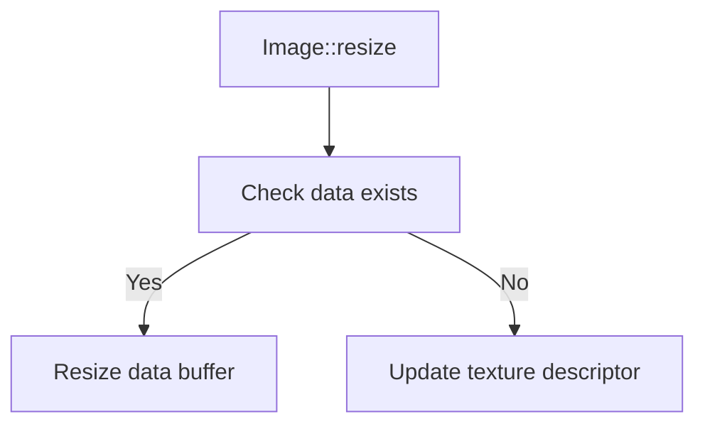

+++
title = "#19116 Remove warning from Image::resize"
date = "2025-05-26T00:00:00"
draft = false
template = "pull_request_page.html"
in_search_index = true

[taxonomies]
list_display = ["show"]

[extra]
current_language = "en"
available_languages = {"en" = { name = "English", url = "/pull_request/bevy/2025-05/pr-19116-en-20250526" }, "zh-cn" = { name = "中文", url = "/pull_request/bevy/2025-05/pr-19116-zh-cn-20250526" }}
labels = ["A-Rendering"]
+++

# Remove warning from Image::resize

## Basic Information
- **Title**: Remove warning from Image::resize
- **PR Link**: https://github.com/bevyengine/bevy/pull/19116
- **Author**: SpecificProtagonist
- **Status**: MERGED
- **Labels**: A-Rendering, S-Ready-For-Final-Review
- **Created**: 2025-05-07T15:12:17Z
- **Merged**: 2025-05-26T17:51:17Z
- **Merged By**: alice-i-cecile

## Description Translation
# Objective

`Image::resize` currently prints a warning when resizing an uninitialized `Image`, even though the resizing works correctly. For [code](https://github.com/bevyengine/bevy/blob/c92f14c9e7adc9f5fc02ec14b26589dd82f8b4eb/crates/bevy_ui/src/widget/viewport.rs#L175-L179) that doesn't care about whether the image is initialized CP-side, this is inconvenient and unnecessary.

## The Story of This Pull Request

The problem stemmed from a non-critical warning generated by `Image::resize` when operating on uninitialized images. While the resize operation itself functioned correctly, the warning created noise in scenarios where developers intentionally worked with uninitialized image buffers, particularly in UI rendering code.

The core issue resided in the `resize` method's warning logic:
```rust
if let Some(ref mut data) = self.data {
    data.resize(/* ... */);
} else {
    warn!("Resized an uninitialized image...");
}
```
This warning assumed uninitialized image resizing was always unintended, despite valid use cases where CPU-side data isn't required (e.g., GPU-managed textures).

The solution involved two key changes:
1. Removing the warning emission from the else block
2. Clarifying the method's documentation to emphasize it doesn't perform content scaling

Code changes were surgical:
```rust
// Before:
} else {
    warn!("Resized an uninitialized image...");
}

// After:
// (else block completely removed)
```
The documentation was updated from:
```rust
/// Does not properly resize the contents of the image, but only its internal `data` buffer.
```
To:
```rust
/// Does not properly scale the contents of the image.
```
This change maintains the method's core functionality while reducing false-positive warnings. The warning removal addresses developer experience concerns, while the doc clarification helps prevent misunderstandings about the method's capabilities.

## Visual Representation



## Key Files Changed

### `crates/bevy_image/src/image.rs` (+1/-4)
**Purpose:** Remove unnecessary warning and improve documentation clarity

Code changes:
```rust
// Removed warning import
-use tracing::warn;

// Updated doc comment
-    /// Does not properly resize the contents of the image, but only its internal `data` buffer.
+    /// Does not properly scale the contents of the image.

// Removed warning block
-        } else {
-            warn!("Resized an uninitialized image. Directly modify image.texture_descriptor.size instead");
-        }
```

These changes directly address the PR's goal by eliminating the problematic warning while maintaining the method's core resize functionality.

## Further Reading
- Bevy Asset System Documentation: https://bevyengine.org/learn/book/assets/
- WGPU Texture Management: https://docs.rs/wgpu/latest/wgpu/struct.Texture.html
- Bevy UI Viewport Implementation: [viewport.rs](https://github.com/bevyengine/bevy/blob/main/crates/bevy_ui/src/widget/viewport.rs)