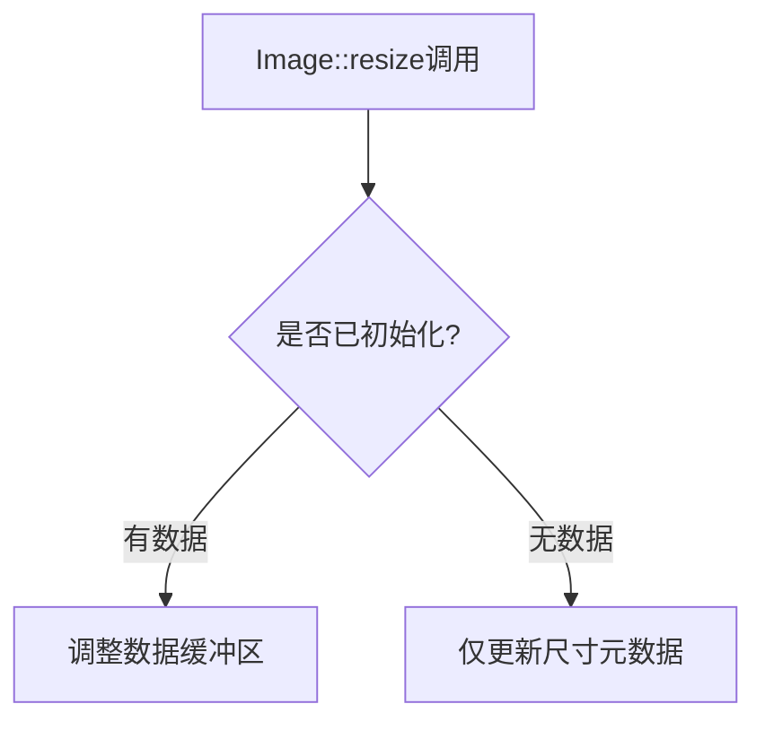

+++
title = "#19116 Remove warning from Image::resize"
date = "2025-05-26T00:00:00"
draft = false
template = "pull_request_page.html"
in_search_index = false

[extra]
current_language = "zh-cn"
available_languages = {"en" = { name = "English", url = "/pull_request/bevy/2025-05/pr-19116-en-20250526" }, "zh-cn" = { name = "中文", url = "/pull_request/bevy/2025-05/pr-19116-zh-cn-20250526" }}
labels = ["A-Rendering"]
+++

# Remove warning from Image::resize

## Basic Information
- **Title**: Remove warning from Image::resize
- **PR Link**: https://github.com/bevyengine/bevy/pull/19116
- **Author**: SpecificProtagonist
- **Status**: MERGED
- **Labels**: A-Rendering, S-Ready-For-Final-Review
- **Created**: 2025-05-07T15:12:17Z
- **Merged**: 2025-05-26T17:51:17Z
- **Merged By**: alice-i-cecile

## Description Translation
### 目标

`Image::resize` 当前在调整未初始化 `Image` 的大小时会打印警告，尽管调整操作本身可以正确执行。对于那些不关心图像是否在 CPU 端初始化的[代码](https://github.com/bevyengine/bevy/blob/c92f14c9e7adc9f5fc02ec14b26589dd82f8b4eb/crates/bevy_ui/src/widget/viewport.rs#L175-L179)来说，这个警告既不必要也不方便。

## The Story of This Pull Request

### 问题背景与上下文
在 Bevy 的 `Image` 类型中，`resize()` 方法存在一个设计矛盾。当开发者调整未初始化图像（没有 CPU 端数据）的尺寸时，系统会输出警告日志：

```rust
warn!("Resized an uninitialized image...");
```

然而实际使用场景中，有些代码（如 UI 视口处理）只需要修改图像的 GPU 端尺寸，并不需要维护 CPU 端数据。此时警告信息反而成为干扰，造成不必要的日志噪音。

### 解决方案与技术实现
PR 的核心修改分为两个部分：

1. **移除冗余警告**：直接删除触发警告的代码分支
2. **澄清文档注释**：将原注释中的"appending 0 to the data"修改为更准确的"Does not properly scale the contents"

关键代码修改如下：

```rust
// Before:
} else {
    warn!("Resized an uninitialized image...");
}

// After: 完全移除警告分支
```

同时更新方法注释：
```rust
// 修改前：
/// Does not properly resize the contents of the image, but only its internal `data` buffer

// 修改后：
/// Does not properly scale the contents of the image
```

### 技术考量与影响
这个修改体现了 API 设计中对"安静失败"（fail silently）模式的应用。原始警告虽然试图提醒开发者潜在问题，但：
- 对于明确不需要 CPU 数据的场景属于误报
- 没有提供实际的错误处理机制
- 可能干扰正常日志监控

修改后：
- 保持原有功能不变（仍支持带数据/不带数据的尺寸调整）
- 消除误报警告
- 文档更准确描述方法行为
- 减少不必要的性能开销（日志调用）

## Visual Representation



## Key Files Changed

### `crates/bevy_image/src/image.rs` (+1/-4)
1. **变更说明**：移除 `Image::resize` 方法中的冗余警告，优化文档注释
2. **关键代码对比**：
```rust
// 修改前：
pub fn resize(&mut self, size: Extent3d) {
    // ...
    } else {
        warn!("Resized an uninitialized image...");
    }
}

// 修改后：
pub fn resize(&mut self, size: Extent3d) {
    // ...
    // 移除警告分支
}
```
3. **关联性**：直接解决警告误报问题，保持 API 行为一致性

## Further Reading
1. [Bevy 图像处理架构文档](https://bevyengine.org/learn/book/next/assets/images/)
2. [Rust 日志最佳实践](https://github.com/rust-unofficial/patterns/blob/master/patterns/quiet-fail.md)
3. [wgpu 纹理管理指南](https://wgpu.rs/guide/textures/)