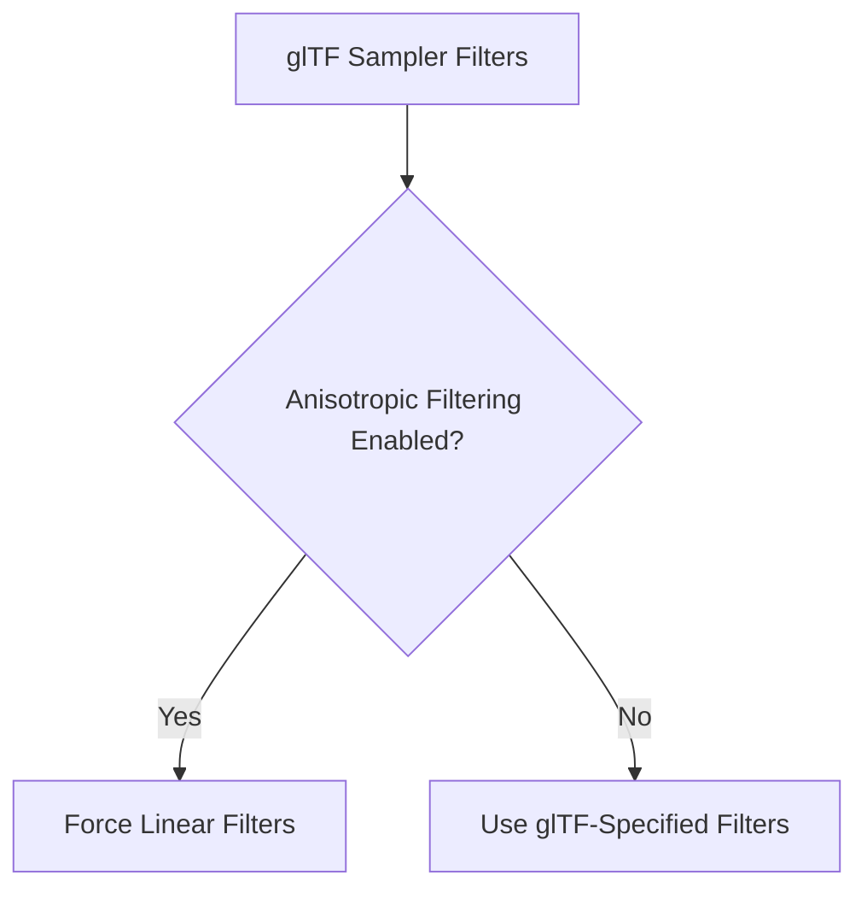

+++
title = "#19118 Fix glTF importer wrongly ignoring sampler filters"
date = "2025-05-26T00:00:00"
draft = false
template = "pull_request_page.html"
in_search_index = true

[taxonomies]
list_display = ["show"]

[extra]
current_language = "en"
available_languages = {"en" = { name = "English", url = "/pull_request/bevy/2025-05/pr-19118-en-20250526" }, "zh-cn" = { name = "中文", url = "/pull_request/bevy/2025-05/pr-19118-zh-cn-20250526" }}
labels = ["C-Bug", "D-Trivial", "A-glTF"]
+++

# Title

## Basic Information
- **Title**: Fix glTF importer wrongly ignoring sampler filters
- **PR Link**: https://github.com/bevyengine/bevy/pull/19118
- **Author**: greeble-dev
- **Status**: MERGED
- **Labels**: C-Bug, D-Trivial, S-Ready-For-Final-Review, A-glTF
- **Created**: 2025-05-07T18:08:40Z
- **Merged**: 2025-05-26T13:39:50Z
- **Merged By**: alice-i-cecile

## Description Translation
**Objective**

Fix #19114.

**Solution**

#17875 changed the glTF importer to make sure that sampler filters are linear when anisotropic filtering is enabled - this is required by `wgpu`. But the condition was mistakenly inverted, so it forces the filtering to linear when anisotropic filtering is _not_ enabled.

**Testing**

```
cargo run --example color_grading
cargo run --example testbed_3d
```

## The Story of This Pull Request

The PR addresses a regression in Bevy's glTF importer where texture sampler filters were incorrectly ignored when anisotropic filtering wasn't enabled. This bug (#19114) originated from a logical inversion in a conditional check introduced in PR #17875.

The core issue stemmed from conflicting requirements between glTF specifications and WebGPU's constraints. When using anisotropic filtering, WebGPU requires trilinear filtering (linear min/mag/mip filters), which means the engine must override any glTF-specified filters in this case. However, the original implementation inverted the conditional logic that determines when to apply this override.

The problem manifested in `texture_sampler` function within the glTF loader. The key conditional check:

```rust
if sampler.anisotropy_clamp != 1 {
```

incorrectly triggered filter overrides when anisotropic filtering *wasn't* active. This meant:
1. Valid glTF sampler filters were ignored in normal cases (anisotropic off)
2. The engine defaulted to linear filtering unnecessarily
3. Users saw unexpected texture filtering behavior

The solution involved flipping the conditional check to:

```rust
if sampler.anisotropy_clamp == 1 {
```

This correction ensures:
- Filter overrides only occur when anisotropic filtering *is* active (as required by WebGPU)
- glTF-specified filters are respected in standard cases
- Proper support for nearest-neighbor and other filter types

The implementation maintains backward compatibility while fixing the regression. Testing focused on verifying correct filter application through standard examples like `color_grading` and `testbed_3d`.

## Visual Representation



## Key Files Changed

**crates/bevy_gltf/src/loader/gltf_ext/texture.rs (+1/-1)**

This file contains the core logic for processing glTF texture samplers. The single-line change fixes the conditional check that determines when to override sampler filters.

Before:
```rust
if sampler.anisotropy_clamp != 1 {
```

After:
```rust
if sampler.anisotropy_clamp == 1 {
```

This change directly addresses the root cause by reversing the condition that controls filter override behavior. When anisotropic filtering is enabled (`anisotropy_clamp > 1`), the engine now correctly forces linear filtering as required by WebGPU, while preserving user-specified filters in other cases.

## Further Reading

1. WebGPU texture filtering requirements: https://www.w3.org/TR/webgpu/#texture-filtering
2. glTF sampler specification: https://registry.khronos.org/glTF/specs/2.0/glTF-2.0.html#samplers
3. Bevy texture handling documentation: https://bevyengine.org/learn/book/features/assets/textures

# Full Code Diff
```diff
diff --git a/crates/bevy_gltf/src/loader/gltf_ext/texture.rs b/crates/bevy_gltf/src/loader/gltf_ext/texture.rs
index f666752479bb6..0ea16936a6344 100644
--- a/crates/bevy_gltf/src/loader/gltf_ext/texture.rs
+++ b/crates/bevy_gltf/src/loader/gltf_ext/texture.rs
@@ -51,7 +51,7 @@ pub(crate) fn texture_sampler(
 
     // Shouldn't parse filters when anisotropic filtering is on, because trilinear is then required by wgpu.
     // We also trust user to have provided a valid sampler.
-    if sampler.anisotropy_clamp != 1 {
+    if sampler.anisotropy_clamp == 1 {
         if let Some(mag_filter) = gltf_sampler.mag_filter().map(|mf| match mf {
             MagFilter::Nearest => ImageFilterMode::Nearest,
             MagFilter::Linear => ImageFilterMode::Linear,
```