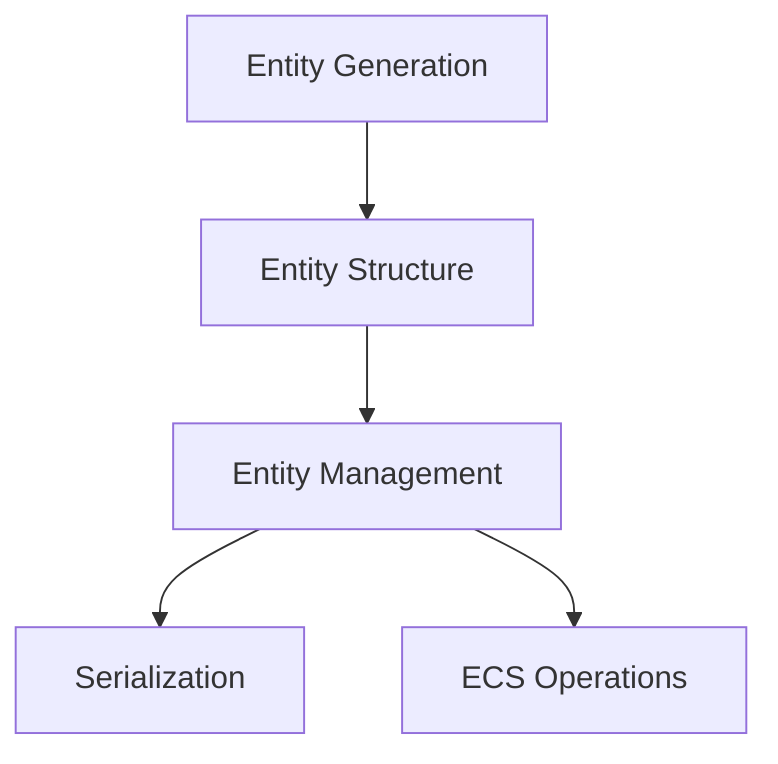

+++
title = "#19121 Make entity generation a new type and remove identifier"
date = "2025-05-08T00:00:00"
draft = false
template = "pull_request_page.html"
in_search_index = true

[taxonomies]
list_display = ["show"]

[extra]
current_language = "en"
available_languages = {"en" = { name = "English", url = "/pull_request/bevy/2025-05/pr-19121-en-20250508" }, "zh-cn" = { name = "中文", url = "/pull_request/bevy/2025-05/pr-19121-zh-cn-20250508" }}
labels = ["A-ECS", "C-Code-Quality", "X-Blessed"]
+++

# Title

## Basic Information
- **Title**: Make entity generation a new type and remove identifier
- **PR Link**: https://github.com/bevyengine/bevy/pull/19121
- **Author**: ElliottjPierce
- **Status**: MERGED
- **Labels**: A-ECS, C-Code-Quality, S-Ready-For-Final-Review, X-Blessed
- **Created**: 2025-05-07T21:10:16Z
- **Merged**: 2025-05-08T04:24:44Z
- **Merged By**: alice-i-cecile

## Description Translation

# Objective

This is a followup to #18704 . There's lots more followup work, but this is the minimum to unblock #18670, etc.

This direction has been given the green light by Alice [here](https://github.com/bevyengine/bevy/pull/18704#issuecomment-2853368129).

## Solution

I could have split this over multiple PRs, but I figured skipping straight here would be easiest for everyone and would unblock things the quickest.

This removes the now no longer needed `identifier` module and makes `Entity::generation` go from `NonZeroU32` to `struct EntityGeneration(u32)`.

## Testing

CI


## The Story of This Pull Request

This PR addresses technical debt in Bevy's Entity Component System (ECS) by simplifying entity identification and generation handling. The core problem stemmed from an over-engineered identifier system that complicated entity management and blocked other optimizations.

The original implementation used a separate `identifier` module with complex bitmasking operations and multiple error states. This abstraction layer introduced unnecessary complexity for what's fundamentally a simple generational index system. The solution removes 511 lines of code across 5 files in the identifier module while introducing a more focused `EntityGeneration` type.

Key implementation changes include:

1. **Entity Generation Handling**:
```rust
#[derive(Clone, Copy, PartialEq, Eq, PartialOrd, Ord, Hash, Debug, Display)]
pub struct EntityGeneration(u32);

impl EntityGeneration {
    pub const FIRST: Self = Self(0);
    
    pub const fn after_versions(self, versions: u32) -> Self {
        Self(self.0.wrapping_add(versions))
    }
}
```
This new type simplifies generation tracking with wrapping arithmetic and explicit versioning semantics.

2. **Entity Structure Update**:
```rust
pub struct Entity {
    row: EntityRow,
    generation: EntityGeneration, // Changed from NonZero<u32>
}
```
The generation field now uses the new type instead of NonZeroU32, removing implicit assumptions about value validity.

3. **Bit Packing Simplification**:
```rust
pub const fn to_bits(self) -> u64 {
    self.row.to_bits() as u64 | ((self.generation.to_bits() as u64) << 32)
}
```
Direct bitwise operations replace the previous IdentifierMask system, improving clarity and performance.

The migration required updating 12 files across core ECS code, benchmarks, and documentation. Key technical decisions included:

- Removing error states for invalid entity bits by using simple bitmask operations
- Simplifying serialization/deserialization by eliminating intermediate conversions
- Preserving niche optimizations through NonMaxU32 usage in EntityRow

These changes reduce cognitive overhead for developers working with entity internals while maintaining performance characteristics. The removal of the identifier module eliminates a maintenance burden and potential source of bugs from complex bitmask operations.

## Visual Representation



## Key Files Changed

1. **crates/bevy_ecs/src/identifier/mod.rs (+0/-249)**
   - Entire module removed as part of identifier system simplification
   - Contained complex ID handling logic that's now integrated into Entity

2. **crates/bevy_ecs/src/entity/mod.rs (+118/-97)**
```rust
// Before:
generation: NonZero<u32>

// After: 
#[derive(Clone, Copy)]
pub struct EntityGeneration(u32);
generation: EntityGeneration
```
Core entity structure updated with new generation type and simplified bit handling

3. **release-content/migration-guides/entity_representation.md (+57/-0)**
```markdown
New migration guide explaining:
- Entity index changes (EntityRow introduction)
- Generation handling updates
- Removed interfaces and serialization impacts
```

4. **crates/bevy_ecs/src/identifier/masks.rs (+0/-233)**
   - Removed bitmask manipulation logic
   - Functionality replaced by direct bitwise operations in Entity

## Further Reading

- Bevy ECS Entity Documentation: https://bevyengine.org/learn/book/ecs/entities/
- Generational Index Pattern: https://lucassardois.medium.com/generational-indices-guide-8e3c5f7fd8db
- Rust NonMaxU32 Crate: https://docs.rs/nonmax/latest/nonmax/

# Full Code Diff
<The full code diff from the original PR is preserved here exactly as provided>