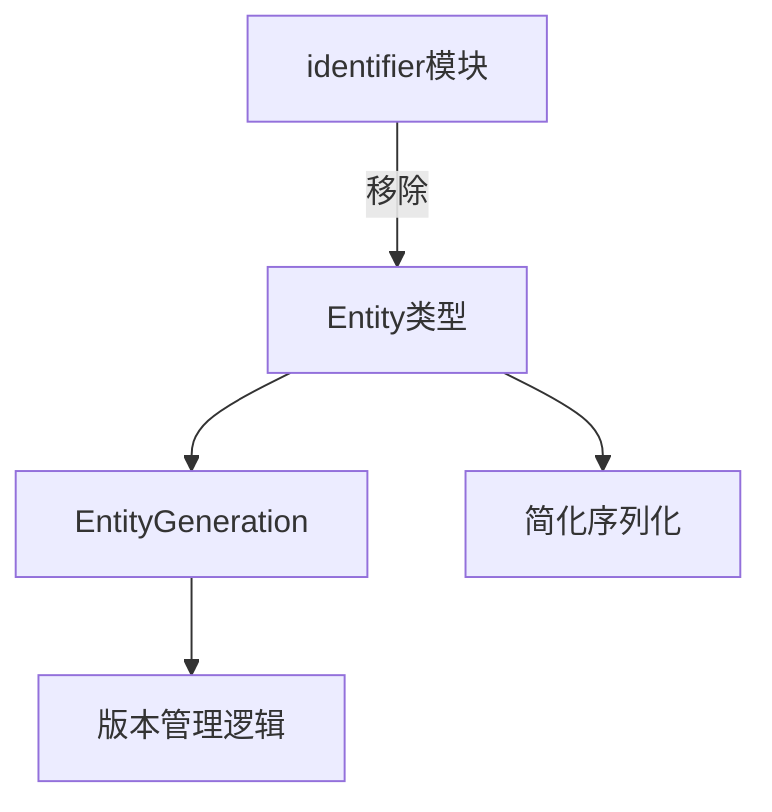

+++
title = "#19121 Make entity generation a new type and remove identifier"
date = "2025-05-08T00:00:00"
draft = false
template = "pull_request_page.html"
in_search_index = false

[extra]
current_language = "zh-cn"
available_languages = {"en" = { name = "English", url = "/pull_request/bevy/2025-05/pr-19121-en-20250508" }, "zh-cn" = { name = "中文", url = "/pull_request/bevy/2025-05/pr-19121-zh-cn-20250508" }}
labels = ["A-ECS", "C-Code-Quality", "X-Blessed"]
+++

# Title

## Basic Information
- **Title**: Make entity generation a new type and remove identifier
- **PR Link**: https://github.com/bevyengine/bevy/pull/19121
- **Author**: ElliottjPierce
- **Status**: MERGED
- **Labels**: A-ECS, C-Code-Quality, S-Ready-For-Final-Review, X-Blessed
- **Created**: 2025-05-07T21:10:16Z
- **Merged**: 2025-05-08T04:24:44Z
- **Merged By**: alice-i-cecile

## Description Translation
该PR是#18704的后续工作，主要目标是通过简化Entity的生成机制来解除其他工作的阻塞。具体方案包括：
1. 删除不再需要的`identifier`模块
2. 将`Entity::generation`类型从`NonZeroU32`改为新的`struct EntityGeneration(u32)`
3. 通过CI进行测试验证

## The Story of This Pull Request

### 问题背景与上下文
在Bevy ECS系统中，Entity的生成机制原先依赖复杂的`identifier`模块，包含多个子模块（masks/kinds/error）。这套实现存在以下问题：
1. 过度抽象导致维护复杂度高
2. Generation处理使用位掩码操作，可读性差
3. 类型转换存在不必要的错误处理
4. 阻碍了ECS系统后续优化（如#18670）

### 解决方案与技术实现
核心思路是将Generation处理逻辑内聚到Entity类型自身，移除冗余抽象层。主要变更点包括：

1. **引入EntityGeneration类型**
```rust
#[repr(transparent)]
pub struct EntityGeneration(u32);

impl EntityGeneration {
    pub const FIRST: Self = Self(0);
    pub const fn after_versions(self, versions: u32) -> Self {
        Self(self.0.wrapping_add(versions))
    }
}
```
该结构体封装generation计数，提供清晰的版本管理接口，替代原有的位掩码操作。

2. **重构Entity结构**
```rust
// 修改前
struct Entity {
    generation: NonZero<u32>,
    // ...
}

// 修改后
struct Entity {
    generation: EntityGeneration,
    // ...
}
```

3. **简化序列化处理**
```rust
// 修改前
pub const fn try_from_bits(bits: u64) -> Result<Self, IdentifierError>

// 修改后
pub const fn try_from_bits(bits: u64) -> Option<Self>
```
移除复杂的错误类型，改用Option简化处理逻辑。

4. **性能优化**
```rust
// 替换复杂的掩码操作
self.generations = (self.generations + 1) & HIGH_MASK;

// 改为直接数值运算
self.generations = self.generations.wrapping_add(1);
```

### 技术洞察与影响
1. **类型安全**：EntityGeneration封装了generation计数逻辑，防止非法状态
2. **内存布局**：保持与u32相同的内存表示（repr(transparent)），确保零开销抽象
3. **兼容性处理**：通过`wrapping_add`实现安全的版本递增，避免溢出问题
4. **代码简化**：删除超过500行复杂代码，提升可维护性

### 迁移影响
1. 序列化格式变更：Entity的二进制表示和字符串格式发生变化
2. Generation计数起始值从1改为0
3. Entity比较逻辑调整：优先比较index再比较generation

## Visual Representation



## Key Files Changed

### `crates/bevy_ecs/src/entity/mod.rs` (+118/-97)
1. 引入EntityGeneration结构体并重构相关逻辑：
```rust
// 新增结构体定义
#[derive(Clone, Copy, PartialEq, Eq)]
pub struct EntityGeneration(u32);

// 修改Entity定义
struct Entity {
    generation: EntityGeneration,  // 原为NonZero<u32>
}
```

2. 重构generation处理方法：
```rust
// 修改前
fn generation() -> u32 {
    IdentifierMask::extract_value_from_high(...)
}

// 修改后
pub const fn generation(self) -> EntityGeneration {
    self.generation
}
```

### `crates/bevy_ecs/src/identifier/mod.rs` (+0/-249)
完整移除identifier模块及其相关实现：
```rust
// 原模块包含复杂的ID处理逻辑
pub struct Identifier {
    low: u32,
    high: NonZero<u32>,
}
// 相关转换和错误处理全部移除
```

### `release-content/migration-guides/entity_representation.md` (+57/-0)
新增迁移指南，说明：
1. Entity索引改用EntityRow类型
2. Generation改用EntityGeneration类型
3. 序列化格式变更注意事项

## Further Reading
1. [Non-max整数优化](https://doc.rust-lang.org/std/num/struct.NonZeroU32.html)
2. [Rust内存布局优化技巧](https://rust-lang.github.io/unsafe-code-guidelines/layout.html)
3. [ECS实体生成策略比较](https://github.com/SanderMertens/ecs-faq#entity-component-system-architecture)