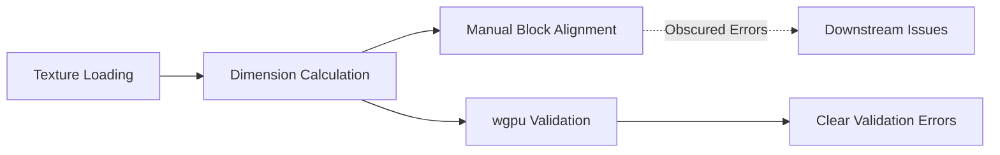

+++
title = "#19129 Provide physical dimensions to wgpu `Device::create_texture_with_data`"
date = "2025-05-26T00:00:00"
draft = false
template = "pull_request_page.html"
in_search_index = true

[taxonomies]
list_display = ["show"]

[extra]
current_language = "en"
available_languages = {"en" = { name = "English", url = "/pull_request/bevy/2025-05/pr-19129-en-20250526" }, "zh-cn" = { name = "中文", url = "/pull_request/bevy/2025-05/pr-19129-zh-cn-20250526" }}
labels = ["A-Rendering", "C-Usability", "D-Straightforward"]
+++

# Title: Provide physical dimensions to wgpu `Device::create_texture_with_data`

## Basic Information
- **Title**: Provide physical dimensions to wgpu `Device::create_texture_with_data`
- **PR Link**: https://github.com/bevyengine/bevy/pull/19129
- **Author**: atlv24
- **Status**: MERGED
- **Labels**: A-Rendering, C-Usability, S-Ready-For-Final-Review, D-Straightforward
- **Created**: 2025-05-08T08:02:21Z
- **Merged**: 2025-05-26T17:58:30Z
- **Merged By**: alice-i-cecile

## Description Translation
# Objective

- Make errors in #19124 #13289 clearer, and opt for option 1. of https://github.com/gfx-rs/wgpu/issues/7677

## Solution

Remove the round to block size `.physical_size(texture_format);`

Error message now becomes much clearer:
```
thread 'Compute Task Pool (5)' panicked at E:\r\wgpu\wgpu\src\backend\wgpu_core.rs:1423:26:
wgpu error: Validation Error

Caused by:
  In Device::create_texture
    Width 2050 is not a multiple of Bc7RgbaUnormSrgb's block width (4)
```

## Testing

- Tested using the repro in #19124

## The Story of This Pull Request

The PR addresses a persistent issue in texture handling where validation errors provided unclear diagnostics when creating textures with incompatible dimensions. The root problem stemmed from how texture dimensions were being adjusted to match format-specific block sizes before being passed to wgpu, which hid validation checks that could provide more direct feedback.

Previously, the code used `.physical_size(texture_format)` to round texture dimensions to the nearest multiple of the texture format's block size. While this avoided immediate validation errors, it created two problems:
1. Masked the actual validation checks that could catch dimension mismatches earlier
2. Produced confusing error messages downstream when misaligned dimensions caused issues

The key insight came from wgpu's validation layer, which performs block size alignment checks internally. By removing the manual rounding and passing logical dimensions directly, we expose these validation checks earlier in the process. This results in more specific error messages that directly identify the dimension/block size mismatch.

The implementation change was straightforward but impactful:
```rust
// Before: Manual alignment
image.texture_descriptor.size = Extent3d { ... }.physical_size(texture_format);

// After: Pass logical dimensions directly
image.texture_descriptor.size = Extent3d { ... };
```
This change shifts responsibility for dimension validation to wgpu's internal checks, aligning with the API's intended use. The accompanying code comment clarifies this decision:
```rust
// Note: we must give wgpu the logical texture dimensions...
// However this currently causes wgpu to panic if the dimensions arent a multiple of blocksize
```

The trade-off is explicit: developers must now ensure proper dimension alignment upfront, but gain clearer error messages when requirements aren't met. This improves debugging efficiency, as shown in the updated error message:
```
Width 2050 is not a multiple of Bc7RgbaUnormSrgb's block width (4)
```

## Visual Representation



## Key Files Changed

**File: crates/bevy_image/src/ktx2.rs** (+4/-2)
1. Removed physical size conversion to surface validation errors earlier
2. Added documentation explaining the validation trade-off

Key code change:
```rust
// Before:
image.texture_descriptor.size = Extent3d {
    // dimension fields
}.physical_size(texture_format);

// After:
image.texture_descriptor.size = Extent3d {
    // dimension fields (unchanged)
};
```

## Further Reading
1. [wgpu texture validation documentation](https://docs.rs/wgpu/latest/wgpu/struct.TextureDescriptor.html)
2. [Block compression formats explained](https://github.com/gfx-rs/wgpu/wiki/Texture-Block-Sizes)
3. [Original wgpu issue #7677](https://github.com/gfx-rs/wgpu/issues/7677)

# Full Code Diff
```diff
diff --git a/crates/bevy_image/src/ktx2.rs b/crates/bevy_image/src/ktx2.rs
index 0cccbacb072c3..c86e32ef525e1 100644
--- a/crates/bevy_image/src/ktx2.rs
+++ b/crates/bevy_image/src/ktx2.rs
@@ -267,6 +267,9 @@ pub fn ktx2_buffer_to_image(
     let mut image = Image::default();
     image.texture_descriptor.format = texture_format;
     image.data = Some(wgpu_data.into_iter().flatten().collect::<Vec<_>>());
+    // Note: we must give wgpu the logical texture dimensions, so it can correctly compute mip sizes.
+    // However this currently causes wgpu to panic if the dimensions arent a multiple of blocksize.
+    // See https://github.com/gfx-rs/wgpu/issues/7677 for more context.
     image.texture_descriptor.size = Extent3d {
         width,
         height,
@@ -276,8 +279,7 @@ pub fn ktx2_buffer_to_image(
             depth
         }
         .max(1),
-    }
-    .physical_size(texture_format);
+    };
     image.texture_descriptor.mip_level_count = level_count;
     image.texture_descriptor.dimension = if depth > 1 {
         TextureDimension::D3
```