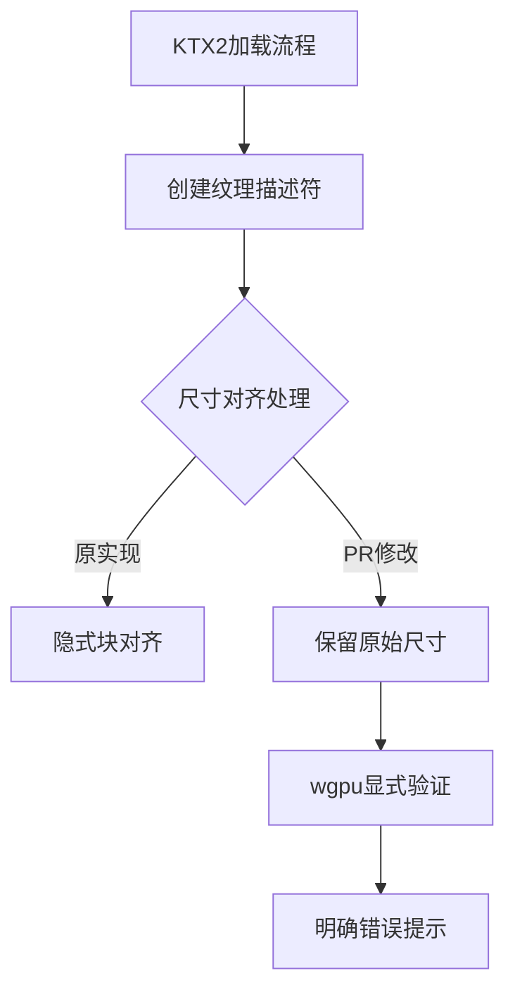

+++
title = "#19129 Provide physical dimensions to wgpu `Device::create_texture_with_data`"
date = "2025-05-26T00:00:00"
draft = false
template = "pull_request_page.html"
in_search_index = false

[extra]
current_language = "zh-cn"
available_languages = {"en" = { name = "English", url = "/pull_request/bevy/2025-05/pr-19129-en-20250526" }, "zh-cn" = { name = "中文", url = "/pull_request/bevy/2025-05/pr-19129-zh-cn-20250526" }}
labels = ["A-Rendering", "C-Usability", "D-Straightforward"]
+++

# Title

## Basic Information
- **Title**: Provide physical dimensions to wgpu `Device::create_texture_with_data`
- **PR Link**: https://github.com/bevyengine/bevy/pull/19129
- **Author**: atlv24
- **Status**: MERGED
- **Labels**: A-Rendering, C-Usability, S-Ready-For-Final-Review, D-Straightforward
- **Created**: 2025-05-08T08:02:21Z
- **Merged**: 2025-05-26T17:58:30Z
- **Merged By**: alice-i-cecile

## Description Translation
该PR旨在解决wgpu纹理创建时的错误信息模糊问题，选择实现wgpu#7677中的方案1。通过移除对纹理尺寸的块大小对齐操作，使验证错误直接暴露原始尺寸问题。修改后错误信息明确提示纹理宽度与格式块大小的不匹配问题，如：
```
Width 2050 is not a multiple of Bc7RgbaUnormSrgb's block width (4)
```

## The Story of This Pull Request

### 问题背景与挑战
在Bevy引擎处理KTX2纹理时，当开发者传入不符合压缩格式块大小要求的纹理尺寸时，错误信息缺乏明确指导。原始实现通过`physical_size()`方法自动对齐尺寸到块大小，这种隐式转换虽然避免了立即panic，但导致两个问题：

1. 掩盖了原始数据尺寸不匹配的根本问题
2. 产生的错误信息指向深层调用栈而非实际尺寸问题（如#19124和#13289中的报告）

### 解决方案选择
面对wgpu#7677中提出的两种解决方案：
1. 要求应用层传入原始逻辑尺寸
2. 在wgpu内部自动对齐尺寸

团队选择方案1，主要基于：
- 保持API的显式性
- 尽早暴露数据规范问题
- 获得更准确的错误定位

### 实现细节
核心修改位于`ktx2.rs`文件的纹理尺寸计算逻辑：

```rust
// 修改前：
image.texture_descriptor.size = Extent3d { ... }.physical_size(texture_format);

// 修改后：
image.texture_descriptor.size = Extent3d { ... };
```

新增的代码注释明确解释：
```rust
// 必须给wgpu传递逻辑尺寸以正确计算mip层级
// 当前会导致尺寸非块大小倍数时panic
// 详见wgpu#7677
```

### 技术权衡与影响
关键决策点在于错误处理策略的转变：
- **之前**：隐式尺寸转换 → 延迟错误暴露 → 调试困难
- **之后**：显式原始尺寸 → 立即panic → 明确错误信息

典型错误信息改进示例：
```
// 修改前：
thread panicked at wgpu_core.rs:1423:26: validation error

// 修改后：
Width 2050 is not a multiple of Bc7RgbaUnormSrgb's block width (4)
```

### 后续影响
该修改：
1. 提升开发者调试效率：直接指出尺寸规范问题
2. 保持API行为一致性：不再隐式修改输入参数
3. 为未来wgpu版本更新奠定基础（相关issue正在跟踪）

## Visual Representation



## Key Files Changed

### `crates/bevy_image/src/ktx2.rs` (+4/-2)
**修改说明**：调整纹理尺寸处理逻辑，移除自动块对齐

**代码对比**：
```rust
// Before:
image.texture_descriptor.size = Extent3d {
    // 尺寸计算...
}.physical_size(texture_format);

// After:
image.texture_descriptor.size = Extent3d {
    // 直接使用原始尺寸
    width,
    height,
    depth_or_array_layers: depth.max(1),
};
```

**关联性**：这是实现策略转换的核心修改点，直接影响纹理创建时的尺寸验证流程

## Further Reading
1. [wgpu纹理验证规范](https://gpuweb.github.io/gpuweb/#texture-creation)
2. [KTX2格式规范](https://github.khronos.org/KTX-Specification/)
3. [Bevy纹理处理架构](https://bevyengine.org/learn/book/features/assets/images/)