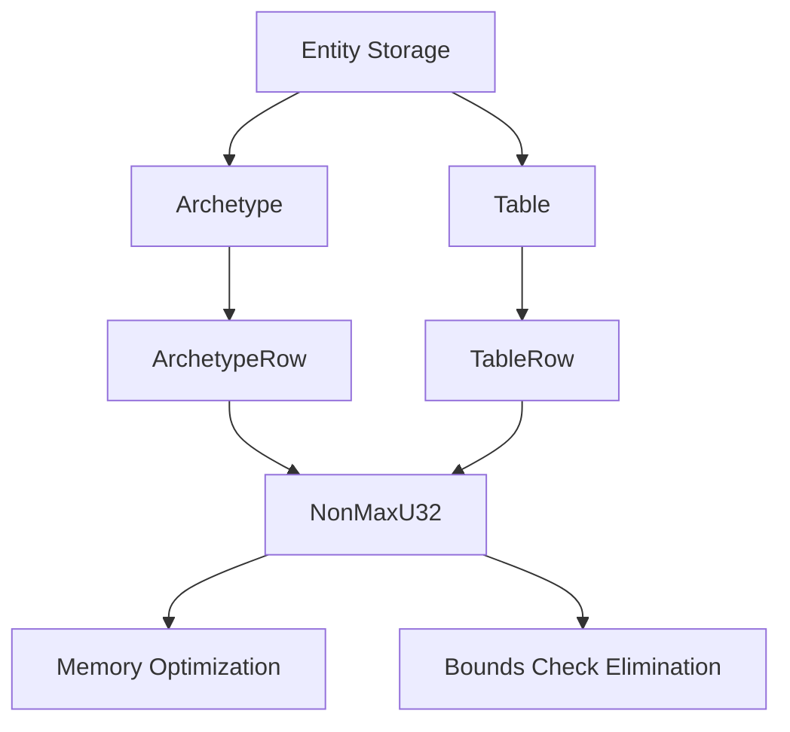

+++
title = "#19132 Nonmax all rows"
date = "2025-05-26T00:00:00"
draft = false
template = "pull_request_page.html"
in_search_index = true

[taxonomies]
list_display = ["show"]

[extra]
current_language = "en"
available_languages = {"en" = { name = "English", url = "/pull_request/bevy/2025-05/pr-19132-en-20250526" }, "zh-cn" = { name = "中文", url = "/pull_request/bevy/2025-05/pr-19132-zh-cn-20250526" }}
labels = ["A-ECS", "C-Performance", "C-Code-Quality"]
+++

# Title

## Basic Information
- **Title**: Nonmax all rows
- **PR Link**: https://github.com/bevyengine/bevy/pull/19132
- **Author**: ElliottjPierce
- **Status**: MERGED
- **Labels**: A-ECS, C-Performance, C-Code-Quality, S-Ready-For-Final-Review, M-Needs-Migration-Guide
- **Created**: 2025-05-08T20:58:13Z
- **Merged**: 2025-05-26T17:58:30Z
- **Merged By**: alice-i-cecile

## Description Translation

# Objective

Since #18704  is done, we can track the length of unique entity row collections with only a `u32` and identify an index within that collection with only a `NonMaxU32`. This leaves an opportunity for performance improvements.

## Solution

- Use `EntityRow` in sparse sets.
- Change table, entity, and query lengths to be `u32` instead of `usize`.
- Keep `batching` module `usize` based since that is reused for events, which may exceed `u32::MAX`.
- Change according `Range<usize>` to `Range<u32>`. This is more efficient and helps justify safety.
- Change `ArchetypeRow` and `TableRow` to wrap `NonMaxU32` instead of `u32`.

Justifying `NonMaxU32::new_unchecked` everywhere is predicated on this safety comment in `Entities::set`: "`location` must be valid for the entity at `index` or immediately made valid afterwards before handing control to unknown code." This ensures no entity is in two table rows for example. That fact is used to argue uniqueness of the entity rows in each table, archetype, sparse set, query, etc. So if there's no duplicates, and a maximum total entities of `u32::MAX` none of the corresponding row ids / indexes can exceed `NonMaxU32`.

## Testing

CI


## The Story of This Pull Request

This PR addresses performance and memory efficiency in Bevy's ECS by optimizing how entity storage indices are handled. The core insight builds on prior work (#18704) that established entity indices as NonMaxU32 values. The changes focus on three main areas: type size reduction, index validity guarantees, and iterator optimizations.

The problem stemmed from using usize for entity counts and indices, which wastes memory on 64-bit systems and prevents niche optimizations. Since entity counts are inherently bounded by u32::MAX due to prior architectural decisions, converting lengths and indices to u32-based types reduces memory usage and improves cache efficiency.

The solution introduces NonMaxU32 wrappers for ArchetypeRow and TableRow, replacing direct u32 storage. This allows using enum niche optimizations (since these indices can never be u32::MAX). The implementation required:

1. Converting length tracking from usize to u32 in archetypes and tables
2. Replacing usize ranges with u32 ranges in iteration logic
3. Updating sparse set storage to use EntityRow (NonMaxU32) indices
4. Modifying query iterators to work with u32-based indices

Key technical decisions included maintaining usize in the batching module to handle potential event counts exceeding u32 limits, and justifying unsafe NonMaxU32 conversions through ECS invariants about unique entity storage locations.

The changes propagate through multiple subsystems:
- Archetype and table methods now return u32 lengths
- Query iteration uses u32 ranges for batch processing
- Sparse sets store entity indices as EntityRow (NonMaxU32)
- All row index types (TableRow/ArchetypeRow) enforce NonMaxU32 constraints

Performance improvements come from:
1. Reduced memory footprint for index storage
2. Better cache utilization through smaller data types
3. Elimination of bounds checks through type invariants
4. More efficient iterator implementations

The migration required updating code that interacted with entity indices or lengths, particularly where usize assumptions existed. The PR maintains safety through careful use of unsafe blocks justified by ECS invariants about entity storage uniqueness.

## Visual Representation



## Key Files Changed

### `crates/bevy_ecs/src/archetype.rs`
1. Changed ArchetypeRow to wrap NonMaxU32
2. Added entities_with_location iterator
3. Converted len() from usize to u32

```rust
// Before:
pub struct ArchetypeRow(u32);
pub fn len(&self) -> usize { self.entities.len() }

// After: 
pub struct ArchetypeRow(NonMaxU32);
pub fn len(&self) -> u32 { self.entities.len() as u32 }
```

### `crates/bevy_ecs/src/storage/table/mod.rs`
1. Updated TableRow to use NonMaxU32
2. Changed entity_count() to return u32
3. Modified row allocation logic

```rust
// Before:
pub struct TableRow(u32);
pub fn entity_count(&self) -> usize { self.entities.len() }

// After:
pub struct TableRow(NonMaxU32);
pub fn entity_count(&self) -> u32 { self.entities.len() as u32 }
```

### `crates/bevy_ecs/src/storage/sparse_set.rs`
1. Replaced EntityIndex with EntityRow
2. Updated sparse storage logic

```rust
// Before:
entities: Vec<EntityIndex>
sparse: SparseArray<EntityIndex, TableRow>

// After:
entities: Vec<EntityRow>
sparse: SparseArray<EntityRow, TableRow>
```

### `crates/bevy_ecs/src/query/iter.rs`
1. Converted iteration ranges to u32
2. Updated cursor logic

```rust
// Before:
rows: Range<usize>
current_row: usize

// After: 
rows: Range<u32>
current_row: u32
```

## Further Reading
- [Nonmax crate documentation](https://docs.rs/nonmax/latest/nonmax/)
- [Rust niche optimizations](https://rust-lang.github.io/unsafe-code-guidelines/layout/enums.html#discriminant-elision-on-option-like-enums)
- [ECS storage internals](https://bevyengine.org/learn/book/implementation-notes/ecs-internals/)