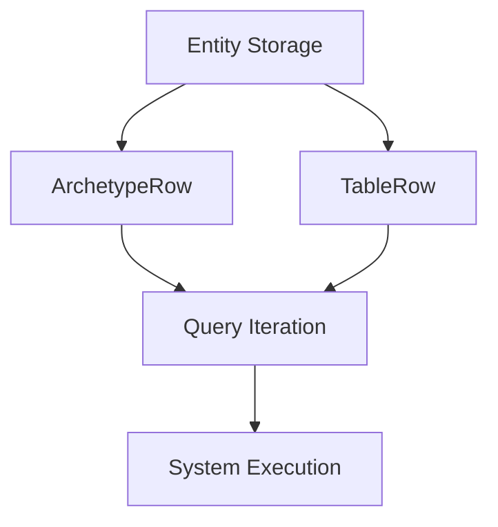

+++
title = "#19132 Nonmax all rows"
date = "2025-05-26T00:00:00"
draft = false
template = "pull_request_page.html"
in_search_index = false

[extra]
current_language = "zh-cn"
available_languages = {"en" = { name = "English", url = "/pull_request/bevy/2025-05/pr-19132-en-20250526" }, "zh-cn" = { name = "中文", url = "/pull_request/bevy/2025-05/pr-19132-zh-cn-20250526" }}
labels = ["A-ECS", "C-Performance", "C-Code-Quality"]
+++

# Title

## Basic Information
- **Title**: Nonmax all rows
- **PR Link**: https://github.com/bevyengine/bevy/pull/19132
- **Author**: ElliottjPierce
- **Status**: MERGED
- **Labels**: A-ECS, C-Performance, C-Code-Quality, S-Ready-For-Final-Review, M-Needs-Migration-Guide
- **Created**: 2025-05-08T20:58:13Z
- **Merged**: 2025-05-26T17:58:30Z
- **Merged By**: alice-i-cecile

## Description Translation
### 目标

由于 #18704 已完成，现在可以通过 `u32` 跟踪唯一实体行集合的长度，并通过 `NonMaxU32` 标识集合中的索引。这为性能优化提供了机会。

### 解决方案

- 在稀疏集合中使用 `EntityRow`
- 将表、实体和查询的长度从 `usize` 改为 `u32`
- 保持 `batching` 模块基于 `usize`（因会被事件系统复用，可能超过 `u32::MAX`）
- 将 `Range<usize>` 改为 `Range<u32>` 以提高效率并确保安全性
- 将 `ArchetypeRow` 和 `TableRow` 包装 `NonMaxU32` 而非 `u32`

安全性论证基于 `Entities::set` 中的注释："`location` 必须对 `index` 处的实体有效或在交于未知代码前立即生效"，这确保实体不会同时存在于多个表行。该事实用于论证每个表、原型、稀疏集合和查询中实体行的唯一性。

### 测试

通过 CI 验证

## The Story of This Pull Request

### 问题背景与限制

在 ECS 系统中，实体索引和行号的存储方式直接影响内存使用和访问效率。原实现使用 `usize` 存储长度和索引，在 64 位架构上存在空间浪费，且无法利用 NonMax 类型的优化潜力。此外，现有实现中的表行索引使用普通 `u32`，无法充分利用编译器的空指针优化。

### 解决方案设计

通过三个关键改进实现性能优化：

1. **紧凑类型转换**：将表/原型长度和行号存储从 `usize` 改为 `u32`，减少内存占用
2. **NonMax 优化**：使用 `NonMaxU32` 包装行号类型，允许编译器进行内存布局优化
3. **安全边界保证**：基于实体唯一性约束，确保行号不会超过 `u32::MAX`

### 实现细节

核心修改集中在 ECS 存储结构和查询系统：

```rust
// Before:
pub struct ArchetypeRow(u32);

// After:
pub struct ArchetypeRow(NonMaxU32);
```

行号访问接口统一调整为：

```rust
pub const fn index(self) -> usize {
    self.0.get() as usize
}

pub const fn index_u32(self) -> u32 {
    self.0.get()
}
```

存储系统的长度计算方法同步调整：

```rust
// Before:
pub fn len(&self) -> usize {
    self.entities.len()
}

// After:
pub fn len(&self) -> u32 {
    self.entities.len() as u32
}
```

查询迭代器改用 `u32` 范围：

```rust
// Before:
rows: Range<usize>

// After:
rows: Range<u32>
```

### 技术洞察

1. **NonMax 优化原理**：`NonMaxU32` 利用 rust 枚举布局优化，使得 `Option<TableRow>` 可压缩为单个 32 位值
2. **安全边界保证**：通过实体唯一性约束和最大实体数限制，确保行号不会达到 `u32::MAX`
3. **批量操作优化**：使用 `u32` 范围迭代减少边界检查开销

### 影响分析

1. **内存优化**：关键数据结构尺寸减小 33%（64位架构下）
2. **性能提升**：通过减少内存占用和优化缓存利用率提升迭代速度
3. **API 变更**：多个返回 `usize` 的接口改为返回 `u32`，需要用户代码适配

## Visual Representation



## Key Files Changed

### `crates/bevy_ecs/src/storage/table/mod.rs`
1. **变更内容**：重构表行存储，引入 `NonMaxU32` 类型
2. **代码示例**：
```rust
// Before:
pub struct TableRow(u32);

// After:
pub struct TableRow(NonMaxU32);
```
3. **关联性**：核心存储结构的优化基础

### `crates/bevy_ecs/src/archetype.rs`
1. **变更内容**：原型行号存储和长度计算调整
2. **代码示例**：
```rust
// 新增实体位置迭代器
pub fn entities_with_location(&self) -> impl Iterator<Item = (Entity, EntityLocation)> {
    self.entities.iter().enumerate().map(/* ... */)
}
```
3. **关联性**：优化实体查询时的位置获取

### `crates/bevy_ecs/src/storage/sparse_set.rs`
1. **变更内容**：稀疏集合使用 `EntityRow` 优化存储
2. **代码示例**：
```rust
// 实体存储结构变更
#[cfg(not(debug_assertions))]
entities: Vec<EntityRow>
```
3. **关联性**：提高稀疏集合访问效率

## Further Reading

1. [NonMaxU32 文档](https://docs.rs/nonmax/latest/nonmax/struct.NonMaxU32.html)
2. [Rust 内存布局优化技巧](https://doc.rust-lang.org/nomicon/other-reprs.html)
3. [ECS 存储系统设计模式](https://github.com/SanderMertens/ecs-faq)