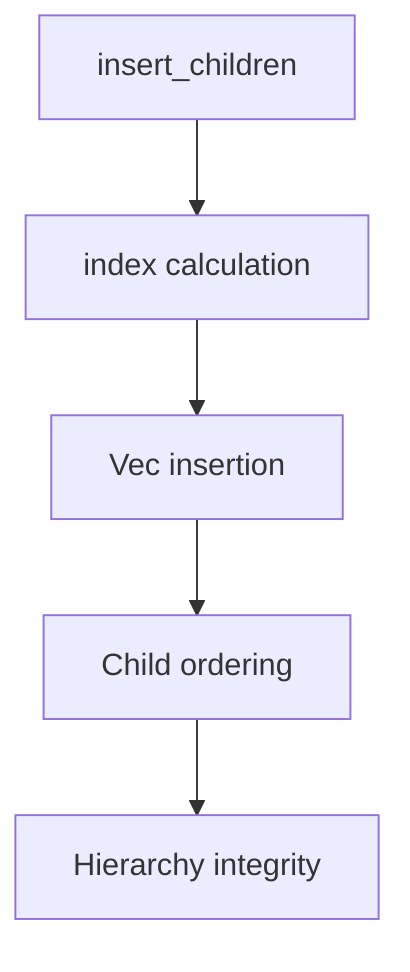

+++
title = "#19134 fix `.insert_related` index bound"
date = "2025-05-10T00:00:00"
draft = false
template = "pull_request_page.html"
in_search_index = true

[taxonomies]
list_display = ["show"]

[extra]
current_language = "en"
available_languages = {"en" = { name = "English", url = "/pull_request/bevy/2025-05/pr-19134-en-20250510" }, "zh-cn" = { name = "中文", url = "/pull_request/bevy/2025-05/pr-19134-zh-cn-20250510" }}
labels = ["C-Bug", "A-ECS", "D-Straightforward"]
+++

# Title: fix `.insert_related` index bound

## Basic Information
- **Title**: fix `.insert_related` index bound
- **PR Link**: https://github.com/bevyengine/bevy/pull/19134
- **Author**: databasedav
- **Status**: MERGED
- **Labels**: C-Bug, A-ECS, S-Ready-For-Final-Review, D-Straightforward
- **Created**: 2025-05-09T00:54:07Z
- **Merged**: 2025-05-09T17:31:37Z
- **Merged By**: alice-i-cecile

## Description Translation
# Objective

resolves #19092

## Solution

- remove the `.saturating_sub` from the index transformation
- add `.saturating_add` to the internal offset calculation

## Testing

- added regression test, confirming 0 index order + testing max bound

## The Story of This Pull Request

The PR addresses an index boundary issue in Bevy's ECS hierarchy management when inserting multiple child entities. The root cause was found in two locations where index calculations used incorrect saturation logic, potentially leading to off-by-one errors when inserting entities at collection boundaries.

In `relationship_source_collection.rs`, the original code capped insertion indices at `len().saturating_sub(1)` when reorganizing entities. This prevented valid insertions at the exact end of collections (index == len()), particularly problematic when using `usize::MAX` as an insertion point. The fix removes the unnecessary subtraction, allowing proper insertion at collection endpoints:

```rust
// Before:
let index = index.min(self.len().saturating_sub(1));

// After: 
let index = index.min(self.len());
```

The second critical change appears in `related_methods.rs` where multiple entity insertions could overflow the index calculation. The original code used raw addition (`index + offset`), risking integer overflow. The fix introduces saturation arithmetic:

```rust
// Before:
let index = index + offset;

// After:
let index = index.saturating_add(offset);
```

A comprehensive regression test verifies both edge cases:
1. Basic insertion order preservation
2. Max-index insertion behavior
3. Multiple entity insertion at collection boundaries

The test creates a hierarchy with four children, first inserting two at position 0, then two more at `usize::MAX`, verifying the final order matches expectations through explicit tree structure assertions.

## Visual Representation



## Key Files Changed

1. **crates/bevy_ecs/src/hierarchy.rs** (+37/-0)
   - Added regression test for index boundary conditions
   - Validates insertion at 0 index and max boundary

2. **crates/bevy_ecs/src/relationship/relationship_source_collection.rs** (+2/-3)
   - Critical fix: Removed saturating_sub in index clamping
   ```rust
   // Before:
   let index = index.min(self.len().saturating_sub(1));
   
   // After:
   let index = index.min(self.len());
   ```

3. **crates/bevy_ecs/src/relationship/related_methods.rs** (+1/-1)
   - Prevented index overflow during batch insertion
   ```rust
   // Before:
   let index = index + offset;
   
   // After:
   let index = index.saturating_add(offset);
   ```

## Further Reading

1. Rust documentation on [saturating arithmetic](https://doc.rust-lang.org/std/primitive.usize.html#method.saturating_add)
2. Bevy ECS hierarchy documentation: [Entity Relationships](https://bevyengine.org/learn/book/ecs/entity-relationships/)
3. Vec::insert behavior: [Rust Vec documentation](https://doc.rust-lang.org/std/vec/struct.Vec.html#method.insert)

# Full Code Diff
(See original PR for full diff contents)