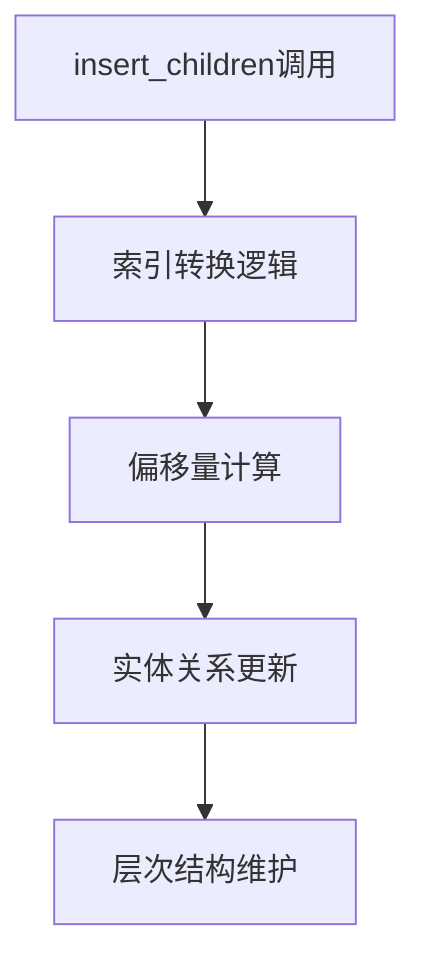

+++
title = "#19134 fix `.insert_related` index bound"
date = "2025-05-10T00:00:00"
draft = false
template = "pull_request_page.html"
in_search_index = false

[extra]
current_language = "zh-cn"
available_languages = {"en" = { name = "English", url = "/pull_request/bevy/2025-05/pr-19134-en-20250510" }, "zh-cn" = { name = "中文", url = "/pull_request/bevy/2025-05/pr-19134-zh-cn-20250510" }}
labels = ["C-Bug", "A-ECS", "D-Straightforward"]
+++

# Title

## Basic Information
- **Title**: fix `.insert_related` index bound
- **PR Link**: https://github.com/bevyengine/bevy/pull/19134
- **Author**: databasedav
- **Status**: MERGED
- **Labels**: C-Bug, A-ECS, S-Ready-For-Final-Review, D-Straightforward
- **Created**: 2025-05-09T00:54:07Z
- **Merged**: 2025-05-09T17:31:37Z
- **Merged By**: alice-i-cecile

## Description Translation
### 目标
解决 #19092

### 解决方案
- 移除索引转换中的 `.saturating_sub`
- 在内部偏移量计算中添加 `.saturating_add`

### 测试
- 新增回归测试，验证0索引顺序并测试最大边界

## The Story of This Pull Request

### 问题根源与上下文
在Bevy的ECS（Entity Component System）系统中，`.insert_related`方法在处理实体关系插入时存在索引越界问题。当开发者尝试在最大索引位置（如`usize::MAX`）插入子实体时，系统错误地计算了插入位置，导致子实体被错误地插入到非预期位置而非末尾。这个bug主要影响实体层次结构的维护，可能导致父子关系错乱。

### 解决方案与实现路径
核心问题源于索引转换时的边界处理。原实现错误地使用了`.saturating_sub(1)`来计算插入位置，导致最大索引被截断。修复方案采用双重调整：
1. **移除冗余的边界缩减**：在`relationship_source_collection.rs`中删除`.saturating_sub(1)`，避免不必要的位置截断
2. **增加安全的偏移累加**：在`related_methods.rs`中使用`.saturating_add(offset)`处理迭代过程中的索引累加，防止整数溢出

```rust
// File: crates/bevy_ecs/src/relationship/related_methods.rs
// Before:
let index = index + offset;

// After:
let index = index.saturating_add(offset);
```

### 技术验证与测试保障
新增的回归测试`insert_children_index_bound`验证了四个关键场景：
1. 初始子实体插入
2. 在最大索引位置（`usize::MAX`）追加新实体
3. 最终层次结构验证
4. 插入顺序保持正确

测试用例通过构造极端场景，确保修复后的代码能够正确处理边界情况：
```rust
world.entity_mut(first_children)
    .insert_children(usize::MAX, &[child3, child4]);
```

### 影响与工程经验
此次修复：
1. 确保最大索引插入操作的正确性
2. 增强ECS系统处理极端情况的可靠性
3. 通过精确的边界计算避免潜在的内存安全问题
4. 为类似的位置计算问题提供了处理模式参考

关键工程经验：
- 处理索引运算时应优先考虑`saturating_`系列方法防止溢出
- 边界条件的测试需要构造极端值（如`usize::MAX`）进行验证
- 位置计算需要同时考虑初始位置和偏移量的累加效应

## Visual Representation



## Key Files Changed

### crates/bevy_ecs/src/hierarchy.rs (+37/-0)
新增回归测试用例，验证边界条件下的插入行为：
```rust
#[test]
fn insert_children_index_bound() {
    // 构造测试实体和极端插入场景
    let root = world.entity_mut(first_children)
        .insert_children(usize::MAX, &[child3, child4])
        .id();
    // 验证最终层次结构
    assert_eq!(hierarchy, Node::new_with(...));
}
```

### crates/bevy_ecs/src/relationship/relationship_source_collection.rs (+2/-3)
修正索引上限计算逻辑：
```rust
// Before:
let index = index.min(self.len().saturating_sub(1));

// After:
let index = index.min(self.len());
```

### crates/bevy_ecs/src/relationship/related_methods.rs (+1/-1)
安全处理偏移量累加：
```rust
// Before:
let index = index + offset;

// After:
let index = index.saturating_add(offset);
```

## Further Reading
1. Rust整数溢出处理文档：https://doc.rust-lang.org/book/ch03-02-data-types.html#integer-overflow
2. Bevy ECS设计文档：https://bevyengine.org/learn/book/plugins/ecs/
3. 软件边界条件测试方法论：https://en.wikipedia.org/wiki/Boundary_case_testing