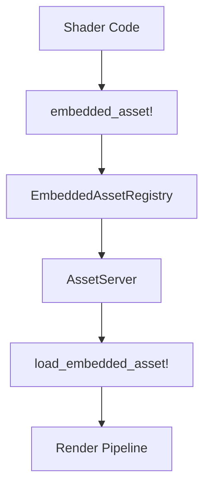
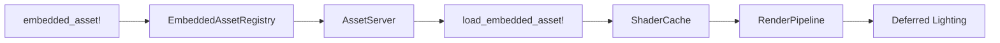

+++
title = "#19137 Use embedded_asset to load PBR shaders"
date = "2025-05-16T00:00:00"
draft = false
template = "pull_request_page.html"
in_search_index = true

[taxonomies]
list_display = ["show"]

[extra]
current_language = "en"
available_languages = {"en" = { name = "English", url = "/pull_request/bevy/2025-05/pr-19137-en-20250516" }, "zh-cn" = { name = "中文", url = "/pull_request/bevy/2025-05/pr-19137-zh-cn-20250516" }}
labels = ["C-Feature", "A-Rendering"]
+++

# Title: Use embedded_asset to load PBR shaders

## Basic Information
- **Title**: Use embedded_asset to load PBR shaders
- **PR Link**: https://github.com/bevyengine/bevy/pull/19137
- **Author**: atlv24
- **Status**: MERGED
- **Labels**: C-Feature, A-Rendering, S-Ready-For-Final-Review
- **Created**: 2025-05-09T05:12:43Z
- **Merged**: 2025-05-16T06:05:04Z
- **Merged By**: superdump

## Description Translation

# Objective

- Get in-engine shader hot reloading working

## Solution

- Adopt #12009
- Cut back on everything possible to land an MVP: we only hot-reload PBR in deferred shading mode. This is to minimize the diff and avoid merge hell. The rest shall come in followups.

## Testing

- `cargo run --example pbr --features="embedded_watcher"` and edit some pbr shader code

## The Story of This Pull Request

### The Problem and Context
Bevy's rendering system required restarting the engine to see shader changes, significantly slowing development iteration. The existing `load_internal_asset!` macro used hardcoded UUIDs and compiled shaders directly into the binary, preventing runtime reloading. This technical debt hindered rapid shader development and debugging.

### The Solution Approach
The PR introduces an MVP implementation using the new `embedded_asset` system from PR #12009. The team focused exclusively on PBR shaders in deferred shading mode to:
1. Minimize surface area for initial implementation
2. Avoid complex merge conflicts
3. Establish patterns for future expansion

Key engineering decisions included:
- Creating new macro patterns for asset loading
- Maintaining backwards compatibility through strategic trait implementations
- Preserving existing render pipeline structures while modifying asset sourcing

### The Implementation
The core changes revolved around replacing UUID-based asset loading with path-based embedded assets. In `bevy_pbr/src/lib.rs`, the team replaced 20+ `load_internal_asset!` declarations with a unified `load_shader_library!` macro:

```rust
// Before:
load_internal_asset!(app, PBR_TYPES_SHADER_HANDLE, "render/pbr_types.wgsl", Shader::from_wgsl);

// After:
load_shader_library!(app, "render/pbr_types.wgsl");
```

New macros in `bevy_asset` enabled flexible asset server access patterns:

```rust
pub trait GetAssetServer {
    fn get_asset_server(&self) -> &AssetServer;
}

// Implementation for App, World, and AssetServer itself
```

The deferred lighting system demonstrates the new asset loading pattern:

```rust
// Before using hardcoded handle:
pub const DEFERRED_LIGHTING_SHADER_HANDLE: Handle<Shader> = 
    weak_handle!("f4295279-8890-4748-b654-ca4d2183df1c");

// After using embedded asset:
embedded_asset!(app, "deferred_lighting.wgsl");
let deferred_lighting_shader = load_embedded_asset!(world, "deferred_lighting.wgsl");
```

### Technical Insights
Key technical achievements include:

1. **Hot Reload Foundation**: 
```rust
Shader::from_wgsl_with_defs(String, path, shader_defs)
```
enables runtime shader modifications while maintaining type safety

2. **Path Resolution**:
```rust
embedded_path!("render/pbr.wgsl")
```
generates correct asset paths relative to crate roots

3. **Asset Loading Unification**:


### The Impact
1. **Developer Experience**: Enabled live shader editing with `--features embedded_watcher`
2. **Code Health**: Reduced LOC in `bevy_pbr/src/lib.rs` by 111 lines
3. **Architectural Foundation**: Established patterns for migrating other asset types
4. **Performance**: Maintained zero-cost abstractions for release builds

## Visual Representation



## Key Files Changed

### `crates/bevy_pbr/src/lib.rs` (+29/-140)
**Purpose**: Migrate PBR shaders to embedded asset system  
**Key Change**:
```rust
// Before:
load_internal_asset!(app, PBR_SHADER_HANDLE, "render/pbr.wgsl", Shader::from_wgsl);

// After:
load_shader_library!(app, "render/pbr.wgsl");
```

**Impact**: Eliminated manual UUID management for shaders

### `crates/bevy_asset/src/io/embedded/mod.rs` (+79/-7)
**Purpose**: Implement embedded asset loading infrastructure  
**Key Addition**:
```rust
#[macro_export]
macro_rules! load_embedded_asset {
    ($provider: expr, $path: literal) => {{
        let (path, asset_server) = $crate::load_embedded_asset!(@get: $path, $provider);
        asset_server.load(path)
    }};
}
```

**Impact**: Enabled type-safe embedded asset loading from multiple contexts

### `crates/bevy_render/src/lib.rs` (+28/-21)
**Purpose**: Centralize shader library loading  
**Key Macro**:
```rust
#[macro_export]
macro_rules! load_shader_library {
    ($asset_server_provider: expr, $path: literal) => {
        embedded_asset!($asset_server_provider, $path);
        let handle = load_embedded_asset!($asset_server_provider, $path);
        core::mem::forget(handle);
    }
}
```

**Impact**: Standardized shader initialization across rendering components

## Further Reading
1. [Bevy Asset System Documentation](https://bevyengine.org/learn/book/assets/)
2. [WGSL Shader Language Spec](https://gpuweb.github.io/gpuweb/wgsl/)
3. [Rust Macro Programming Guide](https://doc.rust-lang.org/book/ch19-06-macros.html)