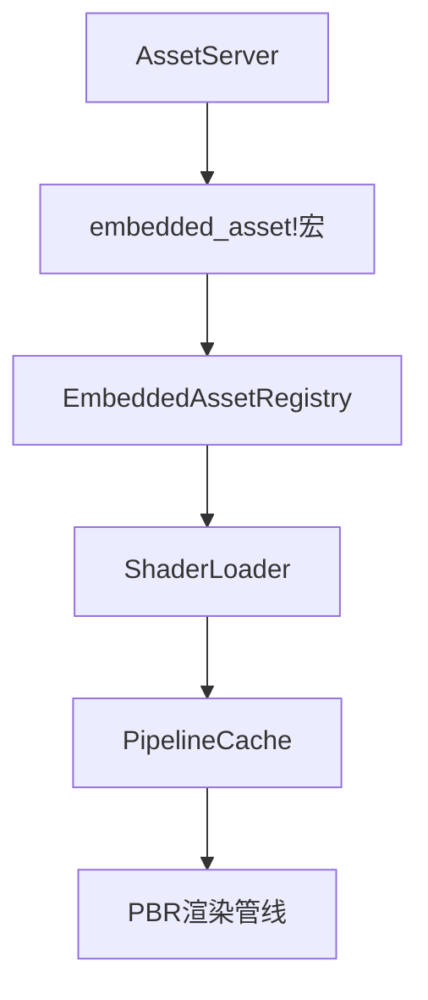

+++
title = "#19137 Use embedded_asset to load PBR shaders"
date = "2025-05-16T00:00:00"
draft = false
template = "pull_request_page.html"
in_search_index = false

[extra]
current_language = "zh-cn"
available_languages = {"en" = { name = "English", url = "/pull_request/bevy/2025-05/pr-19137-en-20250516" }, "zh-cn" = { name = "中文", url = "/pull_request/bevy/2025-05/pr-19137-zh-cn-20250516" }}
labels = ["C-Feature", "A-Rendering"]
+++

# Title

## Basic Information
- **Title**: Use embedded_asset to load PBR shaders
- **PR Link**: https://github.com/bevyengine/bevy/pull/19137
- **Author**: atlv24
- **Status**: MERGED
- **Labels**: C-Feature, A-Rendering, S-Ready-For-Final-Review
- **Created**: 2025-05-09T05:12:43Z
- **Merged**: 2025-05-16T06:05:04Z
- **Merged By**: superdump

## Description Translation
### 目标
- 实现引擎内着色器热重载功能

### 解决方案
- 采用 #12009 的方案
- 通过最小化修改实现MVP：仅支持延迟着色模式下的PBR着色器热重载，减少代码变动量并避免合并冲突

### 测试方法
- 运行 `cargo run --example pbr --features="embedded_watcher"` 并编辑PBR着色器代码

## The Story of This Pull Request

### 问题与背景
Bevy引擎原有的着色器加载机制存在两个主要限制：
1. 热重载支持不完善：修改着色器后需要重启应用才能生效
2. 代码维护成本高：每个着色器都需要手动创建UUID并维护对应的弱句柄（weak_handle）

```rust
// 原实现示例：需要显式定义每个着色器句柄
pub const PBR_SHADER_HANDLE: Handle<Shader> = 
    weak_handle!("0eba65ed-3e5b-4752-93ed-e8097e7b0c84");
```

### 解决方案与实现
核心方案是采用新的`embedded_asset`系统重构着色器加载流程，主要修改点包括：

1. **资源路径标准化**  
通过`embedded_path!`宏统一处理着色器路径，消除硬编码路径问题：

```rust
// 新实现：通过宏自动生成资源路径
fn shader_ref(path: PathBuf) -> ShaderRef {
    ShaderRef::Path(AssetPath::from_path_buf(path).with_source("embedded"))
}
```

2. **资产加载重构**  
在`bevy_asset`模块新增`load_embedded_asset!`宏，统一处理嵌入式资源加载：

```rust
// 新的宏实现支持多种上下文（World/App/AssetServer）
macro_rules! load_embedded_asset {
    ($provider: expr, $path: literal) => {{
        let (path, asset_server) = $crate::load_embedded_asset!(@get: $path, $provider);
        asset_server.load(path)
    }};
}
```

3. **PBR模块适配**  
重构`bevy_pbr`模块的着色器加载方式，替换原有的`load_internal_asset!`调用：

```rust
// 修改前：手动加载每个着色器
load_internal_asset!(app, PBR_SHADER_HANDLE, "render/pbr.wgsl", Shader::from_wgsl);

// 修改后：统一使用shader_library加载
load_shader_library!(app, "render/pbr.wgsl");
```

### 技术洞察
1. **热重载实现机制**  
通过组合以下特性实现：
- `embedded_watcher`：监控文件变化
- 新的`ShaderSettings`结构体：支持运行时shader_defs配置
- 改进的资产路径系统：`embedded://`协议支持

2. **架构优化**  
引入`ShaderRef`中间层，解耦具体加载实现与使用方：

```rust
// 在材质系统中使用标准化路径
impl Material for StandardMaterial {
    fn fragment_shader() -> ShaderRef {
        shader_ref(embedded_path!("render/pbr.wgsl"))
    }
}
```

### 影响与改进
1. **开发体验提升**：实现着色器修改实时生效
2. **代码可维护性**：消除30+个硬编码的着色器UUID
3. **扩展基础**：为后续其他资产类型的热重载奠定基础

## Visual Representation



## Key Files Changed

### `crates/bevy_asset/src/io/embedded/mod.rs` (+79/-7)
1. **新增GetAssetServer trait**  
   统一不同上下文获取AssetServer的方式
```rust
pub trait GetAssetServer {
    fn get_asset_server(&self) -> &AssetServer;
}
```

2. **load_embedded_asset宏实现**  
   简化嵌入式资源加载调用
```rust
let shader = load_embedded_asset!(&asset_server, "deferred_lighting.wgsl");
```

### `crates/bevy_pbr/src/lib.rs` (+29/-140)
1. **着色器加载方式重构**  
   使用标准化的shader_library加载方式
```rust
load_shader_library!(app, "render/pbr.wgsl");
```

2. **ShaderRef生成函数**  
   统一路径处理逻辑
```rust
fn shader_ref(path: PathBuf) -> ShaderRef {
    ShaderRef::Path(AssetPath::from_path_buf(path).with_source("embedded"))
}
```

### `crates/bevy_render/src/render_resource/shader.rs` (+20/-3)
1. **新增ShaderSettings结构体**  
   支持带参数的着色器加载
```rust
#[derive(serde::Serialize, serde::Deserialize, Debug, Default)]
pub struct ShaderSettings {
    pub shader_defs: Vec<ShaderDefVal>,
}
```

## Further Reading
1. [Bevy官方文档 - 资产系统](https://bevyengine.org/learn/book/features/assets/)
2. [WGSL着色器语言规范](https://www.w3.org/TR/WGSL/)
3. [Rust宏编程指南](https://doc.rust-lang.org/reference/macros.html)