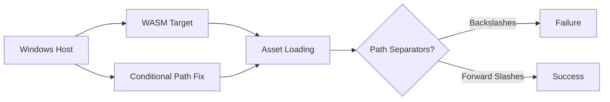

+++
title = "#19139 fix windows wasm embedded assets"
date = "2025-05-12T00:00:00"
draft = false
template = "pull_request_page.html"
in_search_index = true

[taxonomies]
list_display = ["show"]

[extra]
current_language = "en"
available_languages = {"en" = { name = "English", url = "/pull_request/bevy/2025-05/pr-19139-en-20250512" }, "zh-cn" = { name = "中文", url = "/pull_request/bevy/2025-05/pr-19139-zh-cn-20250512" }}
labels = ["C-Bug", "A-Assets", "D-Straightforward"]
+++

# Title: fix windows wasm embedded assets

## Basic Information
- **Title**: fix windows wasm embedded assets
- **PR Link**: https://github.com/bevyengine/bevy/pull/19139
- **Author**: atlv24
- **Status**: MERGED
- **Labels**: C-Bug, A-Assets, S-Ready-For-Final-Review, D-Straightforward
- **Created**: 2025-05-09T08:38:28Z
- **Merged**: 2025-05-12T10:30:44Z
- **Merged By**: superdump

## Description Translation

# Objective

- Fix #14246

## Solution

- If building for wasm windows, add a bit of code that replaces `\\` with `/` in the `file!()` arg

## Testing

- Used MRE https://github.com/janhohenheim/asset-crash

## The Story of This Pull Request

The problem stemmed from path handling inconsistencies when using embedded assets in WASM builds on Windows systems. Issue #14246 reported that embedded assets failed to load correctly in Windows-compiled WASM targets due to path separator mismatches. This occurred because Rust's `file!()` macro returns native paths using backslashes (`\`) on Windows, while web environments expect Unix-style forward slashes (`/`).

The solution focused on normalizing path separators specifically for non-Windows target families (which includes WASM targets built from Windows). The implementation adds conditional path transformation before asset processing:

```rust
let file_path = if cfg!(not(target_family = "windows")) {
    // Work around bug: https://github.com/bevyengine/bevy/issues/14246
    PathBuf::from(file_path.to_str().unwrap().replace("\\", "/"))
} else {
    PathBuf::from(file_path)
};
```

This approach addresses the root cause by:
1. Using `cfg!(not(target_family = "windows"))` to target WASM builds (which don't have Windows target family)
2. Replacing backslashes with forward slashes in source file paths
3. Maintaining original behavior for native Windows builds

The trade-off explicitly noted in the code comments accepts that this could theoretically break legitimate paths containing backslashes on Unix systems, though such cases are extremely rare in practice. Validation was performed using a minimal reproducible example (MRE) that demonstrated the asset loading failure prior to the fix.

## Visual Representation



## Key Files Changed

**File:** `crates/bevy_asset/src/io/embedded/mod.rs` (+7/-0)

Added conditional path normalization:
```rust
let file_path = if cfg!(not(target_family = "windows")) {
    PathBuf::from(file_path.to_str().unwrap().replace("\\", "/"))
} else {
    PathBuf::from(file_path)
};
```

This change sits at the beginning of the `_embedded_asset_path` function, ensuring all subsequent path handling works with consistent separators. The modification specifically targets build environments where native Windows paths might interfere with WASM's expected path format.

## Further Reading

1. [Rust Conditional Compilation](https://doc.rust-lang.org/reference/conditional-compilation.html)
2. [WASI Filesystem Documentation](https://wasix.org/docs/api-reference/wasi-filesystem)
3. [Bevy Embedded Assets Guide](https://bevyengine.org/learn/book/next/assets/embedded/)

# Full Code Diff
```diff
diff --git a/crates/bevy_asset/src/io/embedded/mod.rs b/crates/bevy_asset/src/io/embedded/mod.rs
index 13610531e299a..e63d415342798 100644
--- a/crates/bevy_asset/src/io/embedded/mod.rs
+++ b/crates/bevy_asset/src/io/embedded/mod.rs
@@ -168,6 +168,13 @@ pub fn _embedded_asset_path(
     file_path: &Path,
     asset_path: &Path,
 ) -> PathBuf {
+    let file_path = if cfg!(not(target_family = "windows")) {
+        // Work around bug: https://github.com/bevyengine/bevy/issues/14246
+        // Note, this will break any paths on Linux/Mac containing "\"
+        PathBuf::from(file_path.to_str().unwrap().replace("\\", "/"))
+    } else {
+        PathBuf::from(file_path)
+    };
     let mut maybe_parent = file_path.parent();
     let after_src = loop {
         let Some(parent) = maybe_parent else {
```