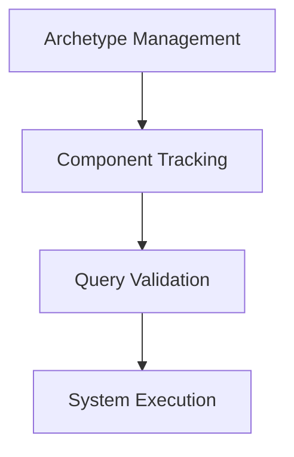

+++
title = "#19143 Remove `ArchetypeComponentId` and `archetype_component_access`"
date = "2025-05-27T00:00:00"
draft = false
template = "pull_request_page.html"
in_search_index = true

[taxonomies]
list_display = ["show"]

[extra]
current_language = "en"
available_languages = {"en" = { name = "English", url = "/pull_request/bevy/2025-05/pr-19143-en-20250527" }, "zh-cn" = { name = "中文", url = "/pull_request/bevy/2025-05/pr-19143-zh-cn-20250527" }}
labels = ["A-ECS", "C-Performance", "C-Code-Quality"]
+++

# Remove `ArchetypeComponentId` and `archetype_component_access`

## Basic Information
- **Title**: Remove `ArchetypeComponentId` and `archetype_component_access`
- **PR Link**: https://github.com/bevyengine/bevy/pull/19143
- **Author**: chescock
- **Status**: MERGED
- **Labels**: A-ECS, C-Performance, C-Code-Quality, S-Ready-For-Final-Review, M-Needs-Migration-Guide
- **Created**: 2025-05-09T13:58:39Z
- **Merged**: 2025-05-27T19:21:46Z
- **Merged By**: alice-i-cecile

## Description Translation

# Objective

Remove `ArchetypeComponentId` and `archetype_component_access`. Following #16885, they are no longer used by the engine, so we can stop spending time calculating them or space storing them.

## Solution

Remove `ArchetypeComponentId` and everything that touches it.

The `System::update_archetype_component_access` method no longer needs to update `archetype_component_access`. We do still need to update query caches, but we no longer need to do so *before* running the system. We'd have to touch every caller anyway if we gave the method a better name, so just remove `System::update_archetype_component_access` and `SystemParam::new_archetype` entirely, and update the query cache in `Query::get_param`.

The `Single` and `Populated` params also need their query caches updated in `SystemParam::validate_param`, so change `validate_param` to take `&mut Self::State` instead of `&Self::State`.

## The Story of This Pull Request

### The Problem and Context
The Bevy ECS previously maintained `ArchetypeComponentId` to track component presence within specific archetypes. This mechanism became redundant after architectural changes in #16885, which eliminated its usage in scheduling and parallel execution. The continued maintenance of these structures incurred unnecessary memory overhead and computational costs, particularly in scenarios with many archetypes.

### The Solution Approach
This PR removes all traces of `ArchetypeComponentId` and related access tracking. The key insight was recognizing that query validation could be deferred until system execution rather than requiring precomputed archetype access data. This allows us to:
1. Eliminate storage of archetype-specific component IDs
2. Remove archetype access tracking from system metadata
3. Simplify query state management

### The Implementation
The removal cascaded through multiple layers of the ECS:

**Archetype Changes (crates/bevy_ecs/src/archetype.rs):**
```rust
// Before:
struct ArchetypeComponentInfo {
    storage_type: StorageType,
    archetype_component_id: ArchetypeComponentId,
}

// After:
struct ArchetypeComponentInfo {
    storage_type: StorageType,
}
```

**Query State Updates (crates/bevy_ecs/src/query/state.rs):**
```rust
// Removal of archetype access tracking
- pub(crate) fn update_archetype_component_access(&mut self, archetype: &Archetype, access: &mut Access<ArchetypeComponentId>) {
-     // ... old implementation ...
- }
```

**System Param Validation (crates/bevy_ecs/src/system/system_param.rs):**
```rust
// Changed method signature
unsafe fn validate_param(
-    state: &Self::State,
+    state: &mut Self::State,
    system_meta: &SystemMeta,
    world: UnsafeWorldCell,
) -> Result<(), SystemParamValidationError>;
```

### Technical Insights
Key architectural changes include:
1. **Query Cache Updates**: Query states now update their internal caches during parameter validation rather than through separate archetype tracking
2. **Simplified Parallelism Checks**: System scheduling now relies solely on component access patterns rather than archetype-specific IDs
3. **Reduced Memory Footprint**: Removal of `ArchetypeComponentId` storage saves 4 bytes per component per archetype

### The Impact
- **Performance**: Reduces memory usage and eliminates unnecessary archetype tracking computations
- **Code Quality**: Removes ~500 lines of complex tracking logic
- **Maintainability**: Simplifies system scheduling and query validation pathways

## Visual Representation



## Key Files Changed

1. **crates/bevy_ecs/src/archetype.rs** (+7/-113)
   - Removed `ArchetypeComponentId` from archetype metadata
   - Simplified archetype creation and component tracking

2. **crates/bevy_ecs/src/system/system_param.rs** (+31/-212)
   - Updated query validation to handle cache updates
   - Removed archetype-specific access tracking

3. **crates/bevy_ecs/src/query/state.rs** (+8/-119)
   - Removed archetype access management
   - Simplified query state transitions

4. **crates/bevy_ecs/src/system/function_system.rs** (+49/-147)
   - Removed archetype tracking from system metadata
   - Updated system validation logic

## Further Reading
- [ECS Scheduling Deep Dive](https://bevyengine.org/learn/book/ecs-scheduling/)
- [Component Storage Strategies](https://bevyengine.org/learn/book/component-storage/)
- [System Param Documentation](https://docs.rs/bevy_ecs/latest/bevy_ecs/system/trait.SystemParam.html)