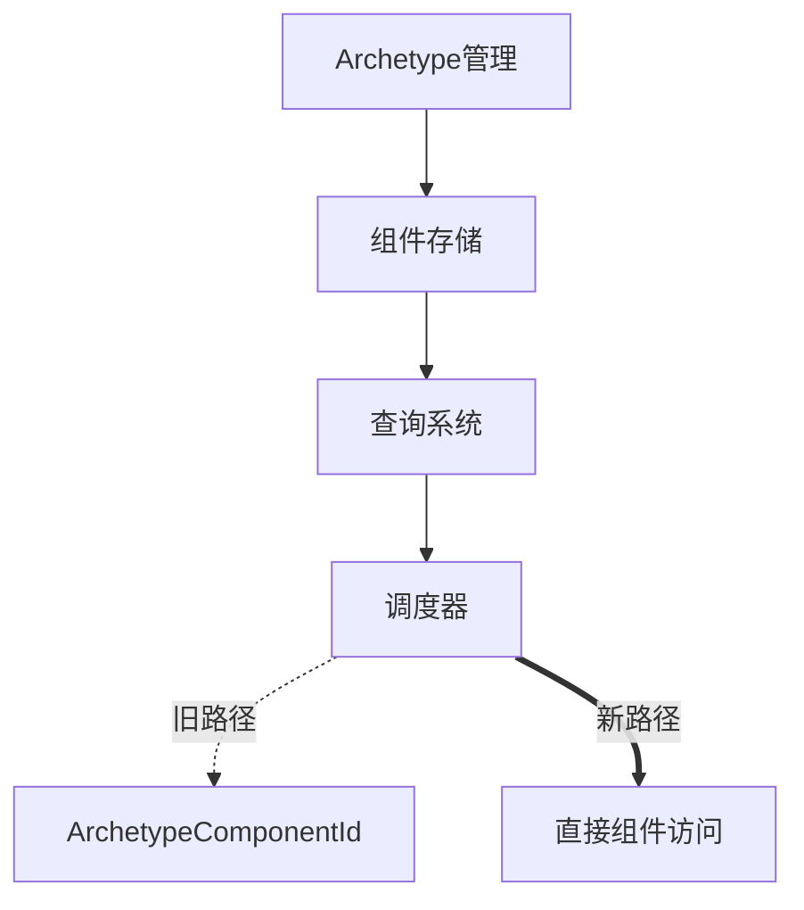

+++
title = "#19143 Remove `ArchetypeComponentId` and `archetype_component_access`"
date = "2025-05-27T00:00:00"
draft = false
template = "pull_request_page.html"
in_search_index = false

[extra]
current_language = "zh-cn"
available_languages = {"en" = { name = "English", url = "/pull_request/bevy/2025-05/pr-19143-en-20250527" }, "zh-cn" = { name = "中文", url = "/pull_request/bevy/2025-05/pr-19143-zh-cn-20250527" }}
labels = ["A-ECS", "C-Performance", "C-Code-Quality"]
+++

# Remove `ArchetypeComponentId` and `archetype_component_access`

## Basic Information
- **Title**: Remove `ArchetypeComponentId` and `archetype_component_access`
- **PR Link**: https://github.com/bevyengine/bevy/pull/19143
- **Author**: chescock
- **Status**: MERGED
- **Labels**: A-ECS, C-Performance, C-Code-Quality, S-Ready-For-Final-Review, M-Needs-Migration-Guide
- **Created**: 2025-05-09T13:58:39Z
- **Merged**: 2025-05-27T19:21:46Z
- **Merged By**: alice-i-cecile

## Description Translation
### 目标
移除`ArchetypeComponentId`和`archetype_component_access`。继#16885之后，引擎不再使用这些结构，因此可以停止计算和存储它们。

### 解决方案
移除所有涉及`ArchetypeComponentId`的代码：
1. 移除`System::update_archetype_component_access`方法
2. 移除`SystemParam::new_archetype`实现
3. 将query缓存更新逻辑移至`Query::get_param`
4. 修改`SystemParam::validate_param`接受可变状态引用

## The Story of This Pull Request

### 问题与背景
Bevy ECS原先使用`ArchetypeComponentId`来精确追踪组件在不同archetype中的存在形式，用于并行调度时的冲突检测。随着#16885的合并，调度器不再需要这种细粒度的访问控制，但相关数据结构仍在持续计算和维护，造成：
- 多余的内存开销（存储每个archetype的组件ID）
- 冗余的计算逻辑（维护archetype组件访问关系）
- 复杂的系统初始化流程（需要预先更新archetype访问信息）

### 解决方案
核心思路是彻底移除不再需要的archetype组件追踪机制：
1. **数据清理**：删除`ArchetypeComponentId`类型及相关字段
2. **逻辑简化**：将query缓存更新延迟到实际使用时
3. **接口调整**：修改系统参数验证接口以支持新的状态管理方式

### 实现细节
**Archetype重构**：
```rust
// Before:
struct ArchetypeComponentInfo {
    storage_type: StorageType,
    archetype_component_id: ArchetypeComponentId, // 被移除的字段
}

// After:
struct ArchetypeComponentInfo {
    storage_type: StorageType,
}
```

**查询状态更新**：
```rust
// Before:
system.update_archetype_component_access(world);

// After:
// 移除了显式的archetype访问更新调用
```

**系统参数验证**：
```rust
// Before:
unsafe fn validate_param(state: &Self::State, ...)

// After:
unsafe fn validate_param(state: &mut Self::State, ...) // 支持在验证时更新状态
```

### 技术洞察
1. **延迟计算**：将query缓存的更新从系统初始化阶段推迟到实际运行时，减少不必要的预计算
2. **状态管理**：通过`&mut State`参数允许系统参数在验证阶段更新内部状态
3. **架构简化**：移除约500行与archetype组件ID相关的代码，降低ECS核心复杂度

### 影响
- **内存优化**：每个archetype减少至少8字节存储开销
- **性能提升**：减少系统初始化时的archetype遍历操作
- **代码精简**：删除多个冗余的数据结构和接口方法
- **迁移需求**：需要调整自定义系统参数的实现方式

## Visual Representation



## Key Files Changed

### `crates/bevy_ecs/src/system/system_param.rs`
```rust
// 查询状态初始化逻辑变更
# Before:
fn init_state(world: &mut World, system_meta: &mut SystemMeta) -> Self::State {
    QueryState::new_with_access(world, &mut system_meta.archetype_component_access)
}

# After:
fn init_state(world: &mut World, _system_meta: &mut SystemMeta) -> Self::State {
    QueryState::new(world)
}
```

### `crates/bevy_ecs/src/archetype.rs`
```rust
// 移除ArchetypeComponentId相关定义
# Before:
pub struct ArchetypeComponentId(usize);

# After:
// 完全移除该结构体定义
```

### `crates/bevy_ecs/macros/src/lib.rs`
```rust
// 系统参数宏生成逻辑变更
# Before:
unsafe fn new_archetype(state: &mut Self::State, archetype: &Archetype, system_meta: &mut SystemMeta) {
    // 生成archetype更新代码
}

# After:
// 完全移除new_archetype方法生成
```

## Further Reading
- [ECS调度优化策略](https://bevyengine.org/learn/book/ecs-scheduling/)
- [Bevy查询系统设计](https://bevyengine.org/learn/book/queries/)
- [Rust借用检查与系统参数](https://doc.rust-lang.org/nomicon/borrow-checker.html)