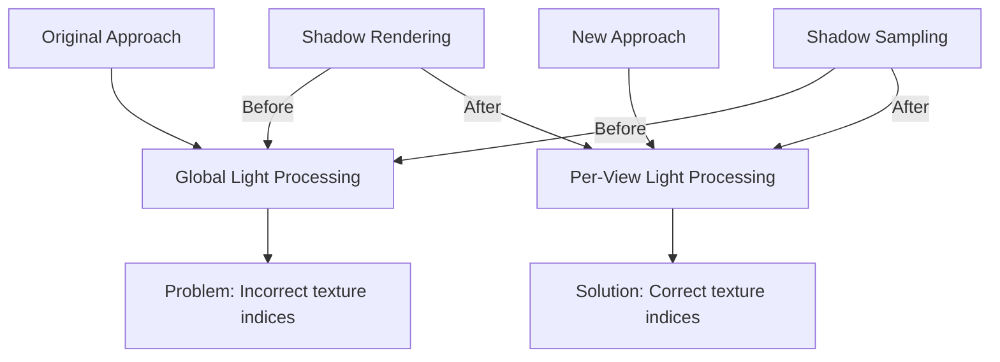

+++
title = "#19147 fix distinct directional lights per view"
date = "2025-05-30T00:00:00"
draft = false
template = "pull_request_page.html"
in_search_index = true

[taxonomies]
list_display = ["show"]

[extra]
current_language = "en"
available_languages = {"en" = { name = "English", url = "/pull_request/bevy/2025-05/pr-19147-en-20250530" }, "zh-cn" = { name = "中文", url = "/pull_request/bevy/2025-05/pr-19147-zh-cn-20250530" }}
labels = ["C-Bug", "A-Rendering", "D-Straightforward"]
+++

# Analysis of PR #19147: fix distinct directional lights per view

## Basic Information
- **Title**: fix distinct directional lights per view
- **PR Link**: https://github.com/bevyengine/bevy/pull/19147
- **Author**: robtfm
- **Status**: MERGED
- **Labels**: C-Bug, A-Rendering, S-Ready-For-Final-Review, D-Straightforward
- **Created**: 2025-05-09T18:05:15Z
- **Merged**: 2025-05-30T19:56:18Z
- **Merged By**: alice-i-cecile

## The Story of This Pull Request

### The Problem and Context
After PR #15156, directional lights assigned to different views via render layers weren't functioning correctly. The core issue involved how shadow map texture indices were allocated and assigned across views. The system allocated texture layers based on the total number of cascades across all lights, regardless of which views actually used them. This caused two main problems:

1. **Incorrect shadow rendering**: When multiple views used different directional lights, they would render shadow maps to the wrong texture indices while sampling from incorrect base indices
2. **Inefficient resource usage**: Texture layers were allocated for lights that weren't visible in a view, including lights with shadows disabled

The problem manifested clearly in split-screen scenarios where each view had its own directional light. Without this fix, only one view would display correct shadows while the others showed incorrect or missing shadows.

### The Solution Approach
The author implemented a more efficient per-view allocation strategy with these key changes:

1. Pre-calculate the maximum number of cascades any single view will need
2. Allocate texture array layers based on this view maximum rather than the global total
3. Build the `GpuDirectionalLight` array per-view instead of globally
4. Assign texture indices sequentially within each view's allocation
5. Remove the `skip` field since per-view construction eliminates unused lights

This approach ensures each view:
- Only considers lights that intersect its render layers
- Uses contiguous texture indices starting from 0 for its shadow maps
- Doesn't waste resources on lights not visible in the view

The solution balances correctness with efficiency while maintaining the same maximum number of directional lights per view (`max_texture_array_layers / MAX_CASCADES_PER_LIGHT`).

### The Implementation
The core changes occur in `light.rs` with supporting modifications in WGSL shaders. The implementation follows these steps:

**1. Precompute maximum cascades per view:**
```rust
let mut num_directional_cascades_enabled = 0usize;
for ... in sorted_cameras ... {
    let mut num_directional_cascades_for_this_view = 0usize;
    let render_layers = maybe_layers.unwrap_or_default();

    for ... in directional_lights.iter() {
        if light.shadows_enabled && light.render_layers.intersects(render_layers) {
            num_directional_cascades_for_this_view += light
                .cascade_shadow_config
                .bounds
                .len()
                .min(MAX_CASCADES_PER_LIGHT);
        }
    }

    num_directional_cascades_enabled = num_directional_cascades_enabled
        .max(num_directional_cascades_for_this_view)
        .min(max_texture_array_layers);
}
```

**2. Per-view directional light processing:**
```rust
let mut gpu_directional_lights = [GpuDirectionalLight::default(); MAX_DIRECTIONAL_LIGHTS];
let mut num_directional_cascades_enabled_for_this_view = 0usize;
let mut num_directional_lights_for_this_view = 0usize;

for (index, (_light_entity, _, light)) in directional_lights
    .iter()
    .filter(|(_, _, light)| light.render_layers.intersects(view_layers))
    .enumerate()
    .take(MAX_DIRECTIONAL_LIGHTS)
{
    // ... light processing ...
    
    gpu_directional_lights[index] = GpuDirectionalLight {
        cascades: [GpuDirectionalCascade::default(); MAX_CASCADES_PER_LIGHT],
        color: Vec4::from_slice(&light.color.to_f32_array()) * light.illuminance,
        dir_to_light: light.transform.back().into(),
        flags: flags.bits(),
        soft_shadow_size: light.soft_shadow_size.unwrap_or_default(),
        shadow_depth_bias: light.shadow_depth_bias,
        shadow_normal_bias: light.shadow_normal_bias,
        num_cascades: num_cascades as u32,
        cascades_overlap_proportion: light.cascade_shadow_config.overlap_proportion,
        depth_texture_base_index: num_directional_cascades_enabled_for_this_view as u32,
    };
    num_directional_cascades_enabled_for_this_view += num_cascades;
}
```

**3. Removal of skip field:**
The `skip` field was removed from both Rust and WGSL structs since per-view construction eliminates the need for it:

```rust
// Before
pub struct GpuDirectionalLight {
    // ...
    depth_texture_base_index: u32,
    skip: u32,
}

// After
pub struct GpuDirectionalLight {
    // ...
    depth_texture_base_index: u32,
}
```

```wgsl
// Before
struct DirectionalLight {
    // ...
    depth_texture_base_index: u32,
    skip: u32,
};

// After
struct DirectionalLight {
    // ...
    depth_texture_base_index: u32,
};
```

### Technical Insights
Key technical aspects of this solution:

1. **Per-view resource management**: By building light data per view, we ensure texture indices are view-local and consistent between shadow map rendering and sampling
2. **Efficient texture allocation**: Using the maximum per-view cascade count minimizes VRAM usage while guaranteeing sufficient space for all views
3. **Render layer filtering**: Early filtering by `render_layers.intersects()` avoids processing irrelevant lights
4. **Simplified shader logic**: Removing the `skip` field eliminates a conditional check in the lighting shader

The solution maintains backward compatibility while fixing both functional and efficiency issues. The per-view approach also naturally extends to future cases with more complex light/view relationships.

### The Impact
These changes provide:
1. **Correct rendering**: Directional lights now work correctly across multiple views with different render layers
2. **Reduced VRAM usage**: Texture memory is allocated based on per-view needs rather than global totals
3. **CPU efficiency**: Avoids processing lights that aren't visible in a view
4. **Cleaner code**: Removal of the `skip` field simplifies both Rust and shader code

The solution was validated using a modified split-screen example that placed separate directional lights on different render layers. Without the fix, directional shadows only rendered correctly in one view; with the fix, all views displayed correct shadows for their respective lights.

## Visual Representation



## Key Files Changed

### crates/bevy_pbr/src/render/light.rs
Significant restructuring of directional light processing:
1. Added precomputation of maximum cascades per view
2. Moved directional light processing into view loop
3. Removed skip field from GpuDirectionalLight
4. Added per-view filtering by render layers

Key changes:
```rust
// Before: Global directional light processing
let mut gpu_directional_lights = [GpuDirectionalLight::default(); MAX_DIRECTIONAL_LIGHTS];
let mut num_directional_cascades_enabled = 0usize;
for (index, (_light_entity, _, light)) in directional_lights.iter().enumerate() {
    // ... process all lights globally ...
    gpu_directional_lights[index] = GpuDirectionalLight {
        // ...
        depth_texture_base_index: num_directional_cascades_enabled as u32,
        skip: 0u32,
    };
}

// After: Per-view directional light processing
let mut num_directional_cascades_enabled = 0usize;
for ... in views { // Precompute max cascades
    // Calculate per-view cascade count
}

// Inside view loop:
let mut gpu_directional_lights = [GpuDirectionalLight::default(); MAX_DIRECTIONAL_LIGHTS];
let mut num_directional_cascades_enabled_for_this_view = 0usize;
for (index, (_light_entity, _, light)) in directional_lights
    .iter()
    .filter(|(_, _, light)| light.render_layers.intersects(view_layers))
    .enumerate()
{
    // ... process only relevant lights ...
    gpu_directional_lights[index] = GpuDirectionalLight {
        // ...
        depth_texture_base_index: num_directional_cascades_enabled_for_this_view as u32,
        // skip field removed
    };
}
```

### crates/bevy_pbr/src/render/mesh_view_types.wgsl
Removed skip field from directional light struct:
```wgsl
// Before
struct DirectionalLight {
    // ...
    depth_texture_base_index: u32,
    skip: u32,
};

// After
struct DirectionalLight {
    // ...
    depth_texture_base_index: u32,
};
```

### crates/bevy_pbr/src/render/pbr_functions.wgsl
Removed skip check in directional light processing:
```wgsl
// Before
let light = &view_bindings::lights.directional_lights[i];
if (*light).skip != 0u {
    continue;
}

// After
let light = &view_bindings::lights.directional_lights[i];
// Skip check removed
```

## Further Reading
1. [Bevy Render Layers Documentation](https://docs.rs/bevy/latest/bevy/render/view/struct.RenderLayers.html)
2. [Bevy Lighting System Overview](https://bevyengine.org/learn/book/next/features/rendering/lighting/)
3. [WGSL Shader Language Specification](https://www.w3.org/TR/WGSL/)
4. [Texture Arrays in Modern Rendering](https://learnopengl.com/Advanced-OpenGL/Texture-Arrays)