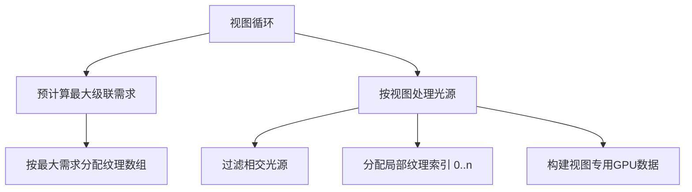

+++
title = "#19147 fix distinct directional lights per view"
date = "2025-05-30T00:00:00"
draft = false
template = "pull_request_page.html"
in_search_index = false

[extra]
current_language = "zh-cn"
available_languages = {"en" = { name = "English", url = "/pull_request/bevy/2025-05/pr-19147-en-20250530" }, "zh-cn" = { name = "中文", url = "/pull_request/bevy/2025-05/pr-19147-zh-cn-20250530" }}
+++

## 分析报告：修复不同视图中的独立平行光问题

### 基本信息
- **标题**: fix distinct directional lights per view
- **PR链接**: https://github.com/bevyengine/bevy/pull/19147
- **作者**: robtfm
- **状态**: 已合并
- **标签**: C-Bug, A-Rendering, S-Ready-For-Final-Review, D-Straightforward
- **创建时间**: 2025-05-09T18:05:15Z
- **合并时间**: 2025-05-30T19:56:18Z
- **合并者**: alice-i-cecile

### 描述翻译
#### 目标
在 #15156 之后，似乎在不同视图上使用独立的平行光（directional lights）会出问题（可能聚光灯也会有问题）。修复它们。

#### 解决方案
原因有点复杂，举个例子：
- 相机 0 在图层 0
- 相机 1 在图层 1
- 平行光 0 在图层 0 (2 级联)
- 平行光 1 在图层 1 (2 级联)

在 render/lights.rs 中：
- 在视图循环外：
  - 计算总的阴影投射平行光级联数量（4）并为每个分配递增的 `depth_texture_base_index`（例如一个光为 0-1，另一个为 2-3，取决于迭代顺序）（第 1034 行）
  - 为总级联数加聚光灯贴图分配纹理数组（4）（第 1106 行）
- 在视图循环中，对于平行光：
  - 跳过不与渲染层相交的光（第 1440 行）
  - 为每个光/级联分配从 0 开始的递增纹理层（每个视图重置为 0）（例如为相交光的 2 个级联分配 0 和 1）（第 1509 行，在 1421 行初始化）

然后在渲染图（rendergraph）中：
- 相机 0 将光 0 的阴影贴图渲染到纹理索引 0 和 1
- 相机 0 使用来自 `depth_texture_base_index` 的阴影渲染（可能是 0-1 或 2-3，取决于迭代顺序）
- 相机 1 将光 1 的阴影贴图渲染到纹理索引 0 和 1
- 相机 0 使用来自 `depth_texture_base_index` 的阴影渲染（可能是 0-1 或 2-3，取决于迭代顺序）

问题：
- 某个视图使用空的阴影贴图（bug）
- 我们为每个光/级联分配纹理层，即使并非所有光在所有视图中都使用（低效）
- 即使 `shadows_enabled: false` 的光也会分配纹理层（低效）

解决方案：
- 预先计算具有最多平行光级联的视图
- 在纹理数组中分配这么多层（加上聚光灯层）
- 在每视图循环中仍使用 0..n 的纹理层，但在循环内同时构建 GpuLights.gpu_directional_lights，使其引用我们渲染的相同层

附带好处：
- 现在每个视图最多可以使用 `max_texture_array_layers / MAX_CASCADES_PER_LIGHT` 个投射阴影的平行光，而不是整体限制
- 可以移除 `GpuDirectionalLight::skip` 字段，因为 GPU 光结构是按视图构建的

更简单的方法是保持一切不变，只为非相交光在视图循环中增加纹理层索引。此 PR 减少了总阴影贴图 VRAM 使用量，并且没有增加太多复杂性。但如果我们需要为 16.1 版本提供风险/侵入性更低的方案，那将是方向。

#### 测试
我修改了分屏示例，将独立的光放在图层 1 和图层 2 上，并将平面和狐狸放在两个图层上（使用来自 #17575 的许多不相关代码进行渲染层传播）。
没有修复时，平行光阴影只会渲染在顶部两个视图中的一个上，尽管两个图层上都有平行光。

```rs
//! Renders two cameras to the same window to accomplish "split screen".
// ... 完整测试代码 ...
```

### PR 分析：问题与解决方案

#### 问题背景
在 PR #15156 后，当不同视图使用独立的平行光源时出现阴影渲染问题。核心问题在于阴影纹理层分配策略：
1. 全局预分配纹理层：在视图循环外计算所有平行光源的总级联数
2. 视图级索引重置：每个视图内部从0开始分配纹理层索引
3. 视图间冲突：不同视图的阴影数据可能写入相同纹理位置，导致阴影数据被覆盖

例如：
- 视图0：将光源0的阴影写入纹理层0-1
- 视图1：将光源1的阴影写入纹理层0-1（覆盖视图0的数据）
- 但着色器使用全局分配的基索引（如2-3）读取，导致访问无效数据

#### 解决方案实现
PR 采用了更精确的纹理层管理策略：

1. **预计算最大需求**（关键优化）：
   ```rust
   // 遍历所有视图找最大级联需求
   let mut num_directional_cascades_enabled = 0usize;
   for view in views {
       let mut cascades_for_view = 0;
       for light in directional_lights {
           if light.shadows_enabled && light.render_layers.intersects(view.render_layers) {
               cascades_for_view += light.cascade_shadow_config.bounds.len().min(MAX_CASCADES_PER_LIGHT);
           }
       }
       num_directional_cascades_enabled = num_directional_cascades_enabled.max(cascades_for_view);
   }
   ```
   计算所有视图中所需的最大级联数，避免过度分配

2. **按视图构建光源数据**（核心修复）：
   ```rust
   // 在视图循环内部
   let mut gpu_directional_lights = [GpuDirectionalLight::default(); MAX_DIRECTIONAL_LIGHTS];
   let mut num_directional_cascades_enabled_for_this_view = 0usize;
   
   for (index, light) in directional_lights
       .iter()
       .filter(|light| light.render_layers.intersects(view_layers))  // 只处理相交光源
       .take(MAX_DIRECTIONAL_LIGHTS)
       .enumerate()
   {
       // 动态计算纹理层分配
       let mut num_cascades = 0;
       if light.shadows_enabled {
           let cascades = light.cascade_shadow_config.bounds.len().min(MAX_CASCADES_PER_LIGHT);
           if num_directional_cascades_enabled_for_this_view + cascades <= max_texture_array_layers {
               flags |= DirectionalLightFlags::SHADOWS_ENABLED;
               num_cascades = cascades;
           }
       }
       
       gpu_directional_lights[index] = GpuDirectionalLight {
           // 不再需要skip字段
           depth_texture_base_index: num_directional_cascades_enabled_for_this_view as u32,
           // ... 其他字段 ...
       };
       num_directional_cascades_enabled_for_this_view += num_cascades;
   }
   ```
   关键改进：
   - 纹理层索引从0开始按视图独立分配
   - 同步更新GPU光源数据中的基索引
   - 移除`skip`字段（通过过滤天然排除不可见光源）

3. **清理无效光源实体**：
   ```rust
   // 移除不与当前视图相交的光源实体
   for light in directional_lights.iter().filter(|light| !light.render_layers.intersects(view_layers)) {
       if let Some(entities) = light_view_entities.remove(&view_entity) {
           despawn_entities(&mut commands, entities);
       }
   }
   ```

#### WGSL 适配
移除不再需要的`skip`字段：
```wgsl
// mesh_view_types.wgsl
struct DirectionalLight {
    // ...
    depth_texture_base_index: u32,
-   skip: u32,
};
```
着色器中移除skip检查：
```wgsl
// pbr_functions.wgsl
- if (*light).skip != 0u {
-     continue;
- }
```

### 技术影响
1. **正确性修复**：
   - 解决视图间阴影数据覆盖问题
   - 确保每个视图只访问自己的阴影数据

2. **性能优化**：
   - 纹理内存：从`全局总级联数`减少到`最大视图级联数`
   - CPU：跳过不可见光源的处理
   - 减少冗余数据（移除skip字段）

3. **资源限制调整**：
   - 平行光源限制从全局改为每视图：`max_texture_array_layers / MAX_CASCADES_PER_LIGHT`

4. **代码简化**：
   - 移除`GpuDirectionalLight::skip`字段及相关处理逻辑
   - 更清晰的资源所有权（视图拥有自己的光源数据）

### 关键文件变更

#### 1. `crates/bevy_pbr/src/render/light.rs` (+105/-60)
核心重构：
- 将平行光处理移入视图循环
- 添加最大级联数预计算
- 实现按视图的纹理层分配
- 移除基于`skip`的过滤机制

关键修改：
```rust
// 之前：全局处理所有光源
let mut gpu_directional_lights = [/* 全局数据 */];
for light in directional_lights {
    // 分配全局纹理索引
}

// 之后：视图内处理
for view in views {
    let mut gpu_directional_lights = [/* 视图私有数据 */];
    for light in directional_lights.filter(intersects_view) {
        // 分配视图局部纹理索引 (0..n)
    }
}
```

#### 2. `crates/bevy_pbr/src/render/mesh_view_types.wgsl` (+0/-1)
```wgsl
// 移除冗余字段
struct DirectionalLight {
    ...
-   skip: u32,
};
```

#### 3. `crates/bevy_pbr/src/render/pbr_functions.wgsl` (+0/-3)
```wgsl
// 移除skip检查
- if (*light).skip != 0u {
-     continue;
- }
```

### 图示：纹理层分配变化


### 经验总结
1. **资源分配策略**：对于视图特定资源，应在视图上下文中分配管理
2. **过滤前置**：尽早过滤无效数据（如不可见光源）减少冗余处理
3. **数据一致性**：资源分配（纹理层）和使用（GPU结构）应同步进行
4. **WGSL/CPU同步**：移除未使用字段需同步修改着色器代码

此PR展示了在多视图渲染系统中管理视图特定资源的有效模式，通过将资源分配范围从全局缩小到视图最大需求，平衡了正确性和内存效率。

### 延伸阅读
1. [Bevy渲染管线架构](https://bevyengine.org/learn/book/getting-started/rendering/)
2. [WGSL着色器语言规范](https://www.w3.org/TR/WGSL/)
3. [级联阴影映射技术](https://learnopengl.com/Guest-Articles/2021/CSM)