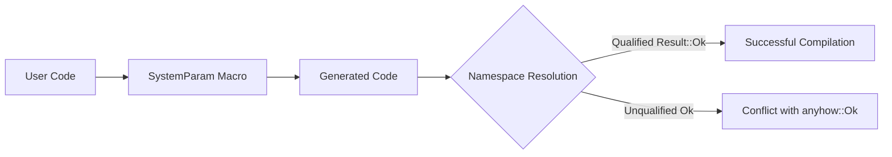

+++
title = "#19155 Fix macro pollution in SystemParam derive"
date = "2025-05-10T00:00:00"
draft = false
template = "pull_request_page.html"
in_search_index = true

[taxonomies]
list_display = ["show"]

[extra]
current_language = "en"
available_languages = {"en" = { name = "English", url = "/pull_request/bevy/2025-05/pr-19155-en-20250510" }, "zh-cn" = { name = "中文", url = "/pull_request/bevy/2025-05/pr-19155-zh-cn-20250510" }}
labels = ["C-Bug", "D-Trivial", "C-Code-Quality", "D-Macros"]
+++

# Fix macro pollution in SystemParam derive

## Basic Information
- **Title**: Fix macro pollution in SystemParam derive
- **PR Link**: https://github.com/bevyengine/bevy/pull/19155
- **Author**: Cyberboss
- **Status**: MERGED
- **Labels**: C-Bug, D-Trivial, C-Code-Quality, S-Ready-For-Final-Review, D-Macros
- **Created**: 2025-05-10T02:27:35Z
- **Merged**: 2025-05-10T03:05:34Z
- **Merged By**: alice-i-cecile

## Description Translation
# Objective

Fixes #19130 

## Solution

Fully qualify `Result::Ok` so as to not accidentally invoke the anyhow function of the same name

## Testing

Tested on this minimal repro with and without change.

main.rs
```rs
use anyhow::Ok;
use bevy::ecs::system::SystemParam;

#[derive(SystemParam)]
pub struct SomeParams;

fn main() {
}
```
Cargo.toml
```toml
[package]
name = "bevy-playground"
version = "0.1.0"
edition = "2024"

[dependencies]
anyhow = "1.0.98"
bevy = { path = "../bevy" }
```

## The Story of This Pull Request

The problem emerged when users combined Bevy's SystemParam derive macro with the anyhow crate's `Ok` import. The macro-generated code contained an unqualified `Ok` variant return, which conflicted with anyhow's `Ok` function when both were in scope. This namespace collision caused compilation errors in user code that appeared puzzling at first glance.

The root cause lay in macro hygiene - the SystemParam derive macro generated code that assumed `Ok` would resolve to `Result::Ok`. However, when users imported `anyhow::Ok`, which provides a function variant, the compiler couldn't resolve the intended `Result` variant. This violated Rust's macro hygiene best practices, where generated code should minimize namespace pollution.

The solution required a precise qualification of the Result type in the generated code. By changing the generated return statement from `Ok(())` to `Result::Ok(())`, the macro ensures explicit resolution to the standard library's Result variant. This modification protects against namespace collisions regardless of user imports.

The implementation involved a single-line change in the macro's code generation logic. The key modification appears in the validation method of SystemParam implementations:

```rust
// Before:
Ok(())

// After:
Result::Ok(())
```

This change demonstrates an important Rust macro pattern: always using fully qualified paths for standard library types in generated code. The fix required understanding how macro expansions interact with user imports and recognizing that even common types like Result need explicit qualification in generated code.

The impact is significant for users combining Bevy with error-handling crates like anyhow. The fix prevents obscure compilation errors and makes the macro more robust against namespace collisions. It reinforces best practices for macro authors to:
1. Use absolute paths for standard library types
2. Consider potential namespace conflicts with common dependencies
3. Validate macro outputs against real-world usage patterns

Testing confirmed the solution using a minimal reproduction case that previously failed when combining anyhow's Ok import with SystemParam derivation. The fixed version compiles successfully while maintaining all original functionality.

## Visual Representation



## Key Files Changed

- `crates/bevy_ecs/macros/src/lib.rs` (+1/-1)

**Change Description:**
Modified the SystemParam derive macro to fully qualify Result::Ok in generated validation code.

**Code Diff:**
```rust
// Before:
Ok(())

// After:
Result::Ok(())
```

This single-character change (adding `Result::`) resolves potential namespace conflicts by explicitly specifying the Result type's Ok variant. The modification occurs in the validation method generated for SystemParam implementations, ensuring consistent resolution regardless of user imports.

## Further Reading

1. [Rust Macro Hygiene Documentation](https://doc.rust-lang.org/reference/macros.html#hygiene)
2. [The Little Book of Rust Macros - Hygiene](https://veykril.github.io/tlborm/decl-macros/minutiae/hygiene.html)
3. [Bevy ECS SystemParam Documentation](https://bevyengine.org/learn/book/ecs/system-param/)

# Full Code Diff
```diff
diff --git a/crates/bevy_ecs/macros/src/lib.rs b/crates/bevy_ecs/macros/src/lib.rs
index a657765ac23f9..410317a275075 100644
--- a/crates/bevy_ecs/macros/src/lib.rs
+++ b/crates/bevy_ecs/macros/src/lib.rs
@@ -455,7 +455,7 @@ pub fn derive_system_param(input: TokenStream) -> TokenStream {
                         <#field_types as #path::system::SystemParam>::validate_param(#field_locals, _system_meta, _world)
                             .map_err(|err| #path::system::SystemParamValidationError::new::<Self>(err.skipped, #field_messages, #field_names))?;
                     )*
-                    Ok(())
+                    Result::Ok(())
                 }
 
                 #[inline]
```