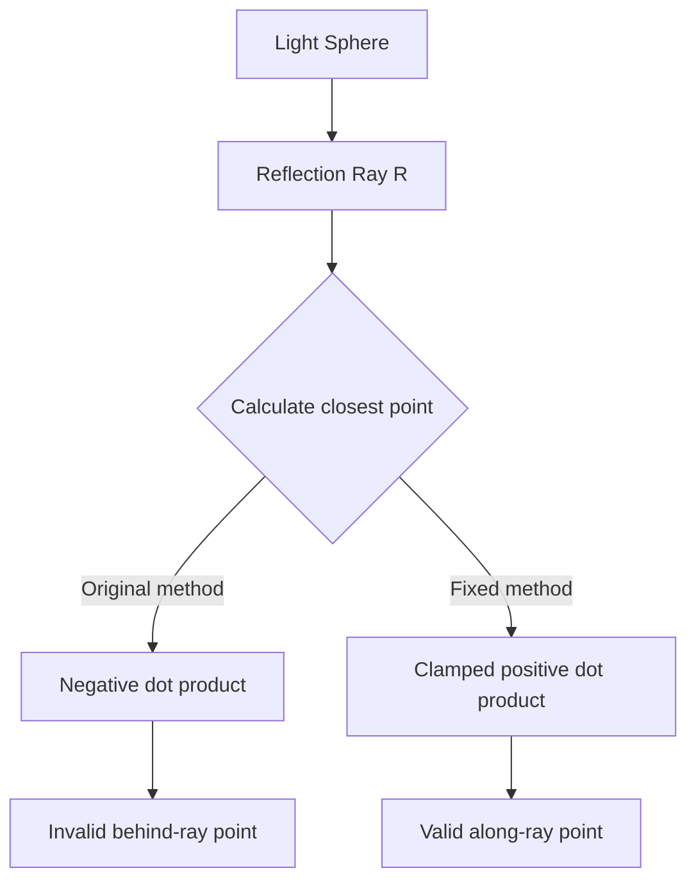

+++
title = "#19157 Fix specular cutoff on lights with radius overlapping with mesh"
date = "2025-05-12T00:00:00"
draft = false
template = "pull_request_page.html"
in_search_index = true

[taxonomies]
list_display = ["show"]

[extra]
current_language = "en"
available_languages = {"en" = { name = "English", url = "/pull_request/bevy/2025-05/pr-19157-en-20250512" }, "zh-cn" = { name = "中文", url = "/pull_request/bevy/2025-05/pr-19157-zh-cn-20250512" }}
labels = ["C-Bug", "A-Rendering", "M-Deliberate-Rendering-Change"]
+++

# Fix specular cutoff on lights with radius overlapping with mesh

## Basic Information
- **Title**: Fix specular cutoff on lights with radius overlapping with mesh
- **PR Link**: https://github.com/bevyengine/bevy/pull/19157
- **Author**: atlv24
- **Status**: MERGED
- **Labels**: C-Bug, A-Rendering, S-Ready-For-Final-Review, M-Deliberate-Rendering-Change
- **Created**: 2025-05-10T06:29:55Z
- **Merged**: 2025-05-12T19:32:24Z
- **Merged By**: superdump

## Description Translation
# Objective

- Fixes #13318

## Solution

- Clamp a dot product to be positive to avoid choosing a `centerToRay` which is not on the ray but behind it.

## Testing

- Repro in #13318

Main:


This PR:


Eevee reference:


## The Story of This Pull Request

The problem stemmed from an incorrect calculation in Bevy's physically based rendering (PBR) implementation when handling lights whose radius overlapped with mesh surfaces. This manifested as harsh specular cutoffs (#13318), particularly noticeable when objects intersected a light's spherical influence area. The root cause lay in how the rendering system computed the closest point between the light sphere and reflection rays.

In the original implementation, the calculation for `centerToRay` used an unclamped dot product between the light-to-fragment vector (`light_to_frag`) and the reflection vector (`R`). This could produce negative values when the surface point was inside or near the light's radius, leading to a miscalculation of the closest point on the light sphere to the reflection ray. The negative dot product caused the algorithm to select a point behind the ray origin rather than along the ray direction, creating visual discontinuities.

The solution involved modifying the shader code in `pbr_lighting.wgsl` to clamp this critical dot product to a small positive value (0.0001). Here's the key code change:

```wgsl
// Before
let centerToRay = dot(light_to_frag, R) * R - light_to_frag;

// After
var LtFdotR = dot(light_to_frag, R);
LtFdotR = max(0.0001, LtFdotR);
let centerToRay = LtFdotR * R - light_to_frag;
```

This clamping ensures the calculation always uses a point along the reflection ray's forward direction, preventing the selection of invalid points behind the ray origin. The 0.0001 threshold was chosen as a practical minimum to avoid division-by-zero errors while maintaining numerical stability.

The implementation preserves the existing representative point area light approximation from Epic's PBR notes but adds this crucial safeguard. The comments in the code acknowledge this as a temporary fix, noting that more accurate solutions like those from recent SIGGRAPH papers could provide better long-term results. However, this minimal change effectively addresses the immediate visual artifact without introducing significant performance overhead.

## Visual Representation



## Key Files Changed

**crates/bevy_pbr/src/render/pbr_lighting.wgsl** (+17/-1)

This WGSL shader file contains the core lighting calculations. The modification addresses a discontinuity in specular highlights when meshes intersect light spheres.

Before:
```wgsl
let centerToRay = dot(light_to_frag, R) * R - light_to_frag;
```

After:
```wgsl
var LtFdotR = dot(light_to_frag, R);
LtFdotR = max(0.0001, LtFdotR);
let centerToRay = LtFdotR * R - light_to_frag;
```

The changes ensure the dot product used in the closest-point calculation remains positive, preventing invalid backward projections that caused visual artifacts.

## Further Reading

1. Epic Games' PBR Notes: http://blog.selfshadow.com/publications/s2013-shading-course/karis/s2013_pbs_epic_notes_v2.pdf
2. Physically Based Area Lights by Michal Drobot
3. Linearly Transformed Cosines paper by Eric Heitz et al.

# Full Code Diff
```diff
diff --git a/crates/bevy_pbr/src/render/pbr_lighting.wgsl b/crates/bevy_pbr/src/render/pbr_lighting.wgsl
index 4497b567e9ff8..01e09fe3b470e 100644
--- a/crates/bevy_pbr/src/render/pbr_lighting.wgsl
+++ b/crates/bevy_pbr/src/render/pbr_lighting.wgsl
@@ -278,7 +278,23 @@ fn compute_specular_layer_values_for_point_light(
 
     // Representative Point Area Lights.
     // see http://blog.selfshadow.com/publications/s2013-shading-course/karis/s2013_pbs_epic_notes_v2.pdf p14-16
-    let centerToRay = dot(light_to_frag, R) * R - light_to_frag;
+    var LtFdotR = dot(light_to_frag, R);
+
+    // HACK: the following line is an amendment to fix a discontinuity when a surface
+    // intersects the light sphere. See https://github.com/bevyengine/bevy/issues/13318
+    //
+    // This sentence in the reference is crux of the problem: "We approximate finding the point with the
+    // smallest angle to the reflection ray by finding the point with the smallest distance to the ray."
+    // This approximation turns out to be completely wrong for points inside or near the sphere.
+    // Clamping this dot product to be positive ensures `centerToRay` lies on ray and not behind it.
+    // Any non-zero epsilon works here, it just has to be positive to avoid a singularity at zero.
+    // However, this is still far from physically accurate. Deriving an exact solution would help,
+    // but really we should adopt a superior solution to area lighting, such as:
+    // Physically Based Area Lights by Michal Drobot, or
+    // Polygonal-Light Shading with Linearly Transformed Cosines by Eric Heitz et al.
+    LtFdotR = max(0.0001, LtFdotR);
+
+    let centerToRay = LtFdotR * R - light_to_frag;
     let closestPoint = light_to_frag + centerToRay * saturate(
         light_position_radius * inverseSqrt(dot(centerToRay, centerToRay)));
     let LspecLengthInverse = inverseSqrt(dot(closestPoint, closestPoint));
```