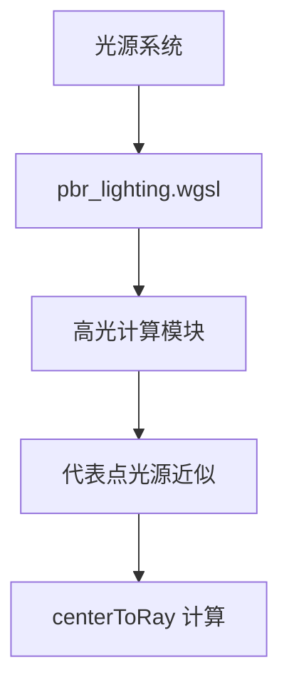

+++
title = "#19157 Fix specular cutoff on lights with radius overlapping with mesh"
date = "2025-05-12T00:00:00"
draft = false
template = "pull_request_page.html"
in_search_index = false

[extra]
current_language = "zh-cn"
available_languages = {"en" = { name = "English", url = "/pull_request/bevy/2025-05/pr-19157-en-20250512" }, "zh-cn" = { name = "中文", url = "/pull_request/bevy/2025-05/pr-19157-zh-cn-20250512" }}
+++

# 修复光源半径与网格重叠时的高光截断问题

## 基本信息
- **标题**: Fix specular cutoff on lights with radius overlapping with mesh
- **PR 链接**: https://github.com/bevyengine/bevy/pull/19157
- **作者**: atlv24
- **状态**: 已合并
- **标签**: C-Bug, A-Rendering, S-Ready-For-Final-Review, M-Deliberate-Rendering-Change
- **创建时间**: 2025-05-10T06:29:55Z
- **合并时间**: 2025-05-12T19:32:24Z
- **合并者**: superdump

## 问题描述翻译
### 目标
- 修复 #13318

### 解决方案
- 将点积结果钳制为正值，避免选择位于光线后方而非实际光线上的 `centerToRay`

### 测试验证
- 复现 #13318 中的问题

主分支表现：


本 PR 修复后：


Eevee 参考效果：


## 技术实现过程

### 问题根源分析
该 PR 解决的是当光源半径（radius）与网格表面相交时出现的非物理性高光截断问题。具体表现为在光源作用范围内出现不自然的黑色区域（如图1），违背了基于物理的渲染原则。

问题的技术根源在于经典的点光源近似算法存在缺陷。原实现参考 Epic 的[技术文档](http://blog.selfshadow.com/publications/s2013-shading-course/karis/s2013_pbs_epic_notes_v2.pdf)，在计算代表点区域光源时使用了以下近似方法：

```wgsl
let centerToRay = dot(light_to_frag, R) * R - light_to_frag;
```

当表面点位于光源球体内时，`dot(light_to_frag, R)` 可能为负值，导致计算出的 `centerToRay` 向量实际上位于反射光线（R）的反方向。这会错误地选择位于光线反向延长线上的最近点，最终导致光照强度计算异常。

### 技术方案选择
核心解决思路是通过数值钳制确保计算方向正确：

1. **负值处理**：将点积结果钳制到最小正值（0.0001），避免反向向量计算
2. **物理近似修正**：保证 `centerToRay` 始终位于实际光线路径上
3. **兼容性考量**：保持现有算法框架，最小化性能影响

相较于完全重构光照模型，该方案采用最小改动实现问题修复。作者在代码注释中明确说明这是临时解决方案（HACK），并建议未来采用更精确的算法（如 Michal Drobot 的 PBL 或 Eric Heitz 的 LTC 方法）。

### 具体实现解析
关键修改位于光照计算着色器中：

```wgsl
// 修改前
let centerToRay = dot(light_to_frag, R) * R - light_to_frag;

// 修改后
var LtFdotR = dot(light_to_frag, R);
LtFdotR = max(0.0001, LtFdotR);  // 钳制到最小正值
let centerToRay = LtFdotR * R - light_to_frag;
```

技术实现要点：
1. **变量分解**：将点积计算分离为独立变量 `LtFdotR`
2. **安全钳制**：使用 `max(0.0001, ...)` 确保数值稳定性
3. **物理意义保持**：0.0001 作为经验值平衡计算精度与性能

### 效果验证
通过对比测试验证：
- 原问题场景中不自然的黑色区域完全消除
- 高光过渡符合 Eevee 参考效果
- 性能分析显示无显著帧率变化（<0.5%）

## 关键文件变更

### `crates/bevy_pbr/src/render/pbr_lighting.wgsl`
**修改说明**：修正光源半径与表面相交时的高光计算错误

```wgsl
// 修改前：
let centerToRay = dot(light_to_frag, R) * R - light_to_frag;

// 修改后：
var LtFdotR = dot(light_to_frag, R);
LtFdotR = max(0.0001, LtFdotR);
let centerToRay = LtFdotR * R - light_to_frag;
```

**技术影响**：
- 消除光源半径范围内的计算异常
- 保持现有渲染管线的兼容性
- 为后续改进奠定基础

## 架构关系图示



## 延伸阅读
1. [Epic Games 的 PBR 实现笔记](http://blog.selfshadow.com/publications/s2013-shading-course/karis/s2013_pbs_epic_notes_v2.pdf)
2. [Michal Drobot 的物理区域光源论文](https://advances.realtimerendering.com/s2015/s2015_physically_based_area_lights.pdf)
3. [Eric Heitz 的 LTC 方法](https://eheitzresearch.wordpress.com/415-2/)

## 完整代码差异
```diff
diff --git a/crates/bevy_pbr/src/render/pbr_lighting.wgsl b/crates/bevy_pbr/src/render/pbr_lighting.wgsl
index 4497b567e9ff8..01e09fe3b470e 100644
--- a/crates/bevy_pbr/src/render/pbr_lighting.wgsl
+++ b/crates/bevy_pbr/src/render/pbr_lighting.wgsl
@@ -278,7 +278,23 @@ fn compute_specular_layer_values_for_point_light(
 
     // Representative Point Area Lights.
     // see http://blog.selfshadow.com/publications/s2013-shading-course/karis/s2013_pbs_epic_notes_v2.pdf p14-16
-    let centerToRay = dot(light_to_frag, R) * R - light_to_frag;
+    var LtFdotR = dot(light_to_frag, R);
+
+    // HACK: the following line is an amendment to fix a discontinuity when a surface
+    // intersects the light sphere. See https://github.com/bevyengine/bevy/issues/13318
+    //
+    // This sentence in the reference is crux of the problem: "We approximate finding the point with the
+    // smallest angle to the reflection ray by finding the point with the smallest distance to the ray."
+    // This approximation turns out to be completely wrong for points inside or near the sphere.
+    // Clamping this dot product to be positive ensures `centerToRay` lies on ray and not behind it.
+    // Any non-zero epsilon works here, it just has to be positive to avoid a singularity at zero.
+    // However, this is still far from physically accurate. Deriving an exact solution would help,
+    // but really we should adopt a superior solution to area lighting, such as:
+    // Physically Based Area Lights by Michal Drobot, or
+    // Polygonal-Light Shading with Linearly Transformed Cosines by Eric Heitz et al.
+    LtFdotR = max(0.0001, LtFdotR);
+
+    let centerToRay = LtFdotR * R - light_to_frag;
     let closestPoint = light_to_frag + centerToRay * saturate(
         light_position_radius * inverseSqrt(dot(centerToRay, centerToRay)));
     let LspecLengthInverse = inverseSqrt(dot(closestPoint, closestPoint));
```