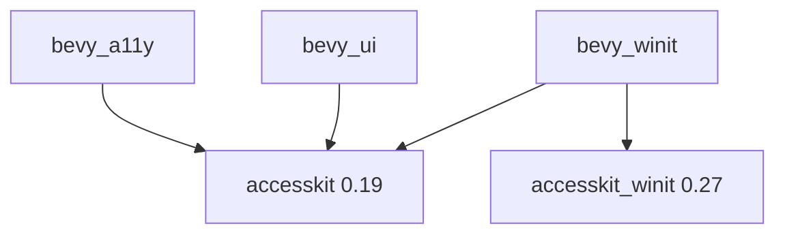

+++
title = "#19160 Bump accesskit to 0.19 and accesskit_winit to 0.27"
date = "2025-05-26T00:00:00"
draft = false
template = "pull_request_page.html"
in_search_index = true

[taxonomies]
list_display = ["show"]

[extra]
current_language = "en"
available_languages = {"en" = { name = "English", url = "/pull_request/bevy/2025-05/pr-19160-en-20250526" }, "zh-cn" = { name = "中文", url = "/pull_request/bevy/2025-05/pr-19160-zh-cn-20250526" }}
labels = ["D-Trivial", "C-Dependencies"]
+++

# Title

## Basic Information
- **Title**: Bump accesskit to 0.19 and accesskit_winit to 0.27
- **PR Link**: https://github.com/bevyengine/bevy/pull/19160
- **Author**: DataTriny
- **Status**: MERGED
- **Labels**: D-Trivial, C-Dependencies, S-Ready-For-Final-Review
- **Created**: 2025-05-10T14:46:16Z
- **Merged**: 2025-05-26T18:08:47Z
- **Merged By**: alice-i-cecile

## Description Translation
# Objective

- Update AccessKit crates to their latest versions.
- Fixes #19040 

## Solution

- Only modifying Cargo.toml files is needed, few changes under the hood but nothing impacting Bevy.

## Testing

- I ran the tab_navigation example on Windows 11.

## The Story of This Pull Request

This dependency update addresses compatibility requirements with AccessKit, a critical accessibility framework that enables Bevy applications to work with assistive technologies. The changes focus on version bumps in three core crates while maintaining existing functionality.

The primary challenge was ensuring compatibility with AccessKit's API changes between versions 0.18 → 0.19 and accesskit_winit 0.25 → 0.27. The maintainer verified through testing that no code changes were required despite the minor version increments, indicating backward compatibility in the parts of the API surface used by Bevy.

Implementation required coordinated updates across multiple subsystems:
1. Root workspace dependencies
2. Accessibility subsystem (bevy_a11y)
3. UI framework (bevy_ui)
4. Winit integration layer (bevy_winit)

The version bumps in `Cargo.toml` files ensure consistent dependency resolution across all components interacting with accessibility features. The maintainer validated the changes using Bevy's tab_navigation example, confirming that keyboard navigation fundamentals remained functional on Windows 11 - a critical test given AccessKit's role in managing focus states and accessibility trees.

## Visual Representation



## Key Files Changed

1. **crates/bevy_winit/Cargo.toml** (+2/-2)
```toml
# Before:
accesskit_winit = { version = "0.25", ... }
accesskit = "0.18"

# After: 
accesskit_winit = { version = "0.27", ... }
accesskit = "0.19"
```
Updates Winit integration to match AccessKit's newer APIs while maintaining raw window handle compatibility.

2. **Cargo.toml** (+1/-1)
```toml
# Before:
accesskit = "0.18"

# After:
accesskit = "0.19"
```
Synchronizes workspace-wide dependency version for consistency.

3. **crates/bevy_a11y/Cargo.toml** (+1/-1)
```toml
# Before:
accesskit = { version = "0.18", ... }

# After:
accesskit = { version = "0.19", ... }
```
Updates core accessibility subsystem to latest framework version.

4. **crates/bevy_ui/Cargo.toml** (+1/-1)
```toml
# Before:
accesskit = "0.18"

# After:
accesskit = "0.19"
```
Aligns UI component's accessibility dependencies with other subsystems.

## Further Reading

- AccessKit Changelog: https://github.com/AccessKit/accesskit/releases
- Winit Accessibility Integration: https://docs.rs/accesskit_winit/latest/accesskit_winit/
- Bevy Accessibility Guide: https://bevyengine.org/learn/book/features/accessibility/