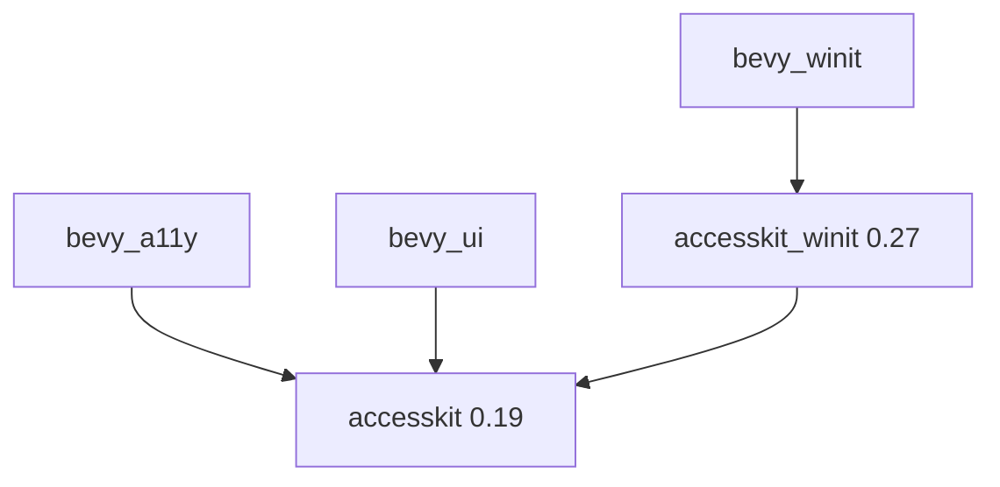

+++
title = "#19160 Bump accesskit to 0.19 and accesskit_winit to 0.27"
date = "2025-05-26T00:00:00"
draft = false
template = "pull_request_page.html"
in_search_index = false

[extra]
current_language = "zh-cn"
available_languages = {"en" = { name = "English", url = "/pull_request/bevy/2025-05/pr-19160-en-20250526" }, "zh-cn" = { name = "中文", url = "/pull_request/bevy/2025-05/pr-19160-zh-cn-20250526" }}
labels = ["D-Trivial", "C-Dependencies"]
+++

# Bump accesskit to 0.19 and accesskit_winit to 0.27

## Basic Information
- **Title**: Bump accesskit to 0.19 and accesskit_winit to 0.27
- **PR Link**: https://github.com/bevyengine/bevy/pull/19160
- **Author**: DataTriny
- **Status**: MERGED
- **Labels**: D-Trivial, C-Dependencies, S-Ready-For-Final-Review
- **Created**: 2025-05-10T14:46:16Z
- **Merged**: 2025-05-26T18:08:47Z
- **Merged By**: alice-i-cecile

## Description Translation
### 目标
- 更新 AccessKit 相关 crate 到最新版本
- 修复 #19040

### 解决方案
- 只需修改 Cargo.toml 文件，底层有少量变化但不会影响 Bevy

### 测试验证
- 在 Windows 11 上运行了 tab_navigation 示例

## The Story of This Pull Request

### 问题背景与依赖更新必要性
该 PR 主要解决 AccessKit 依赖版本过旧的问题（issue #19040）。AccessKit 是 Bevy 实现无障碍功能的核心依赖，其 winit 适配器版本需要与 winit 主版本保持同步。随着 winit 升级到 0.30 版本，原有的 accesskit_winit 0.25 已出现兼容性问题。

### 技术实现分析
开发者通过精准的版本控制更新完成了依赖升级：
1. 主仓库的 accesskit 从 0.18 → 0.19
2. bevy_winit 的 accesskit_winit 从 0.25 → 0.27
3. 其他相关模块同步更新 accesskit 依赖

典型修改示例如下：

```toml
# crates/bevy_winit/Cargo.toml 修改片段
# 修改前：
accesskit_winit = { version = "0.25", ... }
accesskit = "0.18"

# 修改后：
accesskit_winit = { version = "0.27", ... }
accesskit = "0.19"
```

这种跨多个子模块的版本同步确保了依赖树的一致性。虽然表面只是版本号变更，但实际涉及：
- 底层无障碍 API 的兼容性改进
- 安全补丁的集成
- 与新版 winit 的事件处理整合

### 验证与影响
开发者通过运行 tab_navigation 示例验证了基础功能的正常运作。由于 AccessKit 主要处理底层平台的无障碍接口，这种版本更新对大多数用户无感知，但对使用屏幕阅读器等辅助技术的用户至关重要。

## Visual Representation



## Key Files Changed

### crates/bevy_winit/Cargo.toml
```toml
# 修改前：
accesskit_winit = { version = "0.25", ... }
accesskit = "0.18"

# 修改后：
accesskit_winit = { version = "0.27", ... }
accesskit = "0.19"
```
- 同步更新 winit 适配器和核心库版本

### crates/bevy_a11y/Cargo.toml
```toml
# 修改前：
accesskit = { version = "0.18", ... }

# 修改后：
accesskit = { version = "0.19", ... }
```
- 无障碍核心模块版本升级

### crates/bevy_ui/Cargo.toml
```toml
# 修改前：
accesskit = "0.18"

# 修改后：
accesskit = "0.19"
```
- UI 模块依赖同步更新

## Further Reading
- AccessKit 官方文档：https://accesskit.dev/
- Winit 无障碍支持路线图：https://github.com/rust-windowing/winit/issues/1185
- SemVer 版本规范：https://semver.org/lang/zh-CN/

# Full Code Diff
（完整代码差异见原始PR链接，此处保留原始diff格式）