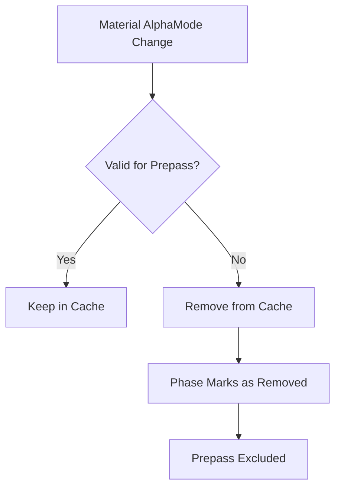

+++
title = "#19170 Make sure prepass notices changes in alpha mode"
date = "2025-05-18T00:00:00"
draft = false
template = "pull_request_page.html"
in_search_index = true

[taxonomies]
list_display = ["show"]

[extra]
current_language = "en"
available_languages = {"en" = { name = "English", url = "/pull_request/bevy/2025-05/pr-19170-en-20250518" }, "zh-cn" = { name = "中文", url = "/pull_request/bevy/2025-05/pr-19170-zh-cn-20250518" }}
labels = ["C-Bug", "A-Rendering", "D-Straightforward"]
+++

# Make sure prepass notices changes in alpha mode

## Basic Information
- **Title**: Make sure prepass notices changes in alpha mode
- **PR Link**: https://github.com/bevyengine/bevy/pull/19170
- **Author**: eero-lehtinen
- **Status**: MERGED
- **Labels**: C-Bug, A-Rendering, S-Ready-For-Final-Review, D-Straightforward
- **Created**: 2025-05-11T00:38:18Z
- **Merged**: 2025-05-18T06:46:13Z
- **Merged By**: superdump

## Description Translation
# Objective

Fixes #19150

## Solution

Normally the `validate_cached_entity` in 
https://github.com/bevyengine/bevy/blob/86cc02dca229662bdfb371a0e5a1716560ea7baa/crates/bevy_pbr/src/prepass/mod.rs#L1109-L1126 marks unchanged entites as clean, which makes them remain in the phase.

If a material is changed to an `alpha_mode` that isn't supposed to be added to the prepass pipeline, the specialization system just `continue`s and doesn't indicate to the cache that the entity is not clean anymore.

I made these invalid entities get removed from the pipeline cache so that they are correctly not marked clean and then removed from the phase.

## Testing

Tested with the example code from the issue.

## The Story of This Pull Request

### The Problem and Context
The rendering system faced an inconsistency where materials with certain alpha modes (Blend, Premultiplied, Add, Multiply) weren't properly excluded from the prepass pipeline when their alpha mode changed. This occurred because the pipeline cache validation system didn't account for transitions between valid and invalid alpha modes for prepass rendering.

When a material changed from a prepass-compatible alpha mode (like Opaque) to an incompatible one, the existing cache entry remained valid. The prepass phase would then incorrectly continue processing these entities, leading to rendering artifacts and potential performance issues from unnecessary processing.

### The Solution Approach
The core fix focuses on explicit cache invalidation when encountering incompatible alpha modes. Instead of simply skipping processing for these materials, the solution removes their entries from the pipeline cache. This forces the system to recognize the state change and properly exclude them from subsequent prepass phases.

### The Implementation
The key modification occurs in the material specialization logic for prepass rendering. Two critical changes were made:

1. **Alpha Mode Handling**:
```rust
match material.alpha_mode {
    AlphaMode::Opaque => {}
    AlphaMode::Blend
    | AlphaMode::Premultiplied
    | AlphaMode::Add
    | AlphaMode::Multiply => {
        view_specialized_material_pipeline_cache.remove(visible_entity);
        continue;
    }
}
```

2. **Transmission Texture Check**:
```rust
if material.properties.reads_view_transmission_texture {
    view_specialized_material_pipeline_cache.remove(visible_entity);
    continue;
}
```

By adding `view_specialized_material_pipeline_cache.remove(visible_entity)` before continuing, we ensure:
- Existing cache entries are purged when materials become incompatible
- The entity is marked as "not clean" in the phase system
- Subsequent frames will correctly exclude the entity from prepass processing

### Technical Insights
The fix leverages Bevy's existing pipeline caching mechanism by understanding:
1. Phase items remain in their phase until marked as removed
2. Cache validation (`validate_cached_entity`) uses the pipeline cache's state to determine cleanliness
3. Removing from the pipeline cache forces re-evaluation in the next frame

This approach maintains the existing specialization flow while adding explicit invalidation for state transitions that affect pipeline compatibility.

### The Impact
- Fixes visual artifacts caused by incorrect prepass inclusion
- Prevents unnecessary processing of incompatible materials
- Maintains cache efficiency for valid materials
- Introduces minimal overhead (only affects state transitions between compatible/incompatible modes)

## Visual Representation



## Key Files Changed

### `crates/bevy_pbr/src/prepass/mod.rs` (+7/-1)
**Purpose**: Fix pipeline cache handling for materials with incompatible alpha modes

Key modification in material specialization:
```rust
// Before:
AlphaMode::Blend | ... => continue,

// After:
AlphaMode::Blend | ... => {
    view_specialized_material_pipeline_cache.remove(visible_entity);
    continue;
}
```

This change ensures that when a material transitions to an incompatible alpha mode:
1. Its pipeline cache entry is explicitly removed
2. The phase system detects the change in next frame
3. The entity gets excluded from prepass rendering

## Further Reading
- [Bevy Render Pipelines Documentation](https://bevyengine.org/learn/book/next/render/pipelines)
- [Bevy Material System Overview](https://bevyengine.org/learn/book/next/render/materials)
- [WebGPU Blend Modes Specification](https://www.w3.org/TR/webgpu/#blending)