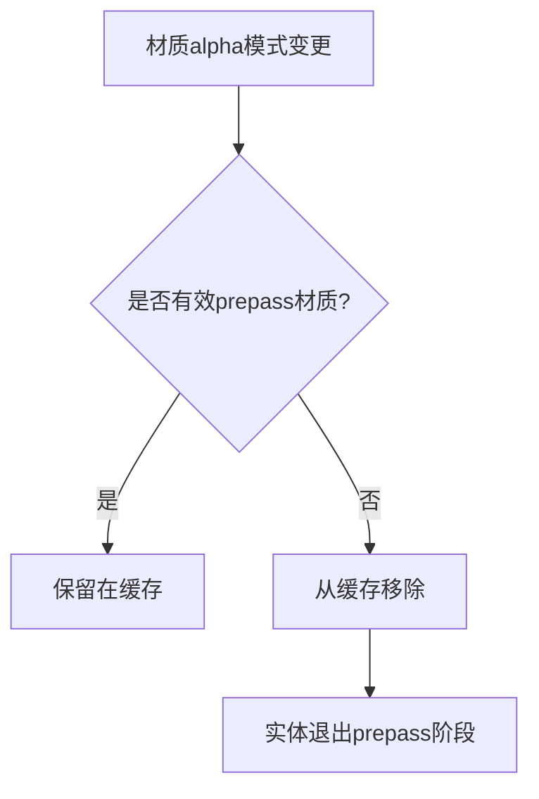

+++
title = "#19170 Make sure prepass notices changes in alpha mode"
date = "2025-05-18T00:00:00"
draft = false
template = "pull_request_page.html"
in_search_index = false

[extra]
current_language = "zh-cn"
available_languages = {"en" = { name = "English", url = "/pull_request/bevy/2025-05/pr-19170-en-20250518" }, "zh-cn" = { name = "中文", url = "/pull_request/bevy/2025-05/pr-19170-zh-cn-20250518" }}
labels = ["C-Bug", "A-Rendering", "D-Straightforward"]
+++

# Make sure prepass notices changes in alpha mode

## Basic Information
- **Title**: Make sure prepass notices changes in alpha mode
- **PR Link**: https://github.com/bevyengine/bevy/pull/19170
- **Author**: eero-lehtinen
- **Status**: MERGED
- **Labels**: C-Bug, A-Rendering, S-Ready-For-Final-Review, D-Straightforward
- **Created**: 2025-05-11T00:38:18Z
- **Merged**: 2025-05-18T06:46:13Z
- **Merged By**: superdump

## Description Translation
### 目标
修复 #19150

### 解决方案
通常`prepass/mod.rs`中的`validate_cached_entity`函数会将未改变的实体标记为"clean"，使其保留在渲染阶段。当材质切换到不适合prepass管线的`alpha_mode`时，原有实现直接`continue`而未通知缓存实体状态已改变。

修改后会使这些无效实体从管线缓存中移除，确保它们不再被标记为clean并从渲染阶段正确移除。

### 测试
使用issue中的示例代码进行了验证

## The Story of This Pull Request

### 问题背景
在Bevy的PBR渲染管线中，prepass阶段需要根据材质的alpha模式决定是否参与渲染。当材质从有效的alpha模式（如Opaque）切换至无效模式（如Blend）时，原有实现存在缓存失效问题——特殊化系统直接跳过处理但未更新缓存状态，导致实体错误地保留在prepass阶段。

### 技术分析
问题根源在于`specialize_prepass_material_meshes`函数的处理逻辑：
```rust
match material.alpha_mode {
    AlphaMode::Opaque => {}
    AlphaMode::Blend
    | AlphaMode::Premultiplied
    | AlphaMode::Add
    | AlphaMode::Multiply => continue,
}
```
当检测到无效alpha模式时直接continue，但未清理缓存条目。这使得：
1. 实体仍保留在`view_specialized_material_pipeline_cache`中
2. 后续帧的`validate_cached_entity`检查误认为实体状态未改变
3. 无效实体持续存在于prepass阶段

### 解决方案实现
核心修改是在遇到无效alpha模式时主动移除缓存条目：
```rust
match material.alpha_mode {
    AlphaMode::Opaque => {}
    AlphaMode::Blend
    | AlphaMode::Premultiplied
    | AlphaMode::Add
    | AlphaMode::Multiply => {
        view_specialized_material_pipeline_cache.remove(visible_entity);
        continue;
    }
}
```
同时对读取`ViewTransmissionTexture`的情况也添加了缓存清理：
```rust
if material.properties.reads_view_transmission_texture {
    view_specialized_material_pipeline_cache.remove(visible_entity);
    continue;
}
```

### 技术影响
1. **缓存一致性**：确保管线缓存准确反映当前材质状态
2. **渲染正确性**：防止无效材质参与prepass阶段造成视觉错误
3. **性能优化**：及时清理无效条目减少不必要的计算

### 工程决策
选择直接操作缓存而非修改标记机制的原因：
1. 现有架构中缓存是状态管理的唯一来源
2. 避免引入新的状态跟踪机制带来复杂度
3. 与现有验证逻辑`validate_cached_entity`保持一致

## Visual Representation



## Key Files Changed

### `crates/bevy_pbr/src/prepass/mod.rs` (+7/-1)
**修改原因**：修复alpha模式变更时prepass缓存失效问题

**关键代码对比**：
```rust
// 修改前：
| AlphaMode::Multiply => continue,

// 修改后：
| AlphaMode::Multiply => {
    view_specialized_material_pipeline_cache.remove(visible_entity);
    continue;
}
```

```rust
// 新增传输纹理处理：
if material.properties.reads_view_transmission_texture {
    view_specialized_material_pipeline_cache.remove(visible_entity);
    continue;
}
```

**关联性**：通过主动清理缓存条目，确保prepass阶段只处理有效材质

## Further Reading
1. [Bevy渲染管线文档](https://bevyengine.org/learn/book/rendering/pipeline/)
2. [WGSL材质系统设计](https://bevyengine.org/learn/book/rendering/materials/)
3. [实体组件系统模式](https://en.wikipedia.org/wiki/Entity_component_system)

# Full Code Diff
<details>
<summary>View full diff</summary>

```diff
diff --git a/crates/bevy_pbr/src/prepass/mod.rs b/crates/bevy_pbr/src/prepass/mod.rs
index cc8dcea6a025b..03a797eba1a23 100644
--- a/crates/bevy_pbr/src/prepass/mod.rs
+++ b/crates/bevy_pbr/src/prepass/mod.rs
@@ -983,12 +983,18 @@ pub fn specialize_prepass_material_meshes<M>(
                 AlphaMode::Blend
                 | AlphaMode::Premultiplied
                 | AlphaMode::Add
-                | AlphaMode::Multiply => continue,
+                | AlphaMode::Multiply => {
+                    // In case this material was previously in a valid alpha_mode, remove it to
+                    // stop the queue system from assuming its retained cache to be valid.
+                    view_specialized_material_pipeline_cache.remove(visible_entity);
+                    continue;
+                }
             }
 
             if material.properties.reads_view_transmission_texture {
                 // No-op: Materials reading from `ViewTransmissionTexture` are not rendered in the `Opaque3d`
                 // phase, and are therefore also excluded from the prepass much like alpha-blended materials.
+                view_specialized_material_pipeline_cache.remove(visible_entity);
                 continue;
             }
 
```

</details>