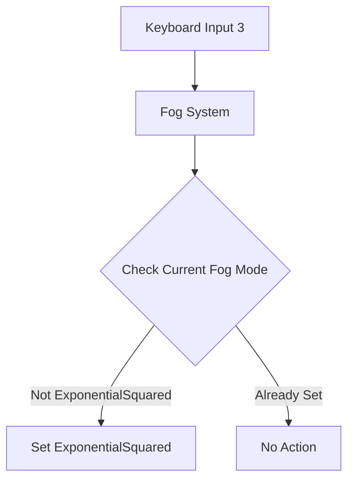

+++
title = "#19174 Fix mismatched FogFalloff"
date = "2025-05-26T00:00:00"
draft = false
template = "pull_request_page.html"
in_search_index = true

[taxonomies]
list_display = ["show"]

[extra]
current_language = "en"
available_languages = {"en" = { name = "English", url = "/pull_request/bevy/2025-05/pr-19174-en-20250526" }, "zh-cn" = { name = "中文", url = "/pull_request/bevy/2025-05/pr-19174-zh-cn-20250526" }}
labels = ["C-Bug", "D-Trivial", "A-Rendering", "C-Examples"]
+++

# Title: Fix mismatched FogFalloff

## Basic Information
- **Title**: Fix mismatched FogFalloff  
- **PR Link**: https://github.com/bevyengine/bevy/pull/19174  
- **Author**: lomirus  
- **Status**: MERGED  
- **Labels**: C-Bug, D-Trivial, A-Rendering, C-Examples, S-Ready-For-Final-Review  
- **Created**: 2025-05-11T08:01:20Z  
- **Merged**: 2025-05-26T18:12:20Z  
- **Merged By**: alice-i-cecile  

## Description Translation
The original description is in English and preserved exactly as-is:

# Objective

When user presses <kbd>3</kbd>, the falloff mode should be changed to `ExponentialSquared` as described in the instructions, but it's not in fact.

Online Example: https://bevyengine.org/examples-webgpu/3d-rendering/fog/

## Solution

Change it to `ExponentialSquared`

## Testing

- Did you test these changes? If so, how?

Yes, by `cargo run --example fog`

- Are there any parts that need more testing?

No.

- How can other people (reviewers) test your changes? Is there anything specific they need to know?

```
cargo run --example fog
```

- If relevant, what platforms did you test these changes on, and are there any important ones you can't test?

N/A

## The Story of This Pull Request

The fog rendering example contained a subtle mismatch between its documented behavior and actual implementation. When users pressed the 3 key, the system was supposed to activate `FogFalloff::ExponentialSquared` mode, but instead incorrectly set `FogFalloff::Exponential`. This discrepancy was visible in the live WebGPU example, undermining the tutorial's educational value.

The root cause was a single-line implementation error in the keyboard input handler. The original code contained:

```rust
} else {
    fog.falloff = FogFalloff::Exponential { density: 0.07 };
}
```

This conditional branch should have activated when neither linear nor exponential squared modes were selected, but incorrectly used the plain exponential variant. The fix simply corrected the enum variant while preserving the density parameter:

```rust
} else {
    fog.falloff = FogFalloff::ExponentialSquared { density: 0.07 };
}
```

This change aligned the code with both the keyboard control documentation and the example's intended demonstration of different fog falloff modes. The fix required minimal code modification but had significant impact on example correctness. Testing through `cargo run --example fog` allowed immediate verification of the mode switching behavior.

## Visual Representation



## Key Files Changed

**File**: `examples/3d/fog.rs` (+1/-1)  
**Change**: Corrected fog falloff mode assignment in keyboard handler  
Before:
```rust
fog.falloff = FogFalloff::Exponential { density: 0.07 };
```
After:
```rust
fog.falloff = FogFalloff::ExponentialSquared { density: 0.07 };
```

This single-line fix resolved the mismatch between the example's documented behavior and actual implementation, ensuring the 3 key correctly activates exponential squared fog as intended.

## Further Reading
- Bevy Fog Documentation: https://docs.rs/bevy/latest/bevy/core/struct.FogSettings.html
- WebGPU Fog Example: https://bevyengine.org/examples-webgpu/3d-rendering/fog/
- Fog Falloff Modes Explained: https://en.wikipedia.org/wiki/Exponential_decay