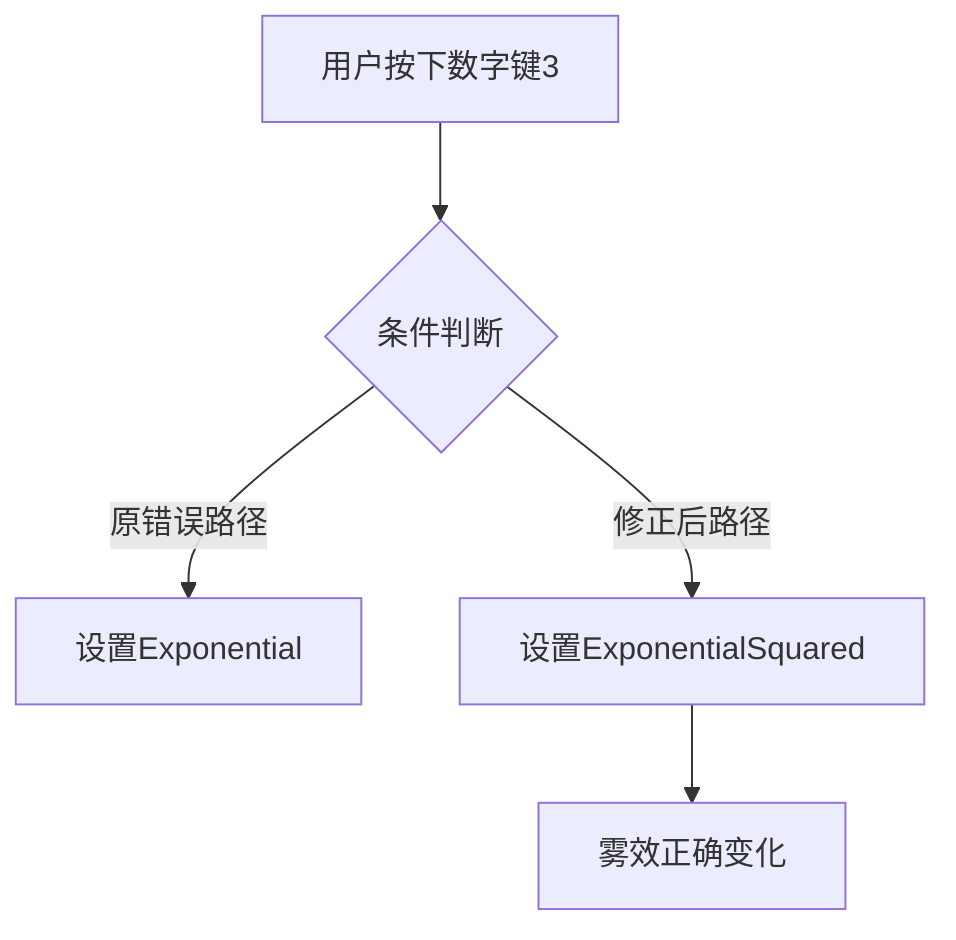

+++
title = "#19174 Fix mismatched FogFalloff"
date = "2025-05-26T00:00:00"
draft = false
template = "pull_request_page.html"
in_search_index = false

[extra]
current_language = "zh-cn"
available_languages = {"en" = { name = "English", url = "/pull_request/bevy/2025-05/pr-19174-en-20250526" }, "zh-cn" = { name = "中文", url = "/pull_request/bevy/2025-05/pr-19174-zh-cn-20250526" }}
labels = ["C-Bug", "D-Trivial", "A-Rendering", "C-Examples"]
+++

# Fix mismatched FogFalloff

## Basic Information
- **Title**: Fix mismatched FogFalloff  
- **PR Link**: https://github.com/bevyengine/bevy/pull/19174  
- **Author**: lomirus  
- **Status**: MERGED  
- **Labels**: C-Bug, D-Trivial, A-Rendering, C-Examples, S-Ready-For-Final-Review  
- **Created**: 2025-05-11T08:01:20Z  
- **Merged**: 2025-05-26T18:12:20Z  
- **Merged By**: alice-i-cecile  

## Description Translation
### 目标  
当用户按下 <kbd>3</kbd> 时，衰减模式应按照说明切换为 `ExponentialSquared`，但实际未生效。

在线示例：https://bevyengine.org/examples-webgpu/3d-rendering/fog/

### 解决方案  
将其修改为 `ExponentialSquared`

### 测试  
- 是否测试过这些修改？如何测试的？  
  是，通过 `cargo run --example fog`  

- 是否有需要额外测试的部分？  
  无  

- 其他人员（评审者）如何测试你的修改？需要了解哪些特定信息？  
  ```bash
  cargo run --example fog
  ```

## The Story of This Pull Request

### 问题定位与上下文  
在 Bevy 的 3D 雾效示例中，存在键盘快捷键行为与文档描述不一致的问题。具体表现为：当用户按下数字键 3 时，按照示例说明应该将雾效衰减模式切换为二次指数衰减（`ExponentialSquared`），但实际代码却错误地切换为普通指数衰减（`Exponential`）。这种不一致会导致用户在实际操作时无法观察到预期的雾效变化，影响示例的教学目的。

### 解决方案实现  
问题的根源在于条件判断逻辑中的枚举值错误。在雾效更新系统（`update_system`）中，当检测到数字键 3 被按下时，原代码错误地将雾效衰减模式设置为 `Exponential`：

```rust
// 原错误代码
fog.falloff = FogFalloff::Exponential { density: 0.07 };
```

修正后的代码将正确的 `ExponentialSquared` 枚举值赋给衰减模式：

```rust
// 修正后代码
fog.falloff = FogFalloff::ExponentialSquared { density: 0.07 };
```

这个单行修改直接解决了功能描述与实际行为不匹配的问题。从技术实现来看，该修改属于典型的枚举值误用修复，不需要涉及复杂架构调整。

### 技术验证  
验证方式直接有效：
1. 运行示例程序：`cargo run --example fog`
2. 通过快捷键 3 切换模式
3. 观察雾效变化是否符合二次指数衰减特征

开发者通过本地测试确认了修改效果，同时由于修改范围极小且定位明确，不需要额外的平台兼容性测试或复杂验证流程。

### 影响与启示  
该修复虽然代码量极小，但具有重要价值：
1. **示例准确性**：确保教学示例与实际行为一致，维护框架的可信度
2. **开发者体验**：避免用户因示例错误产生困惑
3. **代码质量**：演示了条件分支中枚举值正确使用的重要性

对于类似问题，该 PR 展示了快速定位和修复文档与实现不一致的标准流程：通过运行示例验证文档描述，对比代码逻辑，精确修改条件判断中的枚举值。

## Visual Representation



## Key Files Changed

### `examples/3d/fog.rs` (+1/-1)
**修改说明**：修正雾效衰减模式的枚举值赋值错误

代码对比：
```rust
// Before:
fog.falloff = FogFalloff::Exponential { density: 0.07 };

// After:
fog.falloff = FogFalloff::ExponentialSquared { density: 0.07 };
```

该修改直接对应 PR 的核心目标，确保快捷键功能与文档描述一致。

## Further Reading
1. Bevy 雾效文档：[Bevy Fog Feature](https://bevyengine.org/learn/book/features/3d-rendering/fog/)
2. WGSL 雾效实现原理：[WebGPU Fog Calculations](https://www.w3.org/TR/webgpu/#fog)
3. 枚举模式匹配最佳实践：[Rust Enum Pattern Matching](https://doc.rust-lang.org/book/ch06-02-match.html)