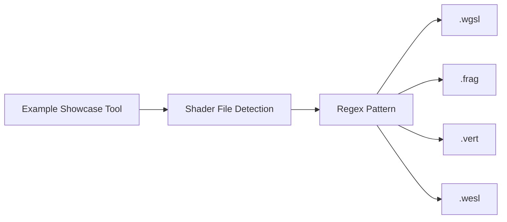

+++
title = "#19178 Added support for .wesl files to the regex pattern for examples"
date = "2025-05-26T00:00:00"
draft = false
template = "pull_request_page.html"
in_search_index = true

[taxonomies]
list_display = ["show"]

[extra]
current_language = "en"
available_languages = {"en" = { name = "English", url = "/pull_request/bevy/2025-05/pr-19178-en-20250526" }, "zh-cn" = { name = "中文", url = "/pull_request/bevy/2025-05/pr-19178-zh-cn-20250526" }}
labels = ["C-Docs", "D-Trivial", "C-Examples"]
+++

# Added support for .wesl files to the regex pattern for examples

## Basic Information
- **Title**: Added support for .wesl files to the regex pattern for examples
- **PR Link**: https://github.com/bevyengine/bevy/pull/19178
- **Author**: atlasgorn
- **Status**: MERGED
- **Labels**: C-Docs, D-Trivial, C-Examples, S-Ready-For-Final-Review
- **Created**: 2025-05-11T17:15:08Z
- **Merged**: 2025-05-26T18:18:20Z
- **Merged By**: alice-i-cecile

## Description Translation
The original description is in English and preserved as-is:

## Objective

[Shaders / Material - WESL](https://bevyengine.org/examples-webgpu/shaders/shader-material-wesl/) example doesn't have a WESL file tab

## Solution

Added wesl to regex

## The Story of This Pull Request

The Bevy engine's example showcase system faced a specific documentation gap - its WESL (WebGPU Shading Language) example wasn't properly displaying shader file tabs. This occurred because the file detection logic used a regular expression that didn't account for .wesl file extensions.

The core issue resided in how the example processing system identifies shader files. The existing implementation used a regex pattern that explicitly matched .wgsl, .frag, and .vert extensions through an alternation pattern:

```rust
r"(shaders\/\w+\.wgsl)|(shaders\/\w+\.frag)|(shaders\/\w+\.vert)"
```

This pattern effectively created three separate capture groups for different shader extensions. However, it lacked support for the newer .wesl extension used in WebGPU examples, causing those files to be overlooked in the documentation generation.

The solution involved refactoring the regex to use a unified extension group while adding the missing wesl extension. The revised pattern:

```rust
r"shaders\/\w+\.(wgsl|frag|vert|wesl)"
```

This change achieves three key improvements:
1. **Simplified maintenance**: By grouping extensions in a single capture
2. **Extended coverage**: Explicit inclusion of .wesl files
3. **Pattern clarity**: More readable structure through logical grouping

The implementation required modifying only three lines in the example showcase tool's Rust code. The updated regex now correctly identifies all supported shader types, ensuring proper tab rendering for WESL examples in the documentation.

From an engineering perspective, this change demonstrates the importance of:
- Regular expression optimization for maintainability
- Comprehensive extension handling in file processing systems
- Documentation system validation when introducing new asset types

The impact is immediately visible in the [updated WESL example documentation](https://bevyengine.org/examples-webgpu/shaders/shader-material-wesl/), which now properly displays all relevant shader files through tabbed navigation.

## Visual Representation



## Key Files Changed

### `tools/example-showcase/src/main.rs` (+1/-3)
**Purpose**: Update regex pattern to include .wesl shader files

**Code Changes**:
```rust
// Before:
let shader_regex =
    Regex::new(r"(shaders\/\w+\.wgsl)|(shaders\/\w+\.frag)|(shaders\/\w+\.vert)")
        .unwrap();

// After:
let shader_regex = Regex::new(r"shaders\/\w+\.(wgsl|frag|vert|wesl)").unwrap();
```

**Impact**:
- Reduced regex complexity from 3 alternations to 1 grouped pattern
- Added wesl extension to recognized shader files
- Maintained backward compatibility with existing shader types

## Further Reading

1. [Bevy Examples Documentation](https://bevyengine.org/learn/book/getting-started/examples/)
2. [Rust Regex Crate Documentation](https://docs.rs/regex/latest/regex/)
3. [WebGPU Shading Language (WGSL) Spec](https://www.w3.org/TR/WGSL/)

# Full Code Diff
```diff
diff --git a/tools/example-showcase/src/main.rs b/tools/example-showcase/src/main.rs
index c8feff10503e1..6fa24b1a27359 100644
--- a/tools/example-showcase/src/main.rs
+++ b/tools/example-showcase/src/main.rs
@@ -773,9 +773,7 @@ fn parse_examples() -> Vec<Example> {
             let technical_name = val.get("name").unwrap().as_str().unwrap().to_string();
 
             let source_code = fs::read_to_string(val["path"].as_str().unwrap()).unwrap();
-            let shader_regex =
-                Regex::new(r"(shaders\/\w+\.wgsl)|(shaders\/\w+\.frag)|(shaders\/\w+\.vert)")
-                    .unwrap();
+            let shader_regex = Regex::new(r"shaders\/\w+\.(wgsl|frag|vert|wesl)").unwrap();
 
             // Find all instances of references to shader files, and keep them in an ordered and deduped vec.
             let mut shader_paths = vec![];
```