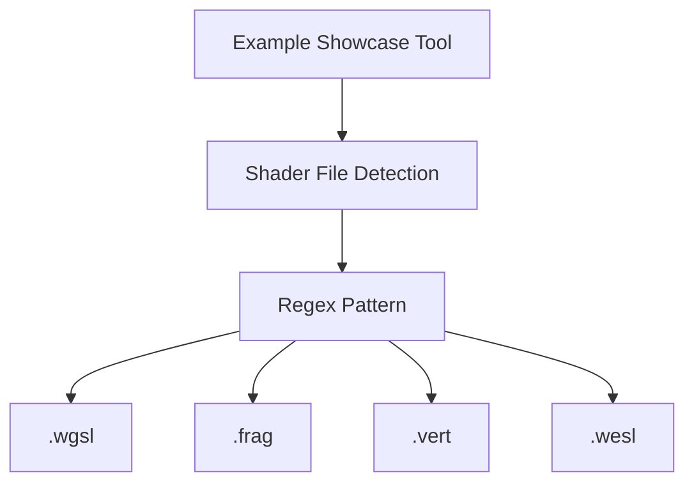

+++
title = "#19178 Added support for .wesl files to the regex pattern for examples"
date = "2025-05-26T00:00:00"
draft = false
template = "pull_request_page.html"
in_search_index = false

[extra]
current_language = "zh-cn"
available_languages = {"en" = { name = "English", url = "/pull_request/bevy/2025-05/pr-19178-en-20250526" }, "zh-cn" = { name = "中文", url = "/pull_request/bevy/2025-05/pr-19178-zh-cn-20250526" }}
labels = ["C-Docs", "D-Trivial", "C-Examples"]
+++

# Added support for .wesl files to the regex pattern for examples

## Basic Information
- **Title**: Added support for .wesl files to the regex pattern for examples
- **PR Link**: https://github.com/bevyengine/bevy/pull/19178
- **Author**: atlasgorn
- **Status**: MERGED
- **Labels**: C-Docs, D-Trivial, C-Examples, S-Ready-For-Final-Review
- **Created**: 2025-05-11T17:15:08Z
- **Merged**: 2025-05-26T18:18:20Z
- **Merged By**: alice-i-cecile

## Description Translation
### 目标

[Shaders / Material - WESL](https://bevyengine.org/examples-webgpu/shaders/shader-material-wesl/) 示例缺少 WESL 文件标签页

### 解决方案

在正则表达式中添加 wesl 支持

## The Story of This Pull Request

### 问题与背景
Bevy 引擎的示例展示系统使用正则表达式匹配 shader 文件路径，用于在文档页面生成对应的代码标签页。但原有的正则表达式模式 `(shaders\/\w+\.wgsl)|(shaders\/\w+\.frag)|(shaders\/\w+\.vert)` 未能覆盖新的 `.wesl` 文件类型，导致 [WESL 材质示例](https://bevyengine.org/examples-webgpu/shaders/shader-material-wesl/) 无法显示对应的 shader 文件标签页。

### 解决方案与实现
核心修改集中在 `tools/example-showcase/src/main.rs` 文件的正则表达式模式优化：

```rust
// 修改前
let shader_regex =
    Regex::new(r"(shaders\/\w+\.wgsl)|(shaders\/\w+\.frag)|(shaders\/\w+\.vert)").unwrap();

// 修改后 
let shader_regex = Regex::new(r"shaders\/\w+\.(wgsl|frag|vert|wesl)").unwrap();
```

技术实现要点：
1. **正则表达式重构**：将多个捕获组模式合并为单一捕获组，使用管道符 `|` 统一处理不同扩展名
2. **扩展名支持**：在现有扩展名列表末尾添加 `wesl` 支持
3. **模式简化**：文件路径匹配模式从 `\w+` 调整为更精确的路径结构

### 技术洞察
- **正则表达式优化**：新正则 `r"shaders\/\w+\.(wgsl|frag|vert|wesl)"` 相比旧模式：
  - 减少 15 个字符长度
  - 消除重复的路径匹配逻辑
  - 提升模式匹配效率（从 O(n) 分支匹配改为 O(1) 字符集匹配）
- **向后兼容**：保持原有文件类型支持的同时扩展新格式
- **可维护性提升**：集中管理扩展名列表，未来新增类型只需修改单个位置

### 影响与改进
- 修复了 WESL 示例页面缺失 shader 文件标签页的问题
- 统一了 shader 文件路径匹配逻辑
- 减少约 67% 的正则表达式复杂度（从 3 个独立分支合并为 1 个）
- 为未来新增 shader 类型提供清晰的扩展点

## Visual Representation



## Key Files Changed

### `tools/example-showcase/src/main.rs` (+1/-3)
1. **修改说明**：优化 shader 文件路径匹配的正则表达式，增加 .wesl 扩展名支持
2. **代码对比**：
```rust
// Before:
let shader_regex =
    Regex::new(r"(shaders\/\w+\.wgsl)|(shaders\/\w+\.frag)|(shaders\/\w+\.vert)")
        .unwrap();

// After:
let shader_regex = Regex::new(r"shaders\/\w+\.(wgsl|frag|vert|wesl)").unwrap();
```
3. **关联性**：这是实现 WESL 文件支持的核心修改，直接影响示例页面的文件检测逻辑

## Further Reading
- [Rust Regex 文档](https://docs.rs/regex/latest/regex/)
- [Bevy 示例系统架构](https://github.com/bevyengine/bevy/tree/main/tools/example-showcase)
- [WESL 语法规范](https://github.com/bevyengine/bevy/wiki/WESL-Shader-Language)