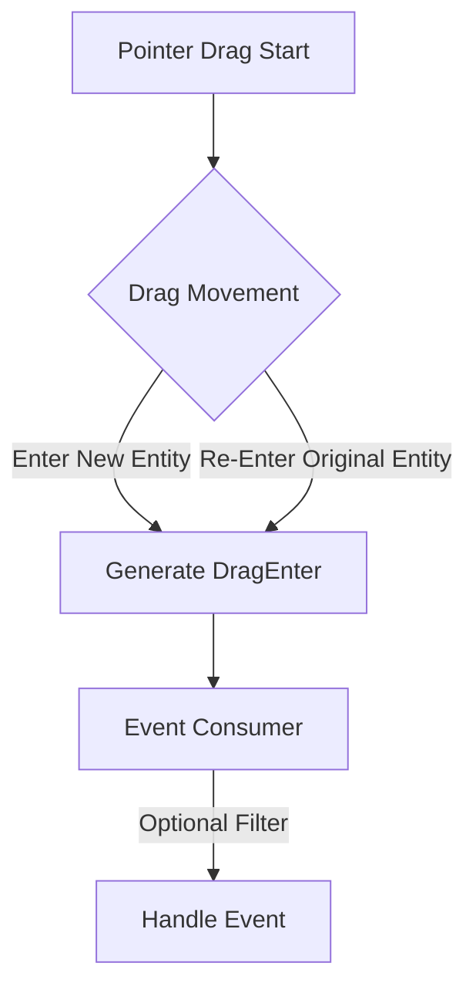

+++
title = "#19179 Fixing DragEnter Event Filtering in Bevy's Picking System"
date = "2025-05-26T00:00:00"
draft = false
template = "pull_request_page.html"
in_search_index = true

[taxonomies]
list_display = ["show"]

[extra]
current_language = "en"
available_languages = {"en" = { name = "English", url = "/pull_request/bevy/2025-05/pr-19179-en-20250526" }, "zh-cn" = { name = "中文", url = "/pull_request/bevy/2025-05/pr-19179-zh-cn-20250526" }}
labels = ["C-Bug", "D-Straightforward", "A-Picking"]
+++

# Title: Fixing DragEnter Event Filtering in Bevy's Picking System

## Basic Information
- **Title**: don't filter dragged entity out of DragEnter events
- **PR Link**: https://github.com/bevyengine/bevy/pull/19179
- **Author**: tomara-x
- **Status**: MERGED
- **Labels**: C-Bug, S-Ready-For-Final-Review, M-Needs-Migration-Guide, D-Straightforward, A-Picking
- **Created**: 2025-05-12T02:06:34Z
- **Merged**: 2025-05-26T18:18:20Z
- **Merged By**: alice-i-cecile

## Description Translation
produce a DragEnter event when reentering the dragged entity

when making a piano, i want dragging across the keys to trigger the notes of each key, but currently if i drag out of a key, then back to it, this will not work since the dragged entity gets filtered out

## Solution

- make DragEnter event work whenever there's an entry. if the user wants to ignore the dragged entity they can compare `target` and `dragged`

## Testing

- tested this with a modified version of the 2d_shapes example. i added an observer to the entities: (and added mesh picking plugin)
```rust
.observe(|t: Trigger<Pointer<DragEnter>>| {
    info!("entered {}, started from {}", t.target(), t.dragged);
}
```
- i'm not sure if other things need more testing, or if this is wrong completely and breaks other things i don't know of!

---

## Showcase

before:

https://github.com/user-attachments/assets/48de606a-e44d-4ca1-ae16-d8dcef640d6e

after:

https://github.com/user-attachments/assets/b1be231f-c826-47bc-be43-c637f22e7846

## The Story of This Pull Request

### The Problem and Context
The PR addresses an inconsistency in Bevy's picking system where `DragEnter` events wouldn't trigger when re-entering the originally dragged entity. This caused problems in use cases like virtual piano implementations, where developers needed continuous interaction tracking even when the pointer briefly left and re-entered the same key during drag operations.

The root cause was an overly restrictive filter in the event generation logic that excluded the dragged entity itself from `DragEnter` event targets. This violated the principle of least surprise for developers expecting consistent event propagation.

### The Solution Approach
The fix involved removing the filtering logic that excluded the dragged entity from `DragEnter` event targets. By eliminating the `filter` call that compared `hovered_entity` with `drag_target`, the system now generates events for all valid entries, including the original dragged entity.

This approach maintains API consistency while shifting responsibility for entity comparison to event consumers when needed. The solution preserves backward compatibility through a migration guide rather than complex configuration options.

### The Implementation
The key modification occurs in `crates/bevy_picking/src/events.rs`:

```rust
// Before:
for drag_target in state
    .dragging
    .keys()
    .filter(|&&drag_target| hovered_entity != drag_target)

// After:
for drag_target in state.dragging.keys()
```

This change removes the conditional filter that previously excluded the dragged entity. The migration guide (`dragenter_includes_dragged_entity.md`) explains how to replicate old behavior:

```markdown
DragEnter events are now triggered when entering any entity, even the originally dragged one.
The old behavior can be achieved by checking if trigger.target != trigger.dragged
```

### Technical Insights
The implementation demonstrates several important patterns:
1. **Event System Design**: Prefer generating complete event data and letting consumers filter rather than making early filtering decisions in core systems
2. **API Evolution**: Using migration guides for behavioral changes while maintaining backward compatibility through documentation
3. **Pointer State Management**: The solution leverages Bevy's existing `pointer_state` tracking without introducing new data structures

A potential trade-off is increased event volume, but this is mitigated by:
- The inherent efficiency of ECS event systems
- Developers' ability to filter events at consumption points
- The relatively narrow use case for drag interactions

### The Impact
This change:
1. Fixes unexpected behavior in drag-and-drop interactions
2. Aligns Bevy's picking system with developer expectations from other UI frameworks
3. Enables new interaction patterns like continuous feedback during tight drag motions
4. Introduces minimal technical debt through a simple, focused modification

The migration guide ensures existing projects can adapt with a simple conditional check rather than requiring complex rewrites.

## Visual Representation



## Key Files Changed

1. `crates/bevy_picking/src/events.rs`
```rust
// Before:
for drag_target in state
    .dragging
    .keys()
    .filter(|&&drag_target| hovered_entity != drag_target)

// After:
for drag_target in state.dragging.keys()
```
- Removes entity comparison filter to include dragged entity in events

2. `release-content/migration-guides/dragenter_includes_dragged_entity.md`
```markdown
---
title: DragEnter now includes the dragged entity
pull_requests: [19179]
---

DragEnter events are now triggered when entering any entity...
The old behavior can be achieved by checking if trigger.target != trigger.dragged
```
- Documents behavioral change and migration path

## Further Reading
- [Bevy Input Handling Documentation](https://bevyengine.org/learn/book/input/)
- [Entity Component System Pattern](https://en.wikipedia.org/wiki/Entity_component_system)
- [Observer Pattern in Game Engines](https://gameprogrammingpatterns.com/observer.html)