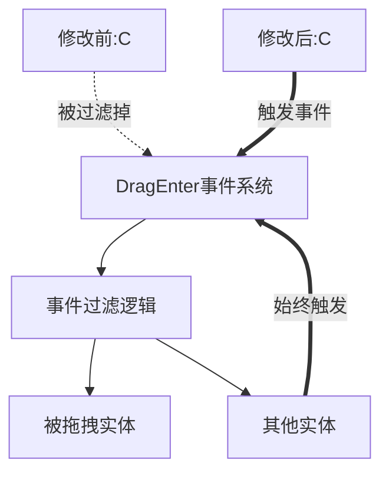

+++
title = "#19179 don't filter dragged entity out of DragEnter events"
date = "2025-05-26T00:00:00"
draft = false
template = "pull_request_page.html"
in_search_index = false

[extra]
current_language = "zh-cn"
available_languages = {"en" = { name = "English", url = "/pull_request/bevy/2025-05/pr-19179-en-20250526" }, "zh-cn" = { name = "中文", url = "/pull_request/bevy/2025-05/pr-19179-zh-cn-20250526" }}
labels = ["C-Bug", "D-Straightforward", "A-Picking"]
+++

# Title: don't filter dragged entity out of DragEnter events

## Basic Information
- **Title**: don't filter dragged entity out of DragEnter events
- **PR Link**: https://github.com/bevyengine/bevy/pull/19179
- **Author**: tomara-x
- **Status**: MERGED
- **Labels**: C-Bug, S-Ready-For-Final-Review, M-Needs-Migration-Guide, D-Straightforward, A-Picking
- **Created**: 2025-05-12T02:06:34Z
- **Merged**: 2025-05-26T18:18:20Z
- **Merged By**: alice-i-cecile

## Description Translation
### 当重新进入被拖拽实体时触发 DragEnter 事件

在开发钢琴应用时，我希望拖拽经过琴键时触发每个键的音符。但目前如果从某个键拖出再拖回，由于被拖拽实体被过滤掉，该功能无法正常工作。

### 解决方案
- 使 DragEnter 事件在任何进入时触发。如果用户需要忽略被拖拽实体，可以自行比较 `target` 和 `dragged`

### 测试
- 使用修改后的 2d_shapes 示例进行测试，添加了观察者：
```rust
.observe(|t: Trigger<Pointer<DragEnter>>| {
    info!("entered {}, started from {}", t.target(), t.dragged);
}
```
- 不确定是否需要更多测试，或此修改是否完全正确且不影响其他功能

---
### 效果对比
修改前：
https://github.com/user-attachments/assets/48de606a-e44d-4ca1-ae16-d8dcef640d6e

修改后：
https://github.com/user-attachments/assets/b1be231f-c826-47bc-be43-c637f22e7846

## The Story of This Pull Request

### 问题背景与约束
在 Bevy 的拖拽事件处理系统中，原有的 DragEnter 事件实现会过滤掉当前被拖拽的实体。这导致当用户将实体拖出后重新拖回时，无法触发新的 DragEnter 事件。对于需要持续监测拖拽路径的应用场景（如钢琴琴键触发机制），这会造成功能缺陷。

开发者 tomara-x 在实现钢琴交互时遇到该问题：当鼠标拖过琴键时，期望每个经过的琴键都能触发音符，但系统在首次进入后就不再响应同一实体的重复进入事件。

### 解决方案选择
核心问题定位在事件过滤逻辑：原有代码使用 `.filter(|&&drag_target| hovered_entity != drag_target)` 排除被拖拽实体。解决方案直接移除该过滤条件，使所有进入事件都能触发 DragEnter，将过滤责任转移给事件消费者。

这种设计选择遵循了框架设计的常见模式——提供原始事件数据，由使用者根据具体需求进行过滤。这种方式提高了API的灵活性，同时减少了框架层面的假设。

### 实现细节分析
关键修改位于 `crates/bevy_picking/src/events.rs` 的指针事件处理逻辑：
```rust
// 修改前
for drag_target in state
    .dragging
    .keys()
    .filter(|&&drag_target| hovered_entity != drag_target)

// 修改后
for drag_target in state.dragging.keys()
```
移除了过滤条件后，事件系统会为所有拖拽目标（包括被拖拽实体本身）生成 DragEnter 事件。这种修改保持了事件触发的完整性，同时保持了向后兼容性——需要旧行为的用户可以通过简单比较 target 和 dragged 来复原过滤逻辑。

### 技术考量与影响
1. **事件系统设计原则**：修改遵循了"事件应包含完整上下文信息"的最佳实践，将业务逻辑决策权交给使用者
2. **性能影响**：由于只是移除过滤条件，且遍历逻辑保持线性复杂度，性能影响可忽略
3. **API兼容性**：通过迁移指南（migration guide）明确告知行为变化，提供适配方案：
```markdown
// migration-guides/dragenter_includes_dragged_entity.md
The old behavior can be achieved by checking if trigger.target != trigger.dragged
```

### 工程实践启示
此修改展示了良好的API设计演进模式：
1. 保持底层事件系统的中立性
2. 通过文档明确行为变更
3. 提供清晰的迁移路径
4. 通过测试用例验证核心功能

## Visual Representation



## Key Files Changed

### 1. `crates/bevy_picking/src/events.rs` (+1/-5)
**修改目的**：移除拖拽事件中的实体过滤逻辑
```rust
// 修改前
for drag_target in state
    .dragging
    .keys()
    .filter(|&&drag_target| hovered_entity != drag_target)

// 修改后
for drag_target in state.dragging.keys()
```
**影响**：使 DragEnter 事件包含所有进入情况，包括被拖拽实体自身

### 2. `release-content/migration-guides/dragenter_includes_dragged_entity.md` (+8/-0)
**新增内容**：
```markdown
---
title: DragEnter now includes the dragged entity
...

DragEnter events are now triggered when entering any entity...
The old behavior can be achieved by checking if trigger.target != trigger.dragged
```
**作用**：提供清晰的版本迁移指导，降低升级成本

## Further Reading
1. [Bevy 事件系统文档](https://bevyengine.org/learn/book/events/)
2. [ECS 模式下的输入处理](https://github.com/bevyengine/bevy/discussions/4003)
3. [UI 交互最佳实践](https://bevy-cheatbook.github.io/programming/ui.html)