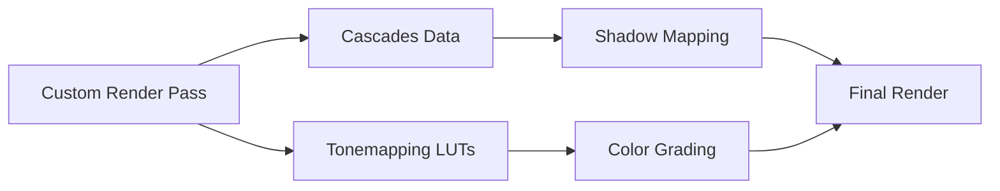

+++
title = "#19189 Make light cascades and tonemapping luts pub"
date = "2025-05-27T00:00:00"
draft = false
template = "pull_request_page.html"
in_search_index = true

[taxonomies]
list_display = ["show"]

[extra]
current_language = "en"
available_languages = {"en" = { name = "English", url = "/pull_request/bevy/2025-05/pr-19189-en-20250527" }, "zh-cn" = { name = "中文", url = "/pull_request/bevy/2025-05/pr-19189-zh-cn-20250527" }}
labels = ["A-Rendering", "C-Usability", "D-Straightforward"]
+++

# Make light cascades and tonemapping luts pub

## Basic Information
- **Title**: Make light cascades and tonemapping luts pub
- **PR Link**: https://github.com/bevyengine/bevy/pull/19189
- **Author**: DGriffin91
- **Status**: MERGED
- **Labels**: A-Rendering, C-Usability, S-Ready-For-Final-Review, D-Straightforward
- **Created**: 2025-05-12T17:28:27Z
- **Merged**: 2025-05-27T20:05:31Z
- **Merged By**: alice-i-cecile

## Description Translation
Make directional light cascades and tonemapping luts pub so that custom render passes / backends can use them.

## The Story of This Pull Request

The PR addresses a common need in graphics programming: enabling extensibility of rendering pipelines while maintaining access to core rendering data structures. Bevy's existing implementation contained several critical data structures for shadow mapping and tonemapping that were not accessible to custom render passes due to visibility restrictions.

### The Visibility Challenge
In the original implementation, both the cascade shadow data (`Cascades` and `Cascade` structs) and tonemapping LUTs (`TonemappingLuts`) were marked with `pub(crate)` visibility. This prevented external crates and custom rendering backends from accessing these essential components:
- **Cascade data** is crucial for implementing directional shadow mapping with multiple frustum splits
- **Tonemapping LUTs** (Look-Up Tables) are necessary for consistent color grading across different rendering paths

### Strategic Visibility Expansion
The solution involved carefully auditing the visibility modifiers and expanding them where appropriate:
1. **Cascade structs** in `bevy_pbr` had their fields made fully public
2. **TonemappingLuts** in `bevy_core_pipeline` had their texture handles exposed

Key code changes in `light/mod.rs`:
```rust
// Before:
pub(crate) cascades: EntityHashMap<Vec<Cascade>>
pub(crate) world_from_cascade: Mat4

// After: 
pub cascades: EntityHashMap<Vec<Cascade>>
pub world_from_cascade: Mat4
```

For tonemapping resources in `tonemapping/mod.rs`:
```rust
// Before:
blender_filmic: Handle<Image>

// After:
pub blender_filmic: Handle<Image>
```

### Technical Rationale
These changes follow Rust's principle of minimum visibility while addressing practical needs:
1. **Cascade data exposure** enables custom shadow mapping implementations to:
   - Access precomputed view/projection matrices
   - Utilize calculated texel sizes for shadow map sampling
   - Maintain consistency with Bevy's cascade splitting logic

2. **LUT accessibility** allows custom render passes to:
   - Reuse existing tonemapping textures
   - Ensure color consistency between built-in and custom pipelines
   - Avoid duplicating LUT resource handling

### Impact and Considerations
The changes introduce no functional alterations but significantly improve extensibility:
- Existing systems continue operating unchanged
- Custom render passes can now integrate with Bevy's lighting and tonemapping systems
- No performance impact as this only modifies access modifiers
- Maintains data encapsulation for non-essential internals

A critical consideration was ensuring these changes didn't expose implementation details that might change frequently. The merged solution strikes a balance by exposing only stable, well-defined data structures crucial for rendering integration.

## Visual Representation



## Key Files Changed

### crates/bevy_pbr/src/light/mod.rs
- Changed visibility modifiers for cascade-related struct fields
- Enables external access to shadow cascade configuration

Before:
```rust
pub(crate) cascades: EntityHashMap<Vec<Cascade>>
pub(crate) world_from_cascade: Mat4
```

After:
```rust
pub cascades: EntityHashMap<Vec<Cascade>>
pub world_from_cascade: Mat4
```

### crates/bevy_core_pipeline/src/tonemapping/mod.rs
- Exposed LUT texture handles for external use
- Allows sharing of color grading resources

Before:
```rust
blender_filmic: Handle<Image>
```

After:
```rust
pub blender_filmic: Handle<Image>
```

## Further Reading
- Bevy's Rendering Architecture: https://bevyengine.org/learn/book/rendering/
- Cascaded Shadow Maps: https://developer.nvidia.com/gpugems/gpugems3/part-ii-light-and-shadows/chapter-10-parallel-split-shadow-maps-programmable-gpus
- Color Look-Up Tables: https://openglinsights.github.io/tonemapping.html