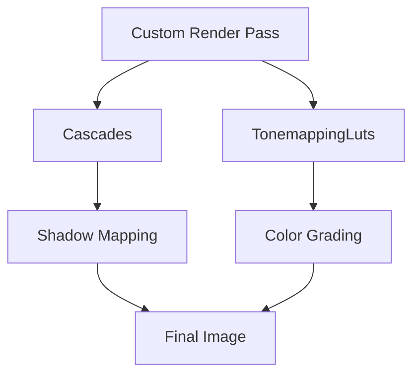

+++
title = "#19189 Make light cascades and tonemapping luts pub"
date = "2025-05-27T00:00:00"
draft = false
template = "pull_request_page.html"
in_search_index = false

[extra]
current_language = "zh-cn"
available_languages = {"en" = { name = "English", url = "/pull_request/bevy/2025-05/pr-19189-en-20250527" }, "zh-cn" = { name = "中文", url = "/pull_request/bevy/2025-05/pr-19189-zh-cn-20250527" }}
labels = ["A-Rendering", "C-Usability", "D-Straightforward"]
+++

# Make light cascades and tonemapping luts pub

## Basic Information
- **Title**: Make light cascades and tonemapping luts pub
- **PR Link**: https://github.com/bevyengine/bevy/pull/19189
- **Author**: DGriffin91
- **Status**: MERGED
- **Labels**: A-Rendering, C-Usability, S-Ready-For-Final-Review, D-Straightforward
- **Created**: 2025-05-12T17:28:27Z
- **Merged**: 2025-05-27T20:05:31Z
- **Merged By**: alice-i-cecile

## Description Translation
将定向光源的级联阴影（directional light cascades）和色调映射LUT（tonemapping luts）设为公开（pub），以便自定义渲染通道（custom render passes）和后端（backends）可以使用它们。

## The Story of This Pull Request

### 问题背景与上下文
在Bevy渲染系统中，定向光源的级联阴影配置（Cascades）和色调映射查找表（TonemappingLuts）原本被设计为内部实现细节，其关键字段使用`pub(crate)`或私有可见性。这导致自定义渲染管线或第三方后端无法直接访问这些数据结构，限制了引擎的扩展性。

具体来说：
1. **级联阴影**（Cascades）用于实现CSM（Cascaded Shadow Maps），其包含的视口变换矩阵和投影矩阵对阴影计算至关重要
2. **色调映射LUT**（TonemappingLuts）存储了不同色调映射算法所需的3D查找表，是后期处理的关键资源

当开发者尝试创建自定义渲染通道时（如实现特殊阴影效果或定制色调映射算法），由于这些关键数据结构字段不可访问，无法正确配置渲染参数。

### 解决方案与实现
核心修改策略直接有效：将关键字段的可见性提升为公开（pub）。这种改动符合Rust的最佳实践——仅暴露必要接口，同时保持类型安全。

在`light/mod.rs`中，修改涉及三个关键结构体：
```rust
// Before:
pub(crate) cascades: EntityHashMap<Vec<Cascade>> 

// After:
pub cascades: EntityHashMap<Vec<Cascade>>
```

类似地，在`Cascade`结构体中：
```rust
// 所有字段从pub(crate)改为pub
pub world_from_cascade: Mat4,
pub clip_from_cascade: Mat4,
pub clip_from_world: Mat4,
pub texel_size: f32
```

在`tonemapping/mod.rs`中，`TonemappingLuts`的三个LUT资源句柄也被公开：
```rust
// Before:
blender_filmic: Handle<Image>

// After:
pub blender_filmic: Handle<Image>
```

### 技术考量与影响
1. **API设计平衡**：在保持封装性的同时暴露必要接口，允许更灵活的扩展
2. **兼容性保障**：所有字段保持原有类型，仅修改可见性，确保向下兼容
3. **渲染管线扩展**：自定义渲染通道现在可以：
   - 访问级联阴影的精确投影矩阵（clip_from_world）
   - 调整阴影贴图的分辨率（texel_size）
   - 替换或混合不同的色调映射LUT

潜在风险在于公开字段可能被误修改，但由于Bevy的ECS架构，这些数据通常通过系统（system）控制，实际使用中风险可控。

## Visual Representation



## Key Files Changed

### crates/bevy_pbr/src/light/mod.rs
**修改目的**：公开级联阴影相关数据结构的字段

关键代码变更：
```rust
// 结构体 Cascades
- pub(crate) cascades: EntityHashMap<Vec<Cascade>>
+ pub cascades: EntityHashMap<Vec<Cascade>>

// 结构体 Cascade
- pub(crate) world_from_cascade: Mat4
+ pub world_from_cascade: Mat4
// 其余三个字段同理
```

### crates/bevy_core_pipeline/src/tonemapping/mod.rs
**修改目的**：公开色调映射LUT资源句柄

关键代码变更：
```rust
// 结构体 TonemappingLuts
- blender_filmic: Handle<Image>
+ pub blender_filmic: Handle<Image>
// 其余两个LUT字段同理
```

## Further Reading
1. [Bevy渲染管线架构文档](https://bevyengine.org/learn/book/rendering/pipelines)
2. [Rust可见性规则](https://doc.rust-lang.org/book/ch07-03-paths-for-referring-to-an-item-in-the-module-tree.html)
3. [级联阴影映射（CSM）原理](https://learnopengl.com/Guest-Articles/2021/CSM)