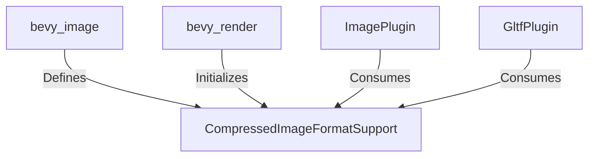

+++
title = "#19190 Optional Explicit Compressed Image Format Support"
date = "2025-05-26T00:00:00"
draft = false
template = "pull_request_page.html"
in_search_index = true

[taxonomies]
list_display = ["show"]

[extra]
current_language = "en"
available_languages = {"en" = { name = "English", url = "/pull_request/bevy/2025-05/pr-19190-en-20250526" }, "zh-cn" = { name = "中文", url = "/pull_request/bevy/2025-05/pr-19190-zh-cn-20250526" }}
labels = ["A-Rendering", "C-Usability", "D-Modest"]
+++

# Title: Optional Explicit Compressed Image Format Support

## Basic Information
- **Title**: Optional explicit compressed image format support
- **PR Link**: https://github.com/bevyengine/bevy/pull/19190
- **Author**: DGriffin91
- **Status**: MERGED
- **Labels**: A-Rendering, C-Usability, S-Ready-For-Final-Review, D-Modest
- **Created**: 2025-05-12T18:37:57Z
- **Merged**: 2025-05-26T18:28:03Z
- **Merged By**: alice-i-cecile

## Description Translation
# Objective

- Allow compressed image formats to be used with `ImagePlugin` and `GltfPlugin` in cases where there is no `RenderDevice` resource. (For example, when using a custom render backend)

## Solution

- Define a `CompressedImageFormatSupport` component that allows the user to explicitly determine which formats are supported.

~~Not sure if this is the best solution. Alternatively, I considered initializing CompressedImageFormatSupport from render device features separately, it would need to run after the render device is initialized but before `ImagePlugin` and `GltfPlugin` finish. Not sure where the best place for that to happen would be.~~

Update: decided on going with @greeble-dev solution: defining the `CompressedImageFormatSupport` resource in `bevy_image`, but letting `bevy_render` register the resource value.

## The Story of This Pull Request

The PR addresses a specific challenge in Bevy's asset loading pipeline when using custom render backends. The core issue stemmed from compressed image format detection relying on the presence of a `RenderDevice` resource, which isn't available in headless or custom rendering scenarios.

Previously, both `ImagePlugin` and `GltfPlugin` determined supported compressed formats by querying the `RenderDevice`:

```rust
// Original approach in ImagePlugin
let supported_compressed_formats = match app.world().get_resource::<RenderDevice>() {
    Some(render_device) => CompressedImageFormats::from_features(render_device.features()),
    None => CompressedImageFormats::NONE,
};
```

This created a hard dependency on the render device initialization order and availability. The solution introduces a new indirection layer through a `CompressedImageFormatSupport` resource:

```rust
// New component definition in bevy_image
#[derive(Resource)]
pub struct CompressedImageFormatSupport(pub CompressedImageFormats);
```

The implementation follows a clear separation of concerns:
1. **bevy_image** defines the resource type
2. **bevy_render** initializes it with device capabilities
3. Consumer plugins (ImagePlugin, GltfPlugin) query the resource instead of RenderDevice

Key modifications in `bevy_render/src/lib.rs` show the resource initialization:

```rust
let compressed_image_format_support = CompressedImageFormatSupport(
    CompressedImageFormats::from_features(device.features()),
);
app.insert_resource(compressed_image_format_support);
```

Consumer plugins now handle missing resources gracefully with warnings:

```rust
// Updated GltfPlugin logic
let supported_compressed_formats = if let Some(resource) =
    app.world().get_resource::<CompressedImageFormatSupport>()
{
    resource.0
} else {
    warn!("CompressedImageFormatSupport resource not found...");
    CompressedImageFormats::NONE
};
```

The architecture preserves backward compatibility while enabling explicit format specification. Users with custom render backends can now manually provide the `CompressedImageFormatSupport` resource if they're not using Bevy's default rendering setup.

## Visual Representation



## Key Files Changed

1. **crates/bevy_render/src/texture/mod.rs** (+14/-6)
   - Updated image format handling to use the new resource
   - Added warning for missing resource detection
   ```rust
   let supported_compressed_formats = if let Some(resource) =
       app.world().get_resource::<CompressedImageFormatSupport>()
   {
       resource.0
   } else {
       warn!("CompressedImageFormatSupport resource not found...");
       CompressedImageFormats::NONE
   };
   ```

2. **crates/bevy_gltf/src/lib.rs** (+11/-5)
   - Modified GLTF loader to use compressed format resource
   - Removed direct RenderDevice dependency
   ```rust
   -use bevy_render::renderer::RenderDevice;
   +use bevy_image::{CompressedImageFormatSupport, ...};
   ```

3. **crates/bevy_render/src/lib.rs** (+7/-1)
   - Added resource initialization in render plugin
   ```rust
   let compressed_image_format_support = ...;
   app.insert_resource(compressed_image_format_support);
   ```

4. **crates/bevy_image/src/image.rs** (+7/-0)
   - Defined new resource type
   ```rust
   #[derive(Resource)]
   pub struct CompressedImageFormatSupport(pub CompressedImageFormats);
   ```

5. **crates/bevy_image/Cargo.toml** (+1/-0)
   - Added bevy_ecs dependency for resource support
   ```toml
   bevy_ecs = { path = "../bevy_ecs", ... }
   ```

## Further Reading

1. [Bevy ECS Resources Documentation](https://bevyengine.org/learn/book/ecs/resources/)
2. [WGPU Texture Format Features](https://docs.rs/wgpu/latest/wgpu/struct.Features.html)
3. [Bevy Plugin System Guide](https://bevyengine.org/learn/book/plugins/)