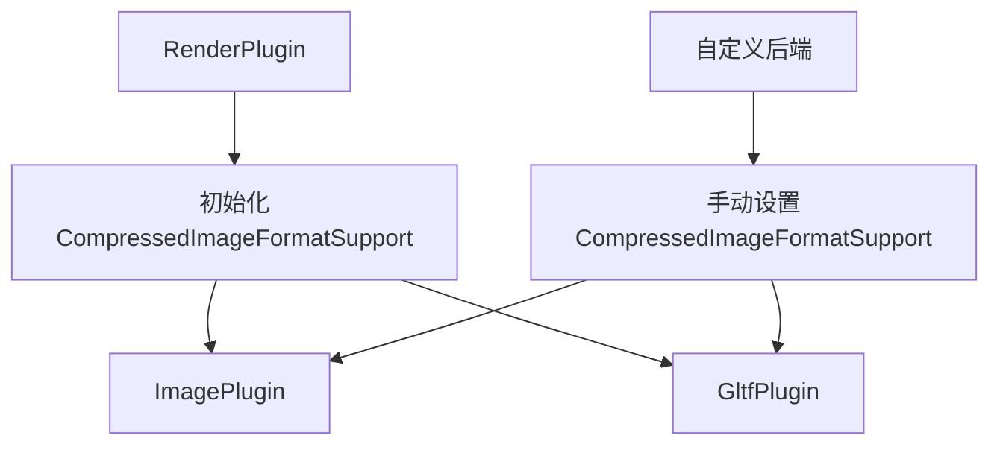

+++
title = "#19190 Optional explicit compressed image format support"
date = "2025-05-26T00:00:00"
draft = false
template = "pull_request_page.html"
in_search_index = false

[extra]
current_language = "zh-cn"
available_languages = {"en" = { name = "English", url = "/pull_request/bevy/2025-05/pr-19190-en-20250526" }, "zh-cn" = { name = "中文", url = "/pull_request/bevy/2025-05/pr-19190-zh-cn-20250526" }}
labels = ["A-Rendering", "C-Usability", "D-Modest"]
+++

# Optional explicit compressed image format support

## Basic Information
- **Title**: Optional explicit compressed image format support
- **PR Link**: https://github.com/bevyengine/bevy/pull/19190
- **Author**: DGriffin91
- **Status**: MERGED
- **Labels**: A-Rendering, C-Usability, S-Ready-For-Final-Review, D-Modest
- **Created**: 2025-05-12T18:37:57Z
- **Merged**: 2025-05-26T18:28:03Z
- **Merged By**: alice-i-cecile

## Description Translation
### 目标
- 允许在没有`RenderDevice`资源的情况下（例如使用自定义渲染后端时），在`ImagePlugin`和`GltfPlugin`中使用压缩图像格式

### 解决方案
- 定义`CompressedImageFormatSupport`组件，允许用户显式确定支持的格式

更新：决定采用@greeble-dev的解决方案：在`bevy_image`中定义`CompressedImageFormatSupport`资源，但由`bevy_render`注册资源值

## The Story of This Pull Request

### 问题与上下文
Bevy引擎原有的压缩图像格式支持检测机制直接依赖`RenderDevice`资源来获取硬件特性。这在标准渲染流程中工作正常，但无法支持以下场景：
1. 使用自定义渲染后端时
2. 需要提前加载资源但渲染设备尚未初始化时
3. 需要覆盖自动检测结果的特殊情况

例如，当用户使用非WGPU渲染后端时，原有的`ImagePlugin`和`GltfPlugin`在初始化阶段会因为无法获取`RenderDevice`而默认禁用所有压缩格式支持。

### 解决方案演进
初始方案尝试直接在插件中定义支持格式，但面临生命周期管理问题。最终采用分层设计：
1. 在`bevy_image`定义`CompressedImageFormatSupport`资源类型
2. 标准渲染流程中由`RenderPlugin`自动初始化该资源
3. 允许用户手动配置该资源以覆盖默认值

```rust
// 在bevy_render的RenderPlugin初始化流程中
let compressed_image_format_support = CompressedImageFormatSupport(
    CompressedImageFormats::from_features(device.features())
);
app.insert_resource(compressed_image_format_support);
```

### 关键技术实现
核心修改涉及三个关键模块的协作：

**1. 资源定义（bevy_image）**
```rust
#[derive(Resource)]
pub struct CompressedImageFormatSupport(pub CompressedImageFormats);
```
通过`Resource`派生宏创建可存储的配置对象，保持与原有`CompressedImageFormats`的兼容性

**2. 渲染插件集成（bevy_render）**
```diff
+ let compressed_image_format_support = CompressedImageFormatSupport(
+    CompressedImageFormats::from_features(device.features())
+ );
+ app.insert_resource(compressed_image_format_support);
```
在渲染设备初始化后自动配置支持格式，保持原有自动化检测逻辑

**3. 插件适配改造（ImagePlugin/GltfPlugin）**
```rust
let supported_compressed_formats = if let Some(resource) = 
    app.world().get_resource::<CompressedImageFormatSupport>()
{
    resource.0
} else {
    warn!("CompressedImageFormatSupport resource not found...");
    CompressedImageFormats::NONE
};
```
统一改用新的资源查询方式，并添加明确的警告日志辅助调试

### 工程权衡
- **解耦程度**：选择在`bevy_image`定义资源类型而非`bevy_render`，保持图像处理逻辑的独立性
- **兼容性处理**：保留自动检测路径，同时允许手动覆盖，确保向后兼容
- **错误处理**：使用`tracing::warn!`而非panic，避免破坏现有工作流

### 影响与改进
1. 自定义渲染后端用户现在可以通过手动设置资源来启用压缩格式支持：
```rust
app.insert_resource(CompressedImageFormatSupport(
    CompressedImageFormats::ASTC_LDR
));
```
2. 解耦渲染设备特性检测与资源加载逻辑，架构更清晰
3. 新增的警告日志帮助开发者快速定位配置问题

## Visual Representation



## Key Files Changed

### 1. crates/bevy_render/src/lib.rs (+7/-1)
```rust
// 修改后代码片段
let compressed_image_format_support = CompressedImageFormatSupport(
    CompressedImageFormats::from_features(device.features())
);
app.insert_resource(compressed_image_format_support);
```
在渲染设备初始化后注入格式支持信息，作为标准渲染流程的一部分

### 2. crates/bevy_gltf/src/lib.rs (+11/-5)
```rust
// 修改后资源获取逻辑
let supported_compressed_formats = if let Some(resource) = 
    app.world().get_resource::<CompressedImageFormatSupport>() 
{
    resource.0
} else {
    warn!("Resource not found...");
    CompressedImageFormats::NONE
};
```
改造GLTF插件使用新的资源查询方式，添加错误提示

### 3. crates/bevy_image/src/image.rs (+7/-0)
```rust
#[derive(Resource)]
pub struct CompressedImageFormatSupport(pub CompressedImageFormats);
```
定义核心资源类型，作为跨插件配置的桥梁

## Further Reading
1. [Bevy ECS Resources文档](https://bevyengine.org/learn/book/ecs/resources/)
2. [WGPU Texture Format特性](https://docs.rs/wgpu/latest/wgpu/struct.Features.html)
3. [类型驱动API设计模式](https://rust-lang.github.io/api-guidelines/type-safety.html)