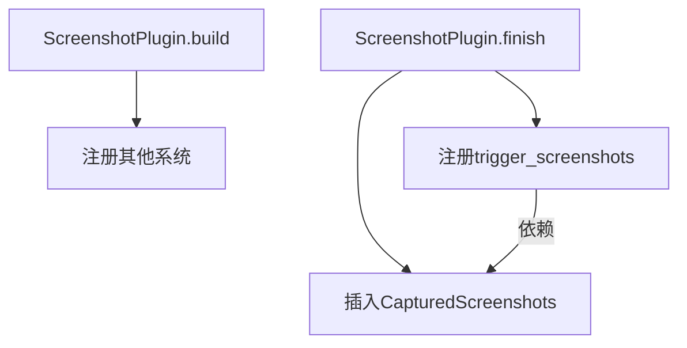

+++
title = "#19204 Move trigger_screenshots to finish()"
date = "2025-05-26T00:00:00"
draft = false
template = "pull_request_page.html"
in_search_index = false

[extra]
current_language = "zh-cn"
available_languages = {"en" = { name = "English", url = "/pull_request/bevy/2025-05/pr-19204-en-20250526" }, "zh-cn" = { name = "中文", url = "/pull_request/bevy/2025-05/pr-19204-zh-cn-20250526" }}
labels = ["D-Trivial", "A-Rendering", "C-Testing"]
+++

# Move trigger_screenshots to finish() 技术分析报告

## Basic Information
- **Title**: Move trigger_screenshots to finish()
- **PR Link**: https://github.com/bevyengine/bevy/pull/19204
- **Author**: IceSentry
- **Status**: MERGED
- **Labels**: D-Trivial, A-Rendering, S-Ready-For-Final-Review, C-Testing
- **Created**: 2025-05-13T19:02:16Z
- **Merged**: 2025-05-26T18:31:03Z
- **Merged By**: alice-i-cecile

## Description Translation
### 目标
- `trigger_screenshots` 系统在 `.build()` 阶段添加，但依赖的资源仅在 `.finish()` 阶段插入
- 对于大多数用户来说这不是 bug，但在进行无头模式（headless mode）测试时，可能因为不调用 `.finish()` 导致问题。该问题在 bevy 0.15 之前可以正常工作，但在迁移工作代码库时出现测试失败

### 解决方案
- 将 `trigger_screenshots` 系统移动到 `.finish()` 阶段

### 测试
- 运行 screenshot 示例验证功能正常

## The Story of This Pull Request

### 问题背景与上下文
在 Bevy 的插件系统生命周期中，`.build()` 和 `.finish()` 阶段有不同的职责。`ScreenshotPlugin` 原本在 `.build()` 阶段注册 `trigger_screenshots` 系统，但该系统依赖的 `CapturedScreenshots` 资源是在 `.finish()` 阶段才被插入应用。这种生命周期错位导致在特定条件下（特别是无头测试场景）可能发生资源访问冲突或空指针异常。

这个问题在常规应用运行中不易暴露，因为大多数用户都会完整调用所有生命周期方法。但在自动化测试场景下，特别是当测试框架不调用 `.finish()` 时，就会导致系统依赖的资源缺失。作者在将代码迁移到 Bevy 0.15 时遇到了具体的测试失败案例，暴露了这个隐藏的问题。

### 解决方案与实现
核心解决思路是调整系统注册的时机，使其与资源插入的时机保持同步。具体修改将 `trigger_screenshots` 系统的注册从 `.build()` 阶段移到 `.finish()` 阶段，确保系统运行时所需资源已经就绪。

关键代码修改体现在 `ScreenshotPlugin` 的实现中：
```rust
// Before:
impl Plugin for ScreenshotPlugin {
    fn build(&self, app: &mut App) {
        // ...
        app.add_systems(Update, trigger_screenshots)
        // ...
    }

    fn finish(&self, app: &mut App) {
        app.insert_resource(CapturedScreenshots(/* ... */));
    }
}

// After:
impl Plugin for ScreenshotPlugin {
    fn build(&self, app: &mut App) {
        // 移除了 trigger_screenshots 的注册
    }

    fn finish(&self, app: &mut App) {
        app.add_systems(Update, trigger_screenshots)
           .insert_resource(CapturedScreenshots(/* ... */));
    }
}
```

这个调整保证了在 `CapturedScreenshots` 资源插入应用之后才注册相关系统，消除了资源访问的竞态条件。

### 技术洞察
1. **生命周期管理**：Bevy 的插件系统通过明确的构建阶段（build/finish）管理初始化顺序。`.build()` 通常用于基本系统注册，`.finish()` 则处理需要跨应用/子应用协调的初始化操作

2. **资源依赖保证**：将系统注册延迟到资源插入之后，遵循了"依赖先行"的设计原则。这种模式在需要跨多个子系统协调初始化的场景下尤为重要

3. **测试场景适配**：无头测试环境往往需要精简的初始化流程，此修改使得截图功能在最小化初始化场景下也能正常工作

### 影响与启示
- **稳定性提升**：修复了特定场景下的潜在崩溃问题
- **API 一致性**：使截图功能与其他遵循生命周期规范的系统保持行为一致
- **模式参考**：为处理类似的生命周期依赖问题提供了标准解决方案

## Visual Representation



## Key Files Changed

### `crates/bevy_render/src/view/window/screenshot.rs`
**修改内容**：调整系统注册与资源插入的顺序

代码对比：
```rust
// 修改前：
impl Plugin for ScreenshotPlugin {
    fn build(&self, app: &mut App) {
        // ...
        app.add_systems(Update, trigger_screenshots)
        // ...
    }

    fn finish(&self, app: &mut App) {
        app.insert_resource(/* ... */);
    }
}

// 修改后：
impl Plugin for ScreenshotPlugin {
    fn build(&self, app: &mut App) {
        // 移除了 trigger_screenshots 的注册
    }

    fn finish(&self, app: &mut App) {
        app.add_systems(Update, trigger_screenshots)
           .insert_resource(/* ... */);
    }
}
```

**影响**：
1. 确保 `trigger_screenshots` 系统运行时 `CapturedScreenshots` 资源已存在
2. 遵循 Bevy 插件生命周期的最佳实践

## Further Reading
- [Bevy Plugin 生命周期文档](https://bevyengine.org/learn/book/getting-started/plugins/)
- [ECS 系统排序与依赖管理](https://bevy-cheatbook.github.io/programming/system-order.html)
- [Rust 的并发原语在游戏引擎中的应用](https://doc.rust-lang.org/book/ch16-00-concurrency.html)