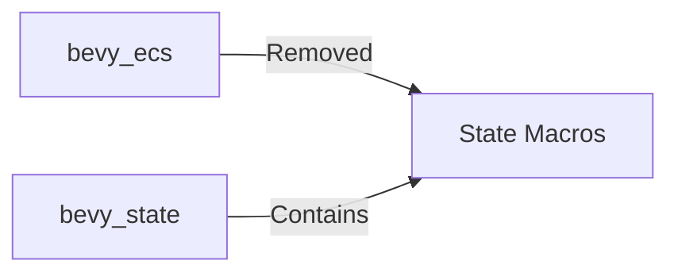

+++
title = "#19210 Remove dead states code from bevy_ecs"
date = "2025-05-14T00:00:00"
draft = false
template = "pull_request_page.html"
in_search_index = true

[taxonomies]
list_display = ["show"]

[extra]
current_language = "en"
available_languages = {"en" = { name = "English", url = "/pull_request/bevy/2025-05/pr-19210-en-20250514" }, "zh-cn" = { name = "中文", url = "/pull_request/bevy/2025-05/pr-19210-zh-cn-20250514" }}
labels = ["D-Trivial", "A-ECS", "C-Code-Quality", "A-States"]
+++

# Title: Remove dead states code from bevy_ecs

## Basic Information
- **Title**: Remove dead states code from bevy_ecs
- **PR Link**: https://github.com/bevyengine/bevy/pull/19210
- **Author**: mgi388
- **Status**: MERGED
- **Labels**: D-Trivial, A-ECS, C-Code-Quality, S-Ready-For-Final-Review, A-States
- **Created**: 2025-05-14T12:47:39Z
- **Merged**: 2025-05-14T13:42:39Z
- **Merged By**: alice-i-cecile

## Description Translation
`bevy_ecs` was meant to have the `States` and `SubStates` `proc_macro_derive`s removed when the separate `bevy_state` [was created](https://github.com/bevyengine/bevy/issues/13216) but they were missed.

## The Story of This Pull Request

### The Problem and Context
When Bevy's state management was moved to the dedicated `bevy_state` crate in PR #13216, the legacy `States` and `SubStates` derive macros were accidentally left behind in `bevy_ecs`. This created dead code that:
1. Violated the architectural separation between ECS core and state management
2. Could cause confusion for developers looking for state-related functionality
3. Increased maintenance burden for the ECS module

### The Solution Approach
The solution involved surgical removal of all state-related macro code from `bevy_ecs`, including:
1. Removing the `states` module containing derive implementations
2. Deleting associated proc_macro attributes from the public API
3. Preserving all other ECS functionality intact

### The Implementation
The changes focused on two key files in the macros subsystem:

1. **Macros Entry Point (lib.rs):**
```rust
// Before:
#[proc_macro_derive(States)]
pub fn derive_states(input: TokenStream) -> TokenStream {
    states::derive_states(input)
}

// After: (Entire block removed)
```

2. **States Implementation (states.rs):**
```rust
// File deleted entirely, removing 144 lines of:
pub fn derive_states(input: TokenStream) -> TokenStream { ... }
pub fn derive_substates(input: TokenStream) -> TokenStream { ... }
```

The removal was straightforward but required careful verification that:
- No remaining code depended on these macros
- All state functionality existed in `bevy_state`
- Macro registration was fully cleaned up

### Technical Insights
Key considerations during implementation:
1. **Architectural Boundaries:** Enforced separation between ECS core and state management
2. **Proc Macro Hygiene:** Ensured complete removal of macro exports to prevent accidental use
3. **Dependency Chain:** Confirmed that `bevy_state` properly re-exported any needed functionality

### The Impact
These changes:
- Reduced `bevy_ecs` compiled size by 155 lines of code
- Eliminated potential confusion about state management location
- Simplified future maintenance of both crates
- Improved adherence to Bevy's modular architecture principles

## Visual Representation



## Key Files Changed

1. `crates/bevy_ecs/macros/src/lib.rs`
```rust
// Removed module declaration
- mod states;

// Removed macro exports
- #[proc_macro_derive(States)]
- pub fn derive_states(input: TokenStream) -> TokenStream {
-     states::derive_states(input)
- }

- #[proc_macro_derive(SubStates, attributes(source))]
- pub fn derive_substates(input: TokenStream) -> TokenStream {
-     states::derive_substates(input)
- }
```

2. `crates/bevy_ecs/macros/src/states.rs`
```rust
// Entire file deleted (-144 lines)
- use proc_macro::TokenStream;
- use quote::{format_ident, quote};
- ...
- pub fn derive_substates(input: TokenStream) -> TokenStream {
-     // Implementation removed
- }
```

## Further Reading
- [Bevy States RFC](https://github.com/bevyengine/rfcs/blob/main/rfcs/45-state.md)
- [Bevy State Module Documentation](https://docs.rs/bevy_state/latest/bevy_state/)
- [Original State Refactor PR](#13216)