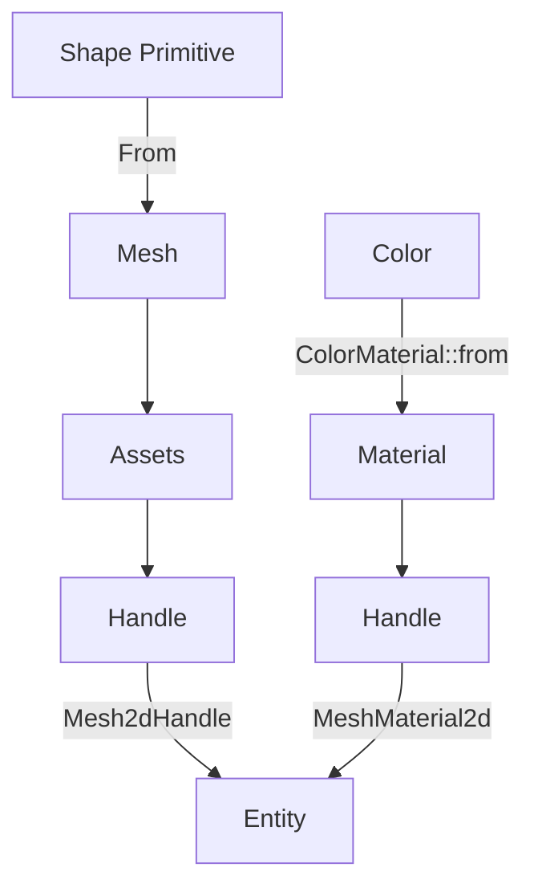

+++
title = "#19211 Explanation for the '2d shapes' example"
date = "2025-05-26T00:00:00"
draft = false
template = "pull_request_page.html"
in_search_index = true

[taxonomies]
list_display = ["show"]

[extra]
current_language = "en"
available_languages = {"en" = { name = "English", url = "/pull_request/bevy/2025-05/pr-19211-en-20250526" }, "zh-cn" = { name = "中文", url = "/pull_request/bevy/2025-05/pr-19211-zh-cn-20250526" }}
labels = ["C-Docs", "A-Rendering", "C-Examples", "D-Straightforward"]
+++

# Explanation for the '2d shapes' example

## Basic Information
- **Title**: Explanation for the '2d shapes' example
- **PR Link**: https://github.com/bevyengine/bevy/pull/19211
- **Author**: fallible-algebra
- **Status**: MERGED
- **Labels**: C-Docs, A-Rendering, C-Examples, S-Ready-For-Final-Review, D-Straightforward
- **Created**: 2025-05-14T17:10:02Z
- **Merged**: 2025-05-26T19:40:40Z
- **Merged By**: alice-i-cecile

## Description Translation
Explanation for the 2d shapes example, taken from the original HackMD document and edited a bit.

This example is a strange one, it's eye-catching mostly because it's the first example (at time of writing) in the examples page. That being said, the example does a decent amount of teaching utility to it: we can explain the bevy math-shape to mesh pipeline, which illuminates a way of transforming one form of data (abstract, mathematical shape descriptions) into another (meshes) which may be novel or inspirational to some users.

## The Story of This Pull Request

The 2D shapes example in Bevy served as an introductory demonstration but lacked clear documentation about its underlying mechanics. While functional, it missed an opportunity to explain key concepts about Bevy's rendering pipeline and type system to new users. This PR focused on enhancing the educational value through improved code comments.

The core challenge was explaining three interconnected concepts in a limited space:
1. Conversion from mathematical shapes to renderable meshes
2. Material handling through the asset system
3. Bevy's newtype pattern for component handles

The solution involved rewriting the module-level documentation to explicitly outline:
- How shape primitives become meshes via `From<Shape>` implementation
- Material creation through `ColorMaterial` and asset insertion
- Purpose of `Mesh2dHandle` and `MeshMaterial2d` wrappers

Key code changes focused on the documentation block:

```rust
// Before:
//! Shows how to render simple primitive shapes with a single color.

// After:
//! Here we use shape primitives to build meshes in a 2D rendering context...
//! Meshes are better known for their use in 3D rendering...
//! A "shape definition" is not a mesh on its own...
```

The implementation preserves all existing functionality while adding explanatory depth. By explaining the `From` trait usage for mesh generation and the asset system's role in material creation, the documentation helps users understand Bevy's data transformation pipeline.

## Visual Representation



## Key Files Changed

### `examples/2d/2d_shapes.rs` (+11/-1)
**Purpose:** Enhance documentation for the 2D shapes example

Before:
```rust
//! Shows how to render simple primitive shapes with a single color.
```

After:
```rust
//! Here we use shape primitives to build meshes in a 2D rendering context...
//! Meshes are better known for their use in 3D rendering...
//! A "shape definition" is not a mesh on its own...
//! Both the mesh and material need to be wrapped in their own "newtypes"...
```

These changes directly support the PR's goal by explaining:
1. Mesh generation pipeline
2. Asset handle management
3. Newtype pattern usage in components

## Further Reading
- [Bevy Asset System](https://bevyengine.org/learn/book/getting-started/assets/)
- [Rendering Pipeline](https://bevyengine.org/learn/book/getting-started/rendering/)
- [Newtype Pattern in Rust](https://doc.rust-lang.org/rust-by-example/generics/new_types.html)

## Full Code Diff
```diff
diff --git a/examples/2d/2d_shapes.rs b/examples/2d/2d_shapes.rs
index dbdd846ebaff6..f69e138364190 100644
--- a/examples/2d/2d_shapes.rs
+++ b/examples/2d/2d_shapes.rs
@@ -1,4 +1,14 @@
-//! Shows how to render simple primitive shapes with a single color.
+//! Here we use shape primitives to build meshes in a 2D rendering context, making each mesh a certain color by giving that mesh's entity a material based off a [`Color`].
+//!
+//! Meshes are better known for their use in 3D rendering, but we can use them in a 2D context too. Without a third dimension, the meshes we're building are flat – like paper on a table. These are still very useful for "vector-style" graphics, picking behavior, or as a foundation to build off of for where to apply a shader.
+//!
+//! A "shape definition" is not a mesh on its own. A circle can be defined with a radius, i.e. [`Circle::new(50.0)`][Circle::new], but rendering tends to happen with meshes built out of triangles. So we need to turn shape descriptions into meshes.
+//!
+//! Thankfully, we can add shape primitives directly to [`Assets<Mesh>`] because [`Mesh`] implements [`From`] for shape primitives and [`Assets<T>::add`] can be given any value that can be "turned into" `T`!
+//!
+//! We apply a material to the shape by first making a [`Color`] then calling [`Assets<ColorMaterial>::add`] with that color as its argument, which will create a material from that color through the same process [`Assets<Mesh>::add`] can take a shape primitive.
+//!
+//! Both the mesh and material need to be wrapped in their own "newtypes". The mesh and material are currently [`Handle<Mesh>`] and [`Handle<ColorMaterial>`] at the moment, which are not components. Handles are put behind "newtypes" to prevent ambiguity, as some entities might want to have handles to meshes (or images, or materials etc.) for different purposes! All we need to do to make them rendering-relevant components is wrap the mesh handle and the material handle in [`Mesh2d`] and [`MeshMaterial2d`] respectively.
 //!
 //! You can toggle wireframes with the space bar except on wasm. Wasm does not support
 //! `POLYGON_MODE_LINE` on the gpu.
```