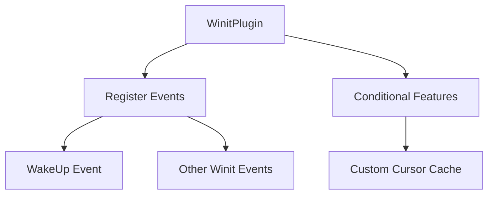

+++
title = "#19212 Add WakeUp event to App"
date = "2025-05-26T00:00:00"
draft = false
template = "pull_request_page.html"
in_search_index = true

[taxonomies]
list_display = ["show"]

[extra]
current_language = "en"
available_languages = {"en" = { name = "English", url = "/pull_request/bevy/2025-05/pr-19212-en-20250526" }, "zh-cn" = { name = "中文", url = "/pull_request/bevy/2025-05/pr-19212-zh-cn-20250526" }}
labels = ["C-Bug", "A-Windowing"]
+++

# Add WakeUp event to App

## Basic Information
- **Title**: Add WakeUp event to App
- **PR Link**: https://github.com/bevyengine/bevy/pull/19212
- **Author**: IceSentry
- **Status**: MERGED
- **Labels**: C-Bug, A-Windowing, S-Ready-For-Final-Review
- **Created**: 2025-05-14T17:59:06Z
- **Merged**: 2025-05-26T19:47:33Z
- **Merged By**: alice-i-cecile

## Description Translation
# Objective

- The WakeUp event is never added to the app. If you need to use that event you currently need to add it yourself.

## Solution

- Add the WakeUp event to the App in the WinitPlugin

## Testing

- I tested the window_setting example and it compiled and worked

## The Story of This Pull Request

The PR addresses a missing event registration in Bevy's windowing system. The core issue stemmed from the `WakeUp` event not being automatically added to the application's event registry when using Winit integration. This event is crucial for handling window wake notifications on supported platforms.

In Bevy's architecture, events must be explicitly registered using `app.add_event::<T>()` to enable their processing. The original implementation conditionally registered events only when the `custom_cursor` feature was enabled, due to its placement inside a feature-gated code block. This meant that without the feature flag, applications requiring `WakeUp` events would fail unless developers manually added them.

The solution restructures the event registration logic in `WinitAppRunnerState` initialization:
1. Unconditionally registers the generic event type `T` using `app.add_event::<T>()`
2. Maintains feature-gated initialization for `CustomCursorCache` resource
3. Preserves existing functionality while fixing the missing event registration

This approach ensures all Winit events (including `WakeUp`) are properly registered regardless of feature flags, while keeping cursor-related functionality conditional. The change demonstrates good practice in separating core functionality from optional features.

## Visual Representation



## Key Files Changed

### `crates/bevy_winit/src/state.rs` (+2/-1)
**Before:**
```rust
#[cfg(feature = "custom_cursor")]
app.add_event::<T>().init_resource::<CustomCursorCache>();
```

**After:**
```rust
app.add_event::<T>();
#[cfg(feature = "custom_cursor")]
app.init_resource::<CustomCursorCache>();
```

This change:
1. Moves event registration outside feature conditionals
2. Maintains feature-specific resource initialization
3. Ensures event availability in all configurations

## Further Reading

- [Bevy Events Documentation](https://docs.rs/bevy/latest/bevy/ecs/event/struct.Events.html)
- [Winit Event Handling](https://docs.rs/winit/latest/winit/event_loop/struct.EventLoop.html#method.run)
- [Bevy Plugin System Guide](https://bevyengine.org/learn/book/getting-started/plugins/)