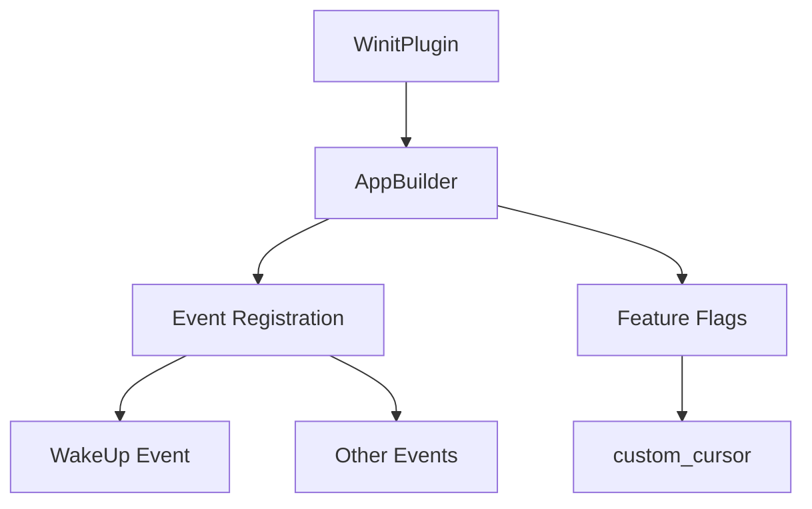

+++
title = "#19212 Add WakeUp event to App"
date = "2025-05-26T00:00:00"
draft = false
template = "pull_request_page.html"
in_search_index = false

[extra]
current_language = "zh-cn"
available_languages = {"en" = { name = "English", url = "/pull_request/bevy/2025-05/pr-19212-en-20250526" }, "zh-cn" = { name = "中文", url = "/pull_request/bevy/2025-05/pr-19212-zh-cn-20250526" }}
labels = ["C-Bug", "A-Windowing"]
+++

# Add WakeUp event to App

## Basic Information
- **Title**: Add WakeUp event to App  
- **PR Link**: https://github.com/bevyengine/bevy/pull/19212  
- **Author**: IceSentry  
- **Status**: MERGED  
- **Labels**: C-Bug, A-Windowing, S-Ready-For-Final-Review  
- **Created**: 2025-05-14T17:59:06Z  
- **Merged**: 2025-05-26T19:47:33Z  
- **Merged By**: alice-i-cecile  

## Description Translation
### 目标  
- WakeUp 事件从未被添加到 app 中。如果需要使用该事件，目前需要手动添加  

### 解决方案  
- 在 WinitPlugin 中为 App 添加 WakeUp 事件  

### 测试  
- 测试了 window_setting 示例，编译和运行正常  

## The Story of This Pull Request

### 问题背景
在 Bevy 游戏引擎的窗口系统实现中，存在一个事件注册的遗漏问题。具体来说，`WakeUp` 事件（用于处理窗口唤醒状态）没有被自动注册到应用的事件系统中。这导致开发者在使用该事件时需要手动调用 `add_event::<WakeUp>()`，增加了使用成本并可能引发运行时错误。

### 解决方案分析
核心修改集中在 `bevy_winit` 模块的事件注册流程。原来的实现通过条件编译处理不同功能模块的初始化，但错误地将 `WakeUp` 事件注册与 `custom_cursor` 功能耦合在一起。当 `custom_cursor` 功能未启用时，事件注册代码路径就被完全跳过了。

### 具体实现
关键修改位于 `crates/bevy_winit/src/state.rs` 文件中的应用初始化逻辑：

```rust
// Before:
#[cfg(feature = "custom_cursor")]
app.add_event::<T>().init_resource::<CustomCursorCache>();

// After:
app.add_event::<T>();
#[cfg(feature = "custom_cursor")]
app.init_resource::<CustomCursorCache>();
```

这个改动将事件注册操作 `add_event::<T>` 从条件编译块中移出，使其成为无条件执行的基础初始化操作。同时保留 `CustomCursorCache` 资源初始化在 `custom_cursor` 特性下的条件编译，维持原有功能隔离。

### 技术影响
1. **行为修正**：确保 `WakeUp` 事件在任何配置下都会被正确注册
2. **架构改进**：解耦事件系统注册与具体功能模块的初始化
3. **兼容性保持**：通过保留 `#[cfg(feature = "custom_cursor")]` 条件编译，不影响原有功能模块的按需加载

### 工程经验
- **事件系统设计**：强调核心事件类型应该与功能模块解耦，确保基础功能的可靠性
- **条件编译实践**：演示了如何合理组织条件编译代码块，避免关键功能被意外禁用
- **最小化修改**：通过单行代码调整解决深层问题，体现精准定位问题的能力

## Visual Representation



## Key Files Changed

### `crates/bevy_winit/src/state.rs` (+2/-1)
**修改说明**：  
调整事件注册逻辑的位置，确保基础事件类型始终注册

**代码对比**：
```rust
// 修改前：
#[cfg(feature = "custom_cursor")]
app.add_event::<T>().init_resource::<CustomCursorCache>();

// 修改后：
app.add_event::<T>();
#[cfg(feature = "custom_cursor")]
app.init_resource::<CustomCursorCache>();
```

**关联性**：  
将 `add_event` 调用从条件编译块移出，保证 `WakeUp` 事件在各类构建配置下都能正确注册

## Further Reading
1. [Bevy Events 系统文档](https://docs.rs/bevy/latest/bevy/ecs/event/index.html)
2. [Rust 条件编译指南](https://doc.rust-lang.org/reference/conditional-compilation.html)
3. [Winit 事件处理模型](https://docs.rs/winit/latest/winit/event_loop/struct.EventLoop.html)