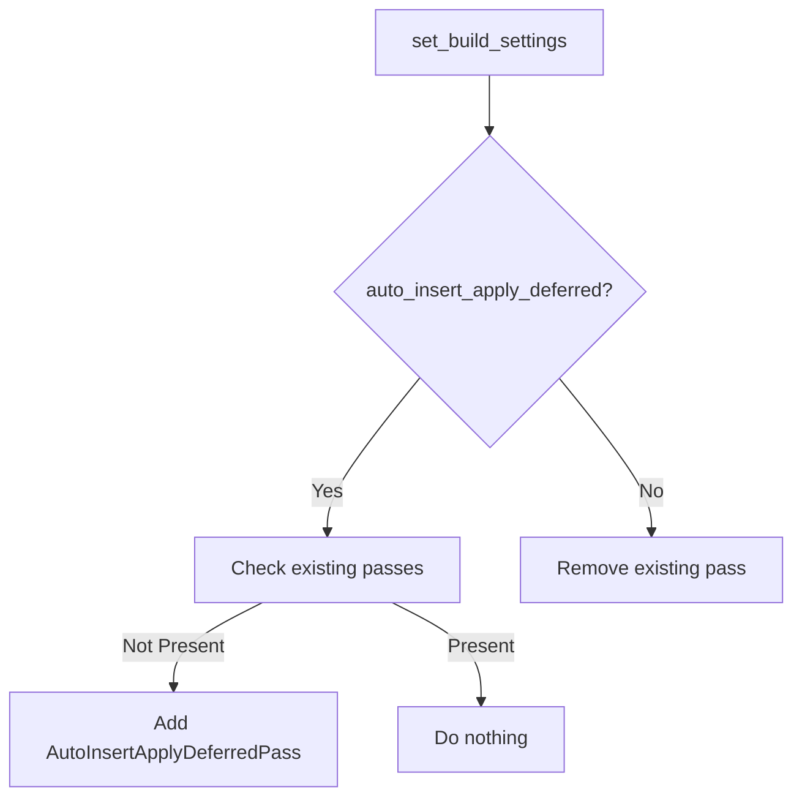

+++
title = "#19217 No schedule build pass overwrite if build settings do not change `auto_insert_apply_deferred` from `true`"
date = "2025-05-26T00:00:00"
draft = false
template = "pull_request_page.html"
in_search_index = true

[taxonomies]
list_display = ["show"]

[extra]
current_language = "en"
available_languages = {"en" = { name = "English", url = "/pull_request/bevy/2025-05/pr-19217-en-20250526" }, "zh-cn" = { name = "中文", url = "/pull_request/bevy/2025-05/pr-19217-zh-cn-20250526" }}
labels = ["C-Bug", "A-ECS", "D-Straightforward"]
+++

# Title

## Basic Information
- **Title**: No schedule build pass overwrite if build settings do not change `auto_insert_apply_deferred` from `true`
- **PR Link**: https://github.com/bevyengine/bevy/pull/19217
- **Author**: urben1680
- **Status**: MERGED
- **Labels**: C-Bug, A-ECS, S-Ready-For-Final-Review, D-Straightforward
- **Created**: 2025-05-15T19:03:32Z
- **Merged**: 2025-05-26T19:47:49Z
- **Merged By**: alice-i-cecile

## Description Translation
# Objective

Fixes #18790.
Simpler alternative to #19195.

## Solution

As suggested by @PixelDust22, simply avoid overwriting the pass if the schedule already has auto sync points enabled.
Leave pass logic untouched.

It still is probably a bad idea to add systems/set configs before changing the build settings, but that is not important as long there are no more complex build passes.

## Testing

Added a test.

## The Story of This Pull Request

The PR addresses a subtle bug in Bevy's ECS scheduler where redundant build passes could be added when modifying schedule settings multiple times. The core issue stemmed from the `set_build_settings` method unconditionally adding an `AutoInsertApplyDeferredPass` every time `auto_insert_apply_deferred` was set to true, even when already present.

The solution implements an idempotency check in the scheduler configuration:

```rust
if settings.auto_insert_apply_deferred {
    if !self
        .graph
        .passes
        .contains_key(&TypeId::of::<passes::AutoInsertApplyDeferredPass>())
    {
        self.add_build_pass(passes::AutoInsertApplyDeferredPass::default());
    }
}
```

This change ensures the build pass is only added once, preventing duplicate synchronization points that could lead to unexpected system execution ordering. The implementation maintains backward compatibility while fixing the edge case where multiple configuration calls might inadvertently modify the schedule structure.

A key test was added to validate the fix:
```rust
#[test]
fn unchanged_auto_insert_apply_deferred_has_no_effect() {
    // Test setup verifying system execution order and sync points
    let expected = vec![
        Entry::System(1),
        Entry::System(2),
        Entry::SyncPoint(1),
        Entry::SyncPoint(2),
    ];
    assert_eq!(actual, expected);
}
```

This test uses a logging mechanism to verify that:
1. Systems execute in expected order
2. Sync points are inserted exactly once per command queue flush
3. Multiple configuration calls don't affect the execution pattern

The change preserves existing edge-clearing behavior when `auto_insert_apply_deferred` is disabled, maintaining consistency with previous functionality. Developers should still configure build settings before adding systems to avoid unexpected interactions, but the fix prevents one class of configuration errors.

## Visual Representation



## Key Files Changed

### `crates/bevy_ecs/src/schedule/schedule.rs` (+53/-1)
**Core Change:**
```rust
// Before:
if settings.auto_insert_apply_deferred {
    self.add_build_pass(passes::AutoInsertApplyDeferredPass::default());
}

// After:
if settings.auto_insert_apply_deferred {
    if !self.graph.passes.contains_key(...) {
        self.add_build_pass(...);
    }
}
```

**Test Addition:**
```rust
#[test]
fn unchanged_auto_insert_apply_deferred_has_no_effect() {
    // Full test implementation verifying correct sync point insertion
}
```

These changes ensure build pass management is idempotent and prevent redundant synchronization points in schedule execution graphs.

## Further Reading
- Bevy ECS Scheduler Documentation: https://bevyengine.org/learn/book/ecs/schedules/
- System Ordering in Bevy: https://bevyengine.org/learn/book/ecs/system-order/
- Command Buffers and Sync Points: https://bevyengine.org/learn/book/ecs/commands/