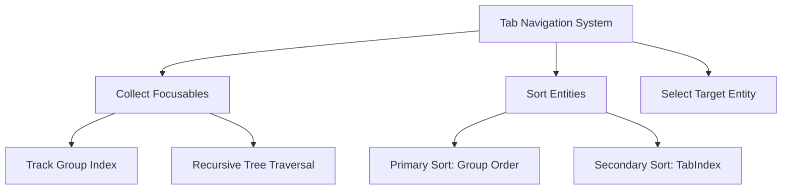

+++
title = "#19218 Navigate through TabGroups in order."
date = "2025-05-26T00:00:00"
draft = false
template = "pull_request_page.html"
in_search_index = true

[taxonomies]
list_display = ["show"]

[extra]
current_language = "en"
available_languages = {"en" = { name = "English", url = "/pull_request/bevy/2025-05/pr-19218-en-20250526" }, "zh-cn" = { name = "中文", url = "/pull_request/bevy/2025-05/pr-19218-zh-cn-20250526" }}
labels = ["C-Bug", "A-Input", "A-UI", "D-Straightforward"]
+++

# Navigate through TabGroups in order

## Basic Information
- **Title**: Navigate through TabGroups in order.
- **PR Link**: https://github.com/bevyengine/bevy/pull/19218
- **Author**: FlippinBerger
- **Status**: MERGED
- **Labels**: C-Bug, A-Input, A-UI, S-Ready-For-Final-Review, D-Straightforward
- **Created**: 2025-05-15T19:42:03Z
- **Merged**: 2025-05-26T20:00:05Z
- **Merged By**: alice-i-cecile

## Description Translation
# Objective
Fixes #19156

## Solution
There was a call to sort by `TabIndex` after iterating through all the `TabGroup`s. Simply removing that line of code made the new test case pass (navigating through `TabIndex` within different `TabGroup`s and kept everything else working as expected as far as I can tell. 

I went ahead and broke the `focusable` vec down into per-group vecs that get sorted by `TabIndex` and appended to the main vec in group sorted order to maintain the sorting that was being done before, but respecting the `TabGroup` sorting that was missing in the issue that this PR addresses.

## Testing
I added a new unit test that reproduced the issue outlined above that will run in CI. This test was failing before deleting the sort, and now both unit tests are passing. 

## The Story of This Pull Request

The PR addresses a navigation issue in Bevy's UI tab system where tab order didn't properly respect TabGroup hierarchies. The core problem stemmed from how focusable elements were collected and sorted during tab navigation.

Previously, the implementation gathered all focusable entities into a single list and sorted them solely by their TabIndex values. This approach worked for flat structures but failed to account for TabGroup ordering when elements were organized into hierarchical groups. The key problematic line was a global sort by TabIndex that overrode the natural group-based ordering.

The solution involved three main changes:

1. **Data Structure Modification**: The `focusable` vector was enhanced to track group membership:
```rust
// Before: Vec<(Entity, TabIndex)>
// After: Vec<(Entity, TabIndex, usize)>
let mut focusable: Vec<(Entity, TabIndex, usize)> = ...
```

2. **Hierarchical Sorting**: The sorting logic was updated to prioritize group order before TabIndex:
```rust
focusable.sort_by(|(_, a_tab_idx, a_group), (_, b_tab_idx, b_group)| {
    if a_group == b_group {
        a_tab_idx.cmp(b_tab_idx)
    } else {
        a_group.cmp(b_group)
    }
});
```

3. **Recursive Group Handling**: The `gather_focusable` method was modified to propagate group indices during tree traversal:
```rust
fn gather_focusable(
    &self,
    out: &mut Vec<(Entity, TabIndex, usize)>,
    parent: Entity,
    tab_group_idx: usize  // New parameter
) { ... }
```

The implementation maintains backward compatibility while fixing the group navigation issue. By tracking group membership during the collection phase and using a two-level sort (group order first, then TabIndex), the solution preserves existing behavior for simple cases while adding proper hierarchical navigation.

A new test case `test_tab_navigation_between_groups_is_sorted_by_group` verifies the correct behavior across multiple groups. This test creates two TabGroups with different orders and validates navigation between them:
```rust
// Group 1 (order 0) contains elements 1 and 2
// Group 2 (order 1) contains elements 3 and 4
assert_eq!(next_from_end_of_group_entity, Ok(tab_entity_3)); // Cross-group navigation
assert_eq!(prev_entity_from_start_of_group, Ok(tab_entity_2)); // Reverse cross-group
```

The changes demonstrate an effective approach to hierarchical UI navigation by:
1. Augmenting data collection with contextual information (group index)
2. Implementing multi-criteria sorting
3. Maintaining recursive traversal while respecting group boundaries

## Visual Representation



## Key Files Changed

### crates/bevy_input_focus/src/tab_navigation.rs (+67/-12)
1. **Data Structure Update**:
```rust
// Before:
let mut focusable: Vec<(Entity, TabIndex)> 

// After:
let mut focusable: Vec<(Entity, TabIndex, usize)>
```
Adds group index tracking to each focusable entity.

2. **Sorting Logic Update**:
```rust
// Before:
focusable.sort_by_key(|(_, idx)| *idx);

// After:
focusable.sort_by(|(_, a_tab_idx, a_group), ...| {
    a_group.cmp(b_group).then_with(|| a_tab_idx.cmp(b_tab_idx))
});
```
Implements hierarchical sorting based on group order and TabIndex.

3. **Recursive Gathering**:
```rust
// Modified method signature
fn gather_focusable(..., tab_group_idx: usize) {
    // Propagates group index through recursive calls
    out.push((entity, *tabindex, tab_group_idx));
}
```
Maintains group context during tree traversal.

## Further Reading

1. Bevy UI Navigation System Documentation: [https://bevyengine.org/learn/book/input/ui-navigation/]
2. Accessibility Tree Navigation Patterns: [https://www.w3.org/WAI/ARIA/apg/patterns/]
3. Rust Sorting with Multiple Criteria: [https://doc.rust-lang.org/std/primitive.slice.html#method.sort_by]