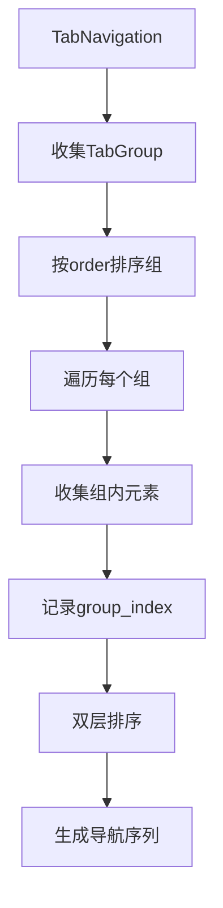

+++
title = "#19218 Navigate through TabGroups in order."
date = "2025-05-26T00:00:00"
draft = false
template = "pull_request_page.html"
in_search_index = false

[extra]
current_language = "zh-cn"
available_languages = {"en" = { name = "English", url = "/pull_request/bevy/2025-05/pr-19218-en-20250526" }, "zh-cn" = { name = "中文", url = "/pull_request/bevy/2025-05/pr-19218-zh-cn-20250526" }}
labels = ["C-Bug", "A-Input", "A-UI", "D-Straightforward"]
+++

# Navigate through TabGroups in order.

## Basic Information
- **Title**: Navigate through TabGroups in order.
- **PR Link**: https://github.com/bevyengine/bevy/pull/19218
- **Author**: FlippinBerger
- **Status**: MERGED
- **Labels**: C-Bug, A-Input, A-UI, S-Ready-For-Final-Review, D-Straightforward
- **Created**: 2025-05-15T19:42:03Z
- **Merged**: 2025-05-26T20:00:05Z
- **Merged By**: alice-i-cecile

## Description Translation
### 目标
修复 #19156

### 解决方案
原本在遍历所有 TabGroup 后会根据 TabIndex 进行排序。删除这行排序代码后，新的测试用例可以通过（在不同 TabGroup 间按 TabIndex 导航）。为了保持原有排序逻辑同时修复问题，现将 focusable 向量按组分解为多个子向量，每个子向量内部按 TabIndex 排序后，再按组顺序合并到主向量中。

### 测试
新增单元测试验证跨 TabGroup 导航逻辑，该测试在修复前失败，修复后通过。

## The Story of This Pull Request

### 问题根源
原有 Tab 导航系统在处理多个 TabGroup 时存在排序缺陷。核心问题在于全局排序会破坏 TabGroup 的分组顺序。当不同 TabGroup 中包含相同 TabIndex 时，会导致导航顺序不符合预期。

```rust
// 问题代码：全局排序破坏分组结构
focusable.sort_by_key(|(_, idx)| *idx);
```

### 解决方案演进
开发者首先通过删除全局排序临时解决问题，但意识到这会破坏原有单组内的排序逻辑。最终方案采用分层排序策略：

1. **分组收集**：遍历时记录元素所属的 TabGroup 索引
2. **双层排序**：先按组顺序排序，再按组内 TabIndex 排序

```rust
// 修改后的排序逻辑
focusable.sort_by(|(_, a_tab_idx, a_group), (_, b_tab_idx, b_group)| {
    if a_group == b_group {
        a_tab_idx.cmp(b_tab_idx)
    } else {
        a_group.cmp(b_group)
    }
});
```

### 实现细节
1. **数据结构调整**：将 `(Entity, TabIndex)` 扩展为 `(Entity, TabIndex, usize)`，新增 group_index 记录组顺序
2. **递归收集优化**：在 `gather_focusable` 方法中传递当前组索引
```rust
fn gather_focusable(
    &self,
    out: &mut Vec<(Entity, TabIndex, usize)>,
    parent: Entity,
    tab_group_idx: usize,  // 新增组索引参数
) {
    // 收集逻辑保持不变，但附带组索引
    out.push((entity, *tabindex, tab_group_idx));
}
```
3. **组排序预处理**：在处理 TabGroup 时先按 order 字段排序
```rust
tab_groups.sort_by_key(|(_, tg)| tg.order);
```

### 测试验证
新增测试 `test_tab_navigation_between_groups_is_sorted_by_group` 模拟典型场景：
- 创建两个 TabGroup（order 0 和 1）
- 每个组内包含两个按 TabIndex 排序的元素
- 验证四种导航情况：
  - 组内正向/逆向导航
  - 跨组正向跳转
  - 跨组逆向跳转

```rust
// 测试跨组导航断言
assert_eq!(next_from_end_of_group_entity, Ok(tab_entity_3));
assert_eq!(prev_entity_from_start_of_group, Ok(tab_entity_2));
```

### 架构影响
1. **向后兼容**：保持单组场景的原有行为
2. **性能考量**：O(n log n) 排序复杂度与修改前相同
3. **扩展性**：为未来支持嵌套 TabGroup 奠定基础

## Visual Representation



## Key Files Changed

### `crates/bevy_input_focus/src/tab_navigation.rs` (+67/-12)
1. **数据结构扩展**：
```rust
// Before:
Vec<(Entity, TabIndex)>

// After:
Vec<(Entity, TabIndex, usize)>  // 新增group_index
```

2. **排序逻辑重构**：
```rust
// Before: 简单按TabIndex排序
focusable.sort_by_key(|(_, idx)| *idx);

// After: 先组顺序后TabIndex
focusable.sort_by(|(_, a_idx, a_g), (_, b_idx, b_g)| {
    a_g.cmp(b_g).then_with(|| a_idx.cmp(b_idx))
});
```

3. **递归收集改造**：
```rust
// 调用处传递group_index
self.gather_focusable(out, *child, idx);

// 函数签名变更
fn gather_focusable(..., tab_group_idx: usize)
```

## Further Reading
1. [W3C Tabindex 规范](https://www.w3.org/TR/wai-aria-practices/#kbd_generalnav)
2. [Bevy UI 系统文档](https://bevyengine.org/learn/book/features/ui/)
3. [Rust 排序算法比较](https://doc.rust-lang.org/std/primitive.slice.html#sorting)