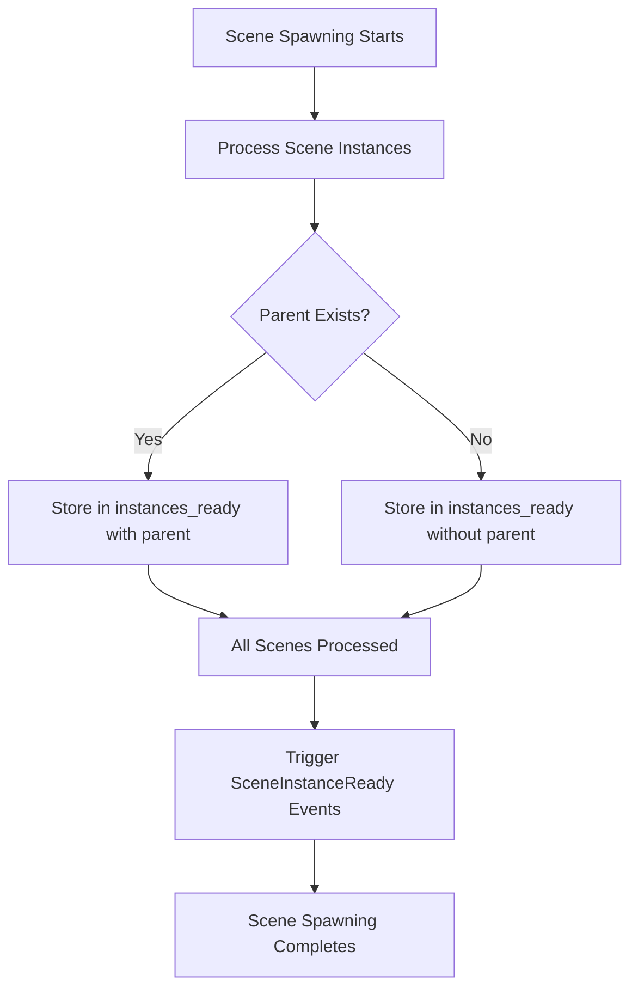

+++
title = "#19221 Fix #19219 by moving observer triggers out of resource_scope"
date = "2025-05-30T00:00:00"
draft = false
template = "pull_request_page.html"
in_search_index = true

[taxonomies]
list_display = ["show"]

[extra]
current_language = "en"
available_languages = {"en" = { name = "English", url = "/pull_request/bevy/2025-05/pr-19221-en-20250530" }, "zh-cn" = { name = "中文", url = "/pull_request/bevy/2025-05/pr-19221-zh-cn-20250530" }}
labels = ["C-Bug", "A-ECS", "D-Modest"]
+++

# Fix #19219 by moving observer triggers out of resource_scope

## Basic Information
- **Title**: Fix #19219 by moving observer triggers out of resource_scope
- **PR Link**: https://github.com/bevyengine/bevy/pull/19221
- **Author**: mbrea-c
- **Status**: MERGED
- **Labels**: C-Bug, A-ECS, S-Ready-For-Final-Review, D-Modest
- **Created**: 2025-05-15T21:37:21Z
- **Merged**: 2025-05-30T19:54:07Z
- **Merged By**: alice-i-cecile

## Description Translation
# Objective

Fixes #19219 

## Solution

Instead of calling `world.commands().trigger` and `world.commands().trigger_targets` whenever each scene is spawned, save the `instance_id` and optional parent entity to perform all such calls at the end. This prevents the potential flush of the world command queue that can happen if `add_child` is called from causing the crash.

## Testing

- Did you test these changes? If so, how?  
  - Verified that I can no longer reproduce the bug with the instructions at #19219.  
  - Ran `bevy_scene` tests  
  - Visually verified that the following examples still run as expected `many_foxes`, `scene` . (should I test any more?)  
- Are there any parts that need more testing?  
  - Pending to run `cargo test` at the root to test that all examples still build; I will update the PR when that's done  
- How can other people (reviewers) test your changes? Is there anything specific they need to know?  
  - Run bevy as usual  
- If relevant, what platforms did you test these changes on, and are there any important ones you can't test?  
  - N/a (tested on Linux/wayland but it shouldn't be relevant)  

---

## The Story of This Pull Request

This PR addresses a specific crash (#19219) that occurred when spawning scenes in Bevy's ECS framework. The root cause was improper timing of event triggers relative to Bevy's command queue processing. When spawning scenes, the original implementation immediately triggered `SceneInstanceReady` events using `world.commands().trigger()`. This approach risked prematurely flushing the command queue while the `SceneSpawner` resource was still in a mutable borrow scope. 

The critical insight is that command queue flushes can trigger systems that might attempt to access the same `SceneSpawner` resource, creating a conflict since Rust's borrow checker prevents simultaneous mutable and immutable access. This was particularly problematic when scene spawning involved parenting operations, as `add_child` commands could indirectly cause early command queue flushes.

The solution modifies the event triggering mechanism to batch and defer notifications. Rather than firing events immediately during scene processing, we now:
1. Collect instance IDs and parent entities in a new `instances_ready` vector
2. Process these pending events after all scene operations complete
3. Trigger events outside the critical resource borrow section

This approach maintains the same functional behavior while eliminating the resource access conflict. By moving event triggers outside the mutable borrow of `SceneSpawner`, we ensure the command queue flushes occur when the resource is no longer borrowed, preventing the crash.

The implementation adds a new `Vec` field to `SceneSpawner` to accumulate pending events:

```rust
pub struct SceneSpawner {
    // ...existing fields...
    instances_ready: Vec<(InstanceId, Option<Entity>)>,
}
```

During scene spawning operations, instead of directly triggering events, we push event data to this buffer:

```rust
// Before (problematic):
world.commands().trigger(SceneInstanceReady { instance_id });

// After (safe):
self.instances_ready.push((instance_id, None));
```

A new method `trigger_scene_ready_events` processes the accumulated events after scene operations complete:

```rust
fn trigger_scene_ready_events(&mut self, world: &mut World) {
    for (instance_id, parent) in self.instances_ready.drain(..) {
        if let Some(parent) = parent {
            world.commands()
                .trigger_targets(SceneInstanceReady { instance_id }, parent);
        } else {
            world.commands().trigger(SceneInstanceReady { instance_id });
        }
    }
}
```

Finally, we call this new method in the main system after all other processing:

```rust
pub fn scene_spawner_system(world: &mut World) {
    world.resource_scope(|world, mut scene_spawner: Mut<SceneSpawner>| {
        // ...existing scene processing...
        scene_spawner.trigger_scene_ready_events(world);
    });
}
```

This solution demonstrates a valuable pattern for ECS development: when dealing with systems that generate events or commands while holding resources, batch and defer side effects until after resource scopes conclude. The changes preserve all existing functionality while eliminating the crash risk, with minimal performance impact since we're simply moving existing operations rather than adding significant new computation.

## Visual Representation



## Key Files Changed

### `crates/bevy_scene/src/scene_spawner.rs`
**Purpose**: Fixes crash by deferring event triggers until after scene processing completes.

**Key changes**:
1. Added new buffer field to accumulate pending events
2. Replaced immediate event triggers with buffer storage
3. Added method to process buffered events
4. Integrated event triggering at end of system

**Code snippets**:
```rust
// Before:
if parent.is_none() {
    world.commands().trigger(SceneInstanceReady { instance_id });
}

// After:
if parent.is_none() {
    self.instances_ready.push((instance_id, None));
}
```

```rust
// New method added:
fn trigger_scene_ready_events(&mut self, world: &mut World) {
    for (instance_id, parent) in self.instances_ready.drain(..) {
        if let Some(parent) = parent {
            world.commands()
                .trigger_targets(SceneInstanceReady { instance_id }, parent);
        } else {
            world.commands().trigger(SceneInstanceReady { instance_id });
        }
    }
}
```

```rust
// System integration:
pub fn scene_spawner_system(world: &mut World) {
    world.resource_scope(|world, mut scene_spawner: Mut<SceneSpawner>| {
        // ...existing code...
        scene_spawner.trigger_scene_ready_events(world);
    });
}
```

## Further Reading
1. [Bevy ECS System Ordering Documentation](https://bevyengine.org/learn/book/getting-started/ecs/#system-ordering)
2. [Bevy Commands and Deferred Operations](https://bevyengine.org/learn/book/getting-started/commands/)
3. [Rust Borrow Checker and Resource Scoping](https://doc.rust-lang.org/book/ch04-02-references-and-borrowing.html)