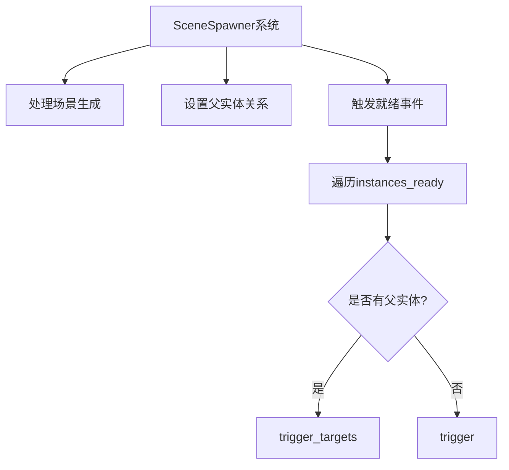

+++
title = "#19221 Fix #19219 by moving observer triggers out of resource_scope"
date = "2025-05-30T00:00:00"
draft = false
template = "pull_request_page.html"
in_search_index = false

[extra]
current_language = "zh-cn"
available_languages = {"en" = { name = "English", url = "/pull_request/bevy/2025-05/pr-19221-en-20250530" }, "zh-cn" = { name = "中文", url = "/pull_request/bevy/2025-05/pr-19221-zh-cn-20250530" }}
labels = ["C-Bug", "A-ECS", "D-Modest"]
+++

# 修复 #19219：将观察者触发器移出 resource_scope

## Basic Information
- **Title**: Fix #19219 by moving observer triggers out of resource_scope
- **PR Link**: https://github.com/bevyengine/bevy/pull/19221
- **Author**: mbrea-c
- **Status**: MERGED
- **Labels**: C-Bug, A-ECS, S-Ready-For-Final-Review, D-Modest
- **Created**: 2025-05-15T21:37:21Z
- **Merged**: 2025-05-30T19:54:07Z
- **Merged By**: alice-i-cecile

## Description Translation
### 目标 (Objective)
修复 #19219

### 解决方案 (Solution)
不再在每次场景生成时调用 `world.commands().trigger` 和 `world.commands().trigger_targets`，而是保存 `instance_id` 和可选的父实体，以便在最后统一执行所有此类调用。这样可以防止因在调用 `add_child` 时可能发生的世界命令队列刷新导致的崩溃。

### 测试 (Testing)
- 你是否测试了这些更改？如果是，如何测试的？
  - 已验证我无法再按照 #19219 中的步骤重现该错误。
  - 运行了 `bevy_scene` 测试。
  - 目视验证了以下示例仍按预期运行：`many_foxes`, `scene`。（我应该测试更多吗？）
- 是否有任何部分需要更多测试？
  - 待运行根目录下的 `cargo test` 以测试所有示例是否仍能构建；完成后我将更新 PR。
- 其他人（审阅者）如何测试你的更改？他们需要了解什么特定信息吗？
  - 像往常一样运行 bevy。
- 如果相关，你在哪些平台上测试了这些更改，是否有任何重要的平台你无法测试？
  - 不适用（在 Linux/wayland 上测试，但应该不相关）。

---

## 本 PR 的技术解析

### 问题根源
在 issue #19219 中，用户报告了一个特定场景下的崩溃问题。当使用 `resource_scope` 访问 `SceneSpawner` 资源时，立即触发 `SceneInstanceReady` 事件会导致命令队列刷新。如果此时系统正在执行 `add_child` 操作（同样会刷新命令队列），就会造成 `SceneSpawner` 资源被双重访问，引发 panic。

核心问题在于：在资源作用域内触发事件会导致命令队列立即刷新，而某些操作（如添加子实体）也会触发队列刷新，从而造成资源访问冲突。

### 解决方案设计
PR 采用延迟事件触发的策略来解决这个问题：
1. 不再在场景生成时立即触发 `SceneInstanceReady` 事件
2. 将事件触发所需数据（`instance_id` 和可选的 `parent` 实体）暂存到新集合中
3. 在所有场景处理完成后统一触发所有事件

这种方法避免了在 `resource_scope` 内刷新命令队列，消除了资源访问冲突的可能性。

### 具体实现
在 `SceneSpawner` 结构中新增 `instances_ready` 字段作为临时存储：
```rust
pub struct SceneSpawner {
    // ...其他字段...
    instances_ready: Vec<(InstanceId, Option<Entity>)>,
}
```

在场景生成逻辑中，将事件触发替换为数据暂存：
```diff
 if parent.is_none() {
-    world.commands().trigger(SceneInstanceReady { instance_id });
+    self.instances_ready.push((instance_id, None));
 }
```

对于有父实体的场景，同样暂存数据：
```diff
+ self.instances_ready.push((instance_id, Some(parent)));
```

新增统一处理事件的方法：
```rust
fn trigger_scene_ready_events(&mut self, world: &mut World) {
    for (instance_id, parent) in self.instances_ready.drain(..) {
        if let Some(parent) = parent {
            world.commands().trigger_targets(SceneInstanceReady { instance_id }, parent);
        } else {
            world.commands().trigger(SceneInstanceReady { instance_id });
        }
    }
}
```

在系统执行流程最后调用新方法：
```diff
 scene_spawner.set_scene_instance_parent_sync(world);
+ scene_spawner.trigger_scene_ready_events(world);
```

### 技术考量
1. **命令队列管理**：Bevy 的命令队列在帧间执行，但在某些情况下（如资源作用域内）会立即刷新
2. **资源访问安全**：`resource_scope` 保证资源独占访问，但命令队列刷新可能违反此约束
3. **事件触发顺序**：延迟触发不会改变事件语义，因为所有场景操作已完成
4. **内存开销**：新增的 `Vec` 结构内存开销可忽略，且每次帧清空

### 影响评估
1. 修复了特定操作序列下的崩溃问题
2. 保持原有事件触发行为不变
3. 对性能影响可忽略不计
4. 提高了场景生成系统的健壮性

测试验证包括：
- 复现 issue 步骤确认崩溃已修复
- `bevy_scene` 测试套件通过
- 关键示例（`many_foxes`, `scene`）功能正常

## 组件关系图



## Key Files Changed

### `crates/bevy_scene/src/scene_spawner.rs`
**修改原因**：  
核心场景生成逻辑所在文件，需要修复资源作用域内命令队列刷新导致的崩溃问题。

**关键变更**：
1. 新增 `instances_ready` 字段存储延迟触发的事件数据
2. 替换即时事件触发为数据收集
3. 添加统一事件触发方法
4. 在系统流程最后调用新方法

```diff
@@ -79,6 +79,7 @@ pub struct SceneSpawner {
     scenes_to_despawn: Vec<AssetId<DynamicScene>>,
     instances_to_despawn: Vec<InstanceId>,
     scenes_with_parent: Vec<(InstanceId, Entity)>,
+    instances_ready: Vec<(InstanceId, Option<Entity>)>,
 }
 
@@ -337,8 +338,9 @@ impl SceneSpawner {
                     // Scenes with parents need more setup before they are ready.
                     // See `set_scene_instance_parent_sync()`.
                     if parent.is_none() {
-                        // Defer via commands otherwise SceneSpawner is not available in the observer.
-                        world.commands().trigger(SceneInstanceReady { instance_id });
+                        // We trigger `SceneInstanceReady` events after processing all scenes
+                        // SceneSpawner may not be available in the observer.
+                        self.instances_ready.push((instance_id, None));
                     }
                 }
@@ -362,8 +364,9 @@ impl SceneSpawner {
                     // Scenes with parents need more setup before they are ready.
                     // See `set_scene_instance_parent_sync()`.
                     if parent.is_none() {
-                        // Defer via commands otherwise SceneSpawner is not available in the observer.
-                        world.commands().trigger(SceneInstanceReady { instance_id });
+                        // We trigger `SceneInstanceReady` events after processing all scenes
+                        // SceneSpawner may not be available in the observer.
+                        self.instances_ready.push((instance_id, None));
                     }
                 }
@@ -398,12 +401,25 @@ impl SceneSpawner {
                     }
                 }
 
+                // We trigger `SceneInstanceReady` events after processing all scenes
+                // SceneSpawner may not be available in the observer.
+                self.instances_ready.push((instance_id, Some(parent)));
+            } else {
+                self.scenes_with_parent.push((instance_id, parent));
+            }
+        }
+    }
+
+    fn trigger_scene_ready_events(&mut self, world: &mut World) {
+        for (instance_id, parent) in self.instances_ready.drain(..) {
+            if let Some(parent) = parent {
                 // Defer via commands otherwise SceneSpawner is not available in the observer.
                 world
                     .commands()
                     .trigger_targets(SceneInstanceReady { instance_id }, parent);
             } else {
-                self.scenes_with_parent.push((instance_id, parent));
+                // Defer via commands otherwise SceneSpawner is not available in the observer.
+                world.commands().trigger(SceneInstanceReady { instance_id });
             }
         }
     }
@@ -477,6 +493,7 @@ pub fn scene_spawner_system(world: &mut World) {
             .update_spawned_scenes(world, &updated_spawned_scenes)
             .unwrap();
         scene_spawner.set_scene_instance_parent_sync(world);
+        scene_spawner.trigger_scene_ready_events(world);
     });
 }
```

## 扩展阅读
1. [Bevy ECS 系统执行模型](https://bevyengine.org/learn/book/next/programming/ecs/system-order/)
2. [Bevy 命令队列工作原理](https://github.com/bevyengine/bevy/blob/main/docs/plugins_guidelines.md#commands)
3. [资源作用域安全访问模式](https://docs.rs/bevy/latest/bevy/ecs/system/fn.resource_scope.html)
4. [观察者模式在 ECS 中的应用](https://github.com/bevyengine/bevy/discussions/3900)