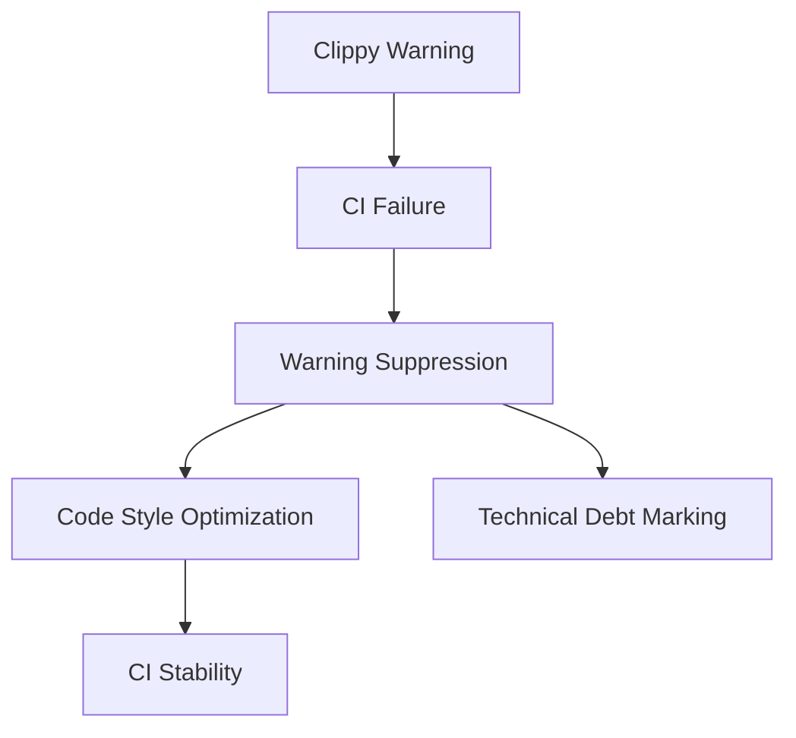

+++
title = "#19222 clippy: expect large variants and other small fixes"
date = "2025-05-15T00:00:00"
draft = false
template = "pull_request_page.html"
in_search_index = false

[extra]
current_language = "zh-cn"
available_languages = {"en" = { name = "English", url = "/pull_request/bevy/2025-05/pr-19222-en-20250515" }, "zh-cn" = { name = "中文", url = "/pull_request/bevy/2025-05/pr-19222-zh-cn-20250515" }}
+++

# Title: clippy: expect large variants and other small fixes

## Basic Information
- **Title**: clippy: expect large variants and other small fixes
- **PR Link**: https://github.com/bevyengine/bevy/pull/19222
- **Author**: atlv24
- **Status**: MERGED
- **Labels**: None
- **Created**: 2025-05-15T22:04:02Z
- **Merged**: 2025-05-15T22:50:15Z
- **Merged By**: mockersf

## Description Translation
目标：
- 修复CI

解决方案：
- 处理新的lint警告
- 参见#19220

测试方法：
- 运行cargo clippy

## The Story of This Pull Request

### 问题背景与上下文
在持续集成（CI）流程中，由于Rust的Clippy静态分析工具引入了新的lint检查规则，导致构建失败。具体来说，新的`clippy::large_enum_variant`警告在多个关键枚举类型上触发，这些枚举包含不同大小的变体（variants）。该警告提示较大的枚举变体会导致内存布局效率低下，但在当前架构下这些设计是必要的。

### 解决方案与技术实现
开发者采用临时抑制警告的策略，通过在相关枚举定义处添加`#[expect]`属性来显式声明接受这些警告。这种做法既保持了代码的当前设计，又符合项目对Clippy警告零容忍的要求。同时，进行了代码风格优化，简化了部分冗余的临时变量使用。

主要技术决策包括：
1. 使用`#[expect(clippy::large_enum_variant)]`属性明确标记已知的设计权衡
2. 在相关代码位置添加issue链接(#19220)作为技术债务标记
3. 优化函数返回表达式，消除中间变量

### 关键代码修改分析
以`pipeline_cache.rs`为例：
```rust
// Before:
#[derive(Debug)]
pub enum CachedPipelineState {
    Queued,
    Failed(PipelineCacheError),
    Ok(Pipeline),
}

// After:
#[expect(
    clippy::large_enum_variant,
    reason = "See https://github.com/bevyengine/bevy/issues/19220"
)]
#[derive(Debug)]
pub enum CachedPipelineState {
    Queued,
    Failed(PipelineCacheError),
    Ok(Pipeline),
}
```
这种修改保留了现有架构设计，同时明确标注技术债务。类似的模式应用于多个核心模块的枚举定义。

### 技术影响与后续考虑
1. 保持CI流程的稳定性，避免因新lint规则导致构建失败
2. 明确标记需要后续优化的代码区域
3. 代码风格改进提升可读性
4. 未来需要针对标记的issue进行架构优化，解决枚举变体大小差异问题

## Visual Representation



## Key Files Changed

1. **crates/bevy_render/src/render_resource/pipeline_cache.rs**
   - 为4个关键枚举添加`expect`属性抑制警告
   - 示例修改：
```rust
#[expect(
    clippy::large_enum_variant,
    reason = "See https://github.com/bevyengine/bevy/issues/19220"
)]
pub enum CachedPipelineState { ... }
```

2. **crates/bevy_text/src/pipeline.rs**
   - 优化函数返回表达式
   - 代码简化：
```rust
// Before:
let attrs = Attrs::new()...;
attrs

// After:
Attrs::new()...
```

3. **crates/bevy_ecs/src/change_detection.rs**
   - 消除冗余变量赋值
   - 代码优化：
```rust
// Before:
let value = unsafe { ... };
value

// After:
unsafe { ... }
```

## Further Reading
1. [Rust Clippy官方文档](https://doc.rust-lang.org/clippy/)
2. [Rust枚举内存布局详解](https://rust-lang.github.io/rustc-dev-guide/type-layout.html)
3. [Bevy引擎架构设计原则](https://bevyengine.org/learn/book/introduction/)