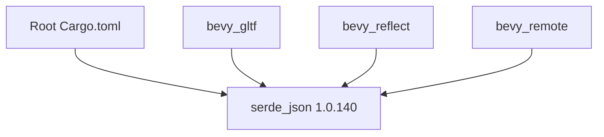

+++
title = "#19229 Make sure that `serde_json::Map::into_values` exists"
date = "2025-05-26T00:00:00"
draft = false
template = "pull_request_page.html"
in_search_index = true

[taxonomies]
list_display = ["show"]

[extra]
current_language = "en"
available_languages = {"en" = { name = "English", url = "/pull_request/bevy/2025-05/pr-19229-en-20250526" }, "zh-cn" = { name = "中文", url = "/pull_request/bevy/2025-05/pr-19229-zh-cn-20250526" }}
labels = ["C-Bug", "D-Trivial", "A-Build-System", "C-Dependencies", "P-Regression"]
+++

# Title

## Basic Information
- **Title**: Make sure that `serde_json::Map::into_values` exists
- **PR Link**: https://github.com/bevyengine/bevy/pull/19229
- **Author**: BenjaminBrienen
- **Status**: MERGED
- **Labels**: C-Bug, D-Trivial, A-Build-System, C-Dependencies, S-Ready-For-Final-Review, P-Regression
- **Created**: 2025-05-16T10:01:19Z
- **Merged**: 2025-05-26T20:05:20Z
- **Merged By**: alice-i-cecile

## Description Translation
# Objective

cargo update was required to build because into_values was added in a patch version

## Solution

Depend on the new patch

## Testing

Builds locally now

## The Story of This Pull Request

The PR addresses a build failure caused by a missing `serde_json::Map::into_values` method. This regression occurred because the Bevy engine's dependency specification for `serde_json` wasn't pinned to a specific patch version containing the required method.

The core issue stemmed from `serde_json` introducing the `into_values` method in version 1.0.140 through a patch update. Bevy's existing dependency specification used either "1" or "1.0" as the version constraint, which allowed older patch versions that lacked this method. When developers ran `cargo update`, they might receive incompatible versions that broke compilation.

The solution involved explicitly specifying the minimum required patch version across four Cargo.toml files:

1. Root Cargo.toml
2. bevy_gltf
3. bevy_reflect
4. bevy_remote

By changing the version specifiers to "1.0.140", the PR ensures all crates consistently use a `serde_json` version containing the `into_values` method. This approach balances specificity with flexibility - the "1.0.140" specification still allows cargo to use newer compatible versions (via semantic versioning rules) while guaranteeing the minimum required functionality.

The implementation required careful verification of all `serde_json` dependencies across the workspace. Each modification follows the same pattern of replacing a generic version constraint with the specific patch version:

```toml
# Before:
serde_json = "1"

# After:
serde_json = "1.0.140"
```

This change demonstrates the importance of precise dependency management in Rust projects, particularly when using features introduced in patch versions. The regression labels (P-Regression, C-Bug) indicate this fixed a recent breakage, likely introduced when a dependency update brought in code requiring the new `into_values` method.

## Visual Representation



## Key Files Changed

1. **Cargo.toml**
```toml
# Before:
serde_json = "1"

# After:
serde_json = "1.0.140"
```
Ensures the root workspace dependencies use the correct serde_json version.

2. **crates/bevy_gltf/Cargo.toml**
```toml
# Before:
serde_json = "1"

# After:
serde_json = "1.0.140"
```
Maintains compatibility for GLTF processing features.

3. **crates/bevy_reflect/Cargo.toml**
```toml
# Before:
serde_json = "1.0"

# After:
serde_json = "1.0.140"
```
Critical for reflection system's serialization/deserialization.

4. **crates/bevy_remote/Cargo.toml**
```toml
# Before:
serde_json = { version = "1" }

# After:
serde_json = "1.0.140"
```
Ensures remote networking features maintain compatibility.

## Further Reading

1. [serde_json 1.0.140 release notes](https://github.com/serde-rs/json/releases/tag/v1.0.140)
2. [Cargo Specifier Documentation](https://doc.rust-lang.org/cargo/reference/specifying-dependencies.html)
3. [Semantic Versioning in Rust](https://doc.rust-lang.org/cargo/reference/semver.html)

# Full Code Diff
<details>
<summary>View full diff</summary>

```diff
diff --git a/Cargo.toml b/Cargo.toml
index a3d3a2ab63e51..a44d01a5e9a09 100644
--- a/Cargo.toml
+++ b/Cargo.toml
@@ -551,7 +551,7 @@ rand_chacha = "0.3.1"
 ron = "0.8.0"
 flate2 = "1.0"
 serde = { version = "1", features = ["derive"] }
-serde_json = "1"
+serde_json = "1.0.140"
 bytemuck = "1.7"
 bevy_render = { path = "crates/bevy_render", version = "0.16.0-dev", default-features = false }
 # The following explicit dependencies are needed for proc macros to work inside of examples as they are part of the bevy crate itself.
diff --git a/crates/bevy_gltf/Cargo.toml b/crates/bevy_gltf/Cargo.toml
index a67ab2276c352..cc67047c230e1 100644
--- a/crates/bevy_gltf/Cargo.toml
+++ b/crates/bevy_gltf/Cargo.toml
@@ -61,7 +61,7 @@ fixedbitset = "0.5"
 itertools = "0.14"
 percent-encoding = "2.1"
 serde = { version = "1.0", features = ["derive"] }
-serde_json = "1"
+serde_json = "1.0.140"
 smallvec = "1.11"
 tracing = { version = "0.1", default-features = false, features = ["std"] }
 
diff --git a/crates/bevy_reflect/Cargo.toml b/crates/bevy_reflect/Cargo.toml
index bb72226ab85a7..09a76ffac49e4 100644
--- a/crates/bevy_reflect/Cargo.toml
+++ b/crates/bevy_reflect/Cargo.toml
@@ -123,7 +123,7 @@ wgpu-types = { version = "24", features = [
 ron = "0.8.0"
 rmp-serde = "1.1"
 bincode = { version = "2.0", features = ["serde"] }
-serde_json = "1.0"
+serde_json = "1.0.140"
 serde = { version = "1", features = ["derive"] }
 static_assertions = "1.1.0"
 
diff --git a/crates/bevy_remote/Cargo.toml b/crates/bevy_remote/Cargo.toml
index d2e3395f77e71..173555675f337 100644
--- a/crates/bevy_remote/Cargo.toml
+++ b/crates/bevy_remote/Cargo.toml
@@ -31,7 +31,7 @@ bevy_platform = { path = "../bevy_platform", version = "0.16.0-dev", default-fea
 anyhow = "1"
 hyper = { version = "1", features = ["server", "http1"] }
 serde = { version = "1", features = ["derive"] }
-serde_json = { version = "1" }
+serde_json = "1.0.140"
 http-body-util = "0.1"
 async-channel = "2"
 
</details>