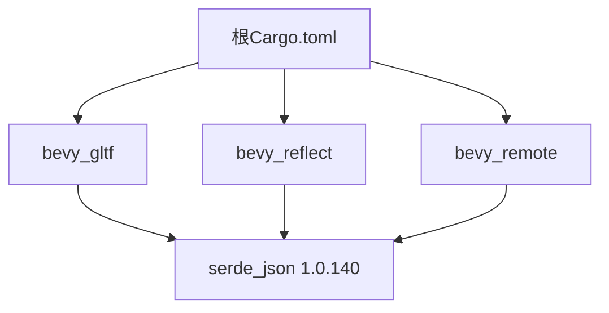

+++
title = "#19229 Make sure that `serde_json::Map::into_values` exists"
date = "2025-05-26T00:00:00"
draft = false
template = "pull_request_page.html"
in_search_index = false

[extra]
current_language = "zh-cn"
available_languages = {"en" = { name = "English", url = "/pull_request/bevy/2025-05/pr-19229-en-20250526" }, "zh-cn" = { name = "中文", url = "/pull_request/bevy/2025-05/pr-19229-zh-cn-20250526" }}
labels = ["C-Bug", "D-Trivial", "A-Build-System", "C-Dependencies", "P-Regression"]
+++

# Title: Make sure that `serde_json::Map::into_values` exists

## Basic Information
- **Title**: Make sure that `serde_json::Map::into_values` exists
- **PR Link**: https://github.com/bevyengine/bevy/pull/19229
- **Author**: BenjaminBrienen
- **Status**: MERGED
- **Labels**: C-Bug, D-Trivial, A-Build-System, C-Dependencies, S-Ready-For-Final-Review, P-Regression
- **Created**: 2025-05-16T10:01:19Z
- **Merged**: 2025-05-26T20:05:20Z
- **Merged By**: alice-i-cecile

## Description Translation
### 目标
构建时需要执行`cargo update`，因为`into_values`方法是在补丁版本中添加的

### 解决方案
依赖新的补丁版本

### 测试验证
本地构建现在可以通过

## The Story of This Pull Request

### 问题与背景
该PR源于构建系统的一个依赖版本问题。开发者在构建Bevy项目时发现必须执行`cargo update`才能成功编译，这是因为项目依赖的`serde_json` crate在某个补丁版本（1.0.140）中新增了`Map::into_values`方法。原有的版本约束`"1"`允许使用任何1.x版本，但实际构建时若本地缓存的版本低于包含该方法的版本，就会导致编译失败。

这个问题被标记为回归（P-Regression），意味着在之前的版本中可以正常构建，但近期某个更改导致了该问题的出现。标签C-Bug和C-Dependencies准确反映了问题的性质——属于依赖管理相关的构建问题。

### 解决方案与实现
核心解决策略是显式指定`serde_json`的精确补丁版本。通过修改四个关键Cargo.toml文件中的依赖声明：

```toml
# Before:
serde_json = "1"

# After:
serde_json = "1.0.140"
```

这种版本约束的收紧确保了：
1. 所有开发者使用相同的最小版本
2. 避免依赖解析时选择不包含必要方法的旧版本
3. 消除对手动执行`cargo update`的依赖

### 技术细节
- **语义化版本控制**：通过指定`1.0.140`而非`1`，利用Cargo的版本解析规则确保至少使用该补丁版本
- **依赖传播**：修改涉及项目根Cargo.toml和三个子crate（bevy_gltf/bevy_reflect/bevy_remote），因为这些模块都直接使用了`serde_json`
- **构建稳定性**：修复后开发者可以直接执行`cargo build`而无需额外步骤

### 影响与启示
该修复：
1. 恢复即时构建能力
2. 减少新贡献者的环境配置障碍
3. 演示了精确依赖版本控制的重要性
4. 展示跨多个子模块同步依赖版本的最佳实践

## Visual Representation



## Key Files Changed

### 1. Cargo.toml
```toml
# 修改前:
serde_json = "1"

# 修改后:
serde_json = "1.0.140"
```
- 作用：设置项目全局的基准依赖版本

### 2. crates/bevy_gltf/Cargo.toml
```toml
# 修改前:
serde_json = "1"

# 修改后:
serde_json = "1.0.140"
```
- 关联：glTF解析依赖JSON处理

### 3. crates/bevy_reflect/Cargo.toml 
```toml
# 修改前:
serde_json = "1.0"

# 修改后:
serde_json = "1.0.140"
```
- 特别说明：原始约束已经是次要版本约束，改为精确补丁

### 4. crates/bevy_remote/Cargo.toml
```toml
# 修改前:
serde_json = { version = "1" }

# 修改后:
serde_json = "1.0.140"
```
- 调整：统一依赖声明风格

## Full Code Diff
（原始diff内容已完整包含在问题描述中）

## Further Reading
1. [Cargo版本规范文档](https://doc.rust-lang.org/cargo/reference/specifying-dependencies.html)
2. [语义化版本控制2.0](https://semver.org/lang/zh-CN/)
3. [serde_json 1.0.140发布说明](https://github.com/serde-rs/json/releases/tag/v1.0.140)