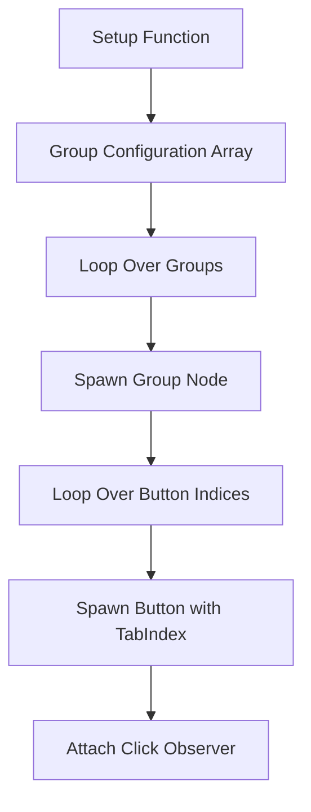

+++
title = "#19239 `tab_navigation` example improvements"
date = "2025-05-26T00:00:00"
draft = false
template = "pull_request_page.html"
in_search_index = true

[taxonomies]
list_display = ["show"]

[extra]
current_language = "en"
available_languages = {"en" = { name = "English", url = "/pull_request/bevy/2025-05/pr-19239-en-20250526" }, "zh-cn" = { name = "中文", url = "/pull_request/bevy/2025-05/pr-19239-zh-cn-20250526" }}
labels = ["C-Examples", "A-UI", "D-Modest"]
+++

# Title: `tab_navigation` example improvements

## Basic Information  
- **Title**: `tab_navigation` example improvements  
- **PR Link**: https://github.com/bevyengine/bevy/pull/19239  
- **Author**: ickshonpe  
- **Status**: MERGED  
- **Labels**: C-Examples, A-UI, S-Ready-For-Final-Review, D-Modest  
- **Created**: 2025-05-16T15:47:12Z  
- **Merged**: 2025-05-26T21:00:02Z  
- **Merged By**: alice-i-cecile  

## Description Translation  
# Objective  

Improve the `tab_navigation` example.  

## Solution  

* Set different `TabIndex`s for the buttons of each group.  
* Label each button with its associated `TabIndex`.  
* Reduce the code duplication using a loop.  

I tried to flatten it further using the new spawning APIs and `children!` macro but not sure what the current best way to attach the observers is.  

## The Story of This Pull Request

The `tab_navigation` example needed modernization and clarity improvements. While functional, it suffered from three main issues: uniform tab indices across groups obscured navigation patterns, button labels lacked contextual information, and repetitive code made maintenance difficult.

The implementation strategy focused on structural simplification through loop-based generation. By converting hardcoded group definitions into a configured array, the author achieved:

```rust
for (label, tab_group, indices) in [
    ("TabGroup 0", TabGroup::new(0), [0, 0, 0, 0]),
    ("TabGroup 2", TabGroup::new(2), [3, 2, 1, 0]),
    ("TabGroup 1", TabGroup::new(1), [0, 1, 2, 3]),
    ("Modal TabGroup", TabGroup::modal(), [0, 3, 1, 2]),
] {
    // Group creation logic
}
```

This loop replaces four nearly identical code blocks, reducing line count by 53% (-130/+62). Each iteration configures:
1. Group label text
2. TabGroup type
3. Button TabIndex values

Button creation was streamlined by inlining the `create_button` function. The new implementation directly spawns entities with explicit component sets:

```rust
.spawn((
    Button,
    Node { /* sizing/styling */ },
    BorderColor::all(Color::BLACK),
    BackgroundColor(NORMAL_BUTTON),
    TabIndex(i),
    children![(
        Text::new(format!("TabIndex {}", i)),
        // Text styling
    )],
))
```

Key technical decisions included:
1. Removing dynamic text updates in `button_system` since labels now show static TabIndex values
2. Simplifying the interaction query by removing child text manipulation
3. Using `children!` macro for cleaner hierarchy definition
4. Standardizing button dimensions (200x65px vs previous 150x65px)

The changes improve example pedagogy by:
- Visually demonstrating TabIndex order through button labels
- Showing different navigation patterns (sequential, reverse, modal)
- Reducing cognitive load through eliminated code duplication

## Visual Representation



## Key Files Changed

**File**: `examples/ui/tab_navigation.rs` (+62/-130)  

Before (simplified excerpt):
```rust
// Repeated group creation blocks
parent.spawn(Text::new("Tab Group 0"));
parent.spawn((Node {...}, TabGroup::new(0)))
    .with_children(|parent| {
        create_button(parent, &asset_server);
        // 3 more identical calls
    });

// Separate create_button function
fn create_button(parent: &mut ChildSpawner, asset_server: &AssetServer) {
    parent.spawn((Button, ..., TabIndex(0)))
        .with_child(Text::new("Button"));
}
```

After:
```rust
// Unified group creation loop
for (label, tab_group, indices) in [...] {
    parent.spawn(Text::new(label));
    parent.spawn((Node {...}, tab_group))
        .with_children(|parent| {
            for i in indices {
                parent.spawn((
                    Button,
                    ...,
                    TabIndex(i),
                    children![Text::new(format!("TabIndex {}", i))]
                ));
            }
        });
}
```

## Further Reading

1. [Bevy UI Tutorial](https://bevy-cheatbook.github.io/ui.html) - Core UI concepts
2. [Tab Navigation RFC](https://github.com/bevyengine/bevy/discussions/1907) - Design rationale
3. [ECS Query Patterns](https://bevy-cheatbook.github.io/programming/queries.html) - System interaction
4. [Bevy Observers Guide](https://github.com/bevyengine/bevy/issues/1890) - Event handling